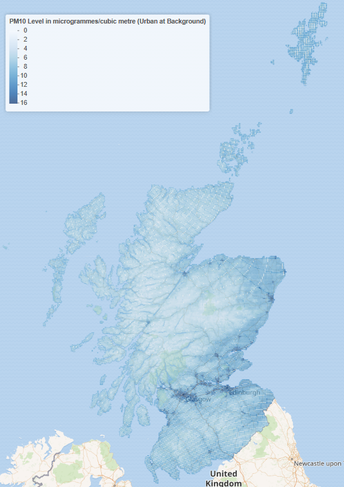
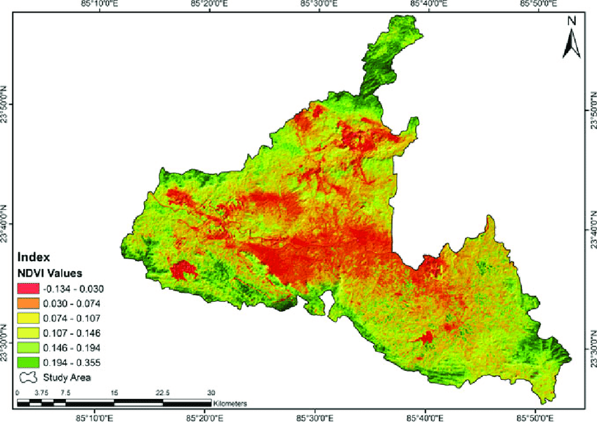
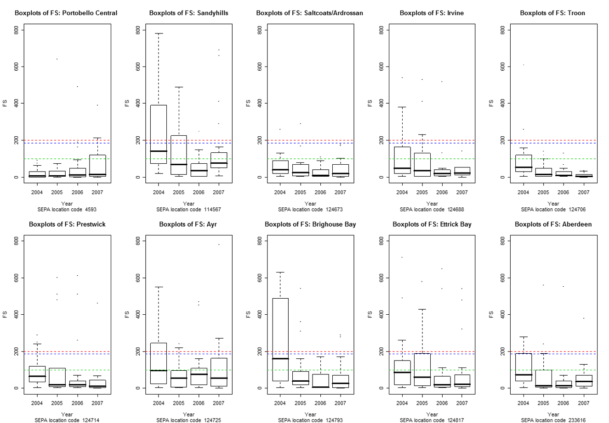

```{r}
#| echo: false
#| warning: false
#| message: false

library(webexercises) 
```

# Overview

**Environmental and Ecological Statistics** is an incredibly broad term covering any form of statistics applied to environmental and ecological issues. Key themes include climate change, environmental regulation (e.g. water and air quality) and biodiversity monitoring. This course focuses on this theme rather than a particular type of statistical methodology. We will look at a variety of statistical methods, some of which you will know, and some which will be new.

Environmental and Ecological problems are complex. Complex questions must be answered with data, but environmental and ecological data are difficult and expensive to collect and gather. For example, we might be interested in understanding if precipitation will change in the next 100 years, an if so how? We might also be interested in mapping the soil nutrients or determining the air/soil/water pollution levels. We might be asked about the population size of elephants in a given region and what environmental conditions makes them thrive or assessing if a specific bird meets the criteria for an endangered species. Answering these questions takes a whole plethora of skills ranging from extreme value analysis, surveying and sampling, spatial and spatiotemporal modelling, remote sensing analysis, animal movement model, point-process models, detection methods, etc.

Very often we will be working together in multidisciplinary teams to answer these big questions. Environmental & Ecological statistician focuses then on extracting meaningful information from the data and convey this with subject experts and policy makers.

::: {.callout-note icon="false"}
##  BBC News article on climate change

On 14th January 2020, BBC News published an article titled "Climate change: Where we are in seven charts and what you can do to help". You can read this by clicking the link below:

<https://www.bbc.co.uk/news/science-environment-46384067>

Please read the BBC News article linked to above, and consider critically how the information is presented. Specifically, what are the good and bad aspects of the graphs in the article? Does the article make you think about climate change any differently?
:::

## Where's the statistics?

We are interested in measuring, sampling or monitoring environmental and ecological data, including variation and uncertainty. This includes detecting and modelling environmental trends, including trends in time and space, modelling and understanding extreme data. We also wish to evaluate environmental regulation and policy, and risk assessment.

We want to understand changes in the environment, in either time, space or both. Are things getting better or worse? Where, when and by how much? What is going to happen next? Where do authorities need to take action, and how can we check if existing actions are working? Also, we should consider relationships between environmental variables (and other variables where necessary).

In general, there are no techniques that are unique to environmental statistics. However, the data used tend to be characterised by strong spatial and temporal elements, and often also high variability.

Our skills in presenting and communicating data are also crucial. We need to be able to explain our findings to the public and show them why our work is important. Below is an example of reporting of a winter storm in 2023, which makes use of plots to tell the story.

::: {.callout-note icon="false"}
##  The Courier article on Storm Babet

On 20th October 2023, The Courier published an article titled "Storm Babet: Timeline of devastating rainfall in charts and maps". This contains some interesting examples of the use of plots to tell a developing environmental story. You can read this by clicking the link below:

<https://www.thecourier.co.uk/fp/news/4788874/storm-babet-timeline-of-devastating-rainfall-in-charts-and-maps/>

Please read the Courier article on Storm Babet linked to above and think about the way that the information is presented.
:::


We will illustrate this with an example relating to air quality. Only **one person in ten** lives in a city that complies with the World Health Organisation Air quality guidelines.

Fine particular matter was associated with an estimated 2,000 premature deaths and 22,500 lost life years in Scotland in 2010. There are 38 "Air Quality Management Areas" (AQMAs) which breach or are likely to breach legal limits. The Cleaner Air for Scotland strategy seeks to reduce air pollution across Scotland. It aims to achieve the "ambitious vision for Scotland to have the best air quality in Europe".

There are 99 air quality monitoring stations in Scotland capturing PM$_{2.5}$, PM$_{10}$, NO$_2$, NO$_\text{X}$, SO$_2$ and O$_3$. The map below shows the placement of the monitors. Live data are available at [Scottish Air Quality](http://www.scottishairquality.scot/).

{fig-align="center" width="276"}

The data from these monitors can be used to estimate the pollution levels across Scotland.

{fig-align="center" width="270"}


::: {.callout-tip icon="false"}
##  Question

The example above shows a map of estimated PM$_{10}$ levels across Scotland. What information do we not have, which we would normally expect to see here?

`r hide("Solution")`

The main thing missing here is the lack of uncertainty information. It seems that most of the monitoring stations are in the Central Belt of Scotland (where most of the pollution might be expected), so we'd expect to see lower uncertainty there than in areas further from a monitoring station.

We might also like to know more about the temporal aspects of the data. Is the prediction map for the same time that the data were collected, or do frequencies of collection vary across the monitoring stations?

Also, are these predictions just from the station data, or do we have other sources that are combined with these? (For at least some variables, we might have satellite data available that provide us with measurements across a fine spatial grid, which we can combine with monitoring station data through "data fusion".) In any case, we'd like to know how these predictions are made.

You may have thought of some other ideas too. We can discuss these in the lectures.

`r unhide()`
:::


# Data Sources

## Ecological and Environmental Data sources

Over the last decade, the information available for surveying and monitoring ecological and environmental resources has changed radically. The rise of new technologies, novel collection methods, and modern data-submission platforms have facilitated the access to large volumes of environmental and ecological data.

::: {.content-visible when-format="html"}
For example, @fig-nbn_records show the increasing trend in the number of NBN trust biodiversity records that have become available over the past 20 years.

{#fig-nbn_records fig-align="center" width="574"}
:::

Today's ecological and environmental data landscape is overwhelmingly vast - far too extensive to cover comprehensively in one session! Instead, we'll focus on key data sources and digital technologies that are currently shaping policy decisions, enabling scientific breakthroughs, and driving innovation in research.

[](https://www.youtube.com/watch?v=7MywGLpOBWs)

<!--  -->

## Institutional Monitoring Programmes

Institutional Monitoring programmes have long been a primary source of information for long-term environmental assessment, producing **structured datasets** essential for detecting ecological change and informing evidence-based policy.

These initiatives rely *field surveys* conducted on established *monitoring networks* to track trends in species populations, habitat quality, and ecosystem processes - a topic we will explore in detail in the following session. Their strength lies in rigorous implementation of *standardized sampling protocols*, which reduces the observational errors associated with data collection methods. However, these are typically constrained by other factors. For example, large-scale programmes are inherently resource-intensive to maintain and often limited in taxonomic scope (typically focusing on key species), spatial/geographic coverage, and temporal resolution. Some popular monitoring schemes are shown below:

| Monitoring Scheme | Description |
|------------------------------------|------------------------------------|
| United Kingdom Butterfly Monitoring Scheme ([UKBMS](https://ukbms.org/)) | Protocolized sampling scheme run by butterfly conservation that has monitored changes in the abundance of butterflies throughout the United Kingdom since 1976. |
| UK Environmental Change Network ([ECN](https://ecn.ac.uk/)) | UK's long-term ecosystem monitoring and research programme that has produced a large collection of publicly available data sets including meteorological, biogeochemistry and biological data for different taxonomic groups [@rennie2020]. |
| National Hydrological Monitoring Programme ([NHMP](https://nrfa.ceh.ac.uk/nhmp)) | The NHMP, particulalry the National River Flow Archive conveys a national scale management of hydrological data within the UK hosted by the UKCEH since 1982 collating hydrometric data from gauging station networks operated by multiple agencies. |
| Natural Capital and Ecosystem Assessment ([NCEA](https://environment.data.gov.uk/natural-capital-ecosystem-assessment/about)) | Long-term environmental monitoring of natural capital including data from freshwater Surveillance Networks, ecosystem condition & soil health, forest inventory, estuary and coast surveillance, etc. |
| Breeding Bird Survey ([BBS](https://www.bto.org/)) | Main scheme for monitoring the population changes of the UK's common breeding birds. It covers all habitat types and monitors 110 common and widespread breeding birds using a randomised site selection. |

## Citizen Science Programmes & Platforms

Citizen science (CS) monitoring involve public participation to collect large volumes of ecological & environmental data at a low cost across broad spatiotemporal scales.

Data submission platforms like iNaturalist and eBird have become an important groundwork for citizen scientist to submit records and generate vast, real-time datasets, enabling researchers to track species distributions, phenology, and ecosystem responses to environmental change in ways that were previously logistically and financially unfeasible.

Despite this, the analysis of such data remains challenging as there is little o no design involved in the sampling protocols of most CS data recording schemes. A major issue with the lack of a standardized sampling protocol is that sampling efforts tend to be uneven over time and space and biased towards human activity centers, locations that are easy to access, or sites where species are more likely to be found such as protected area. If unaccounted for, such sources of bias can mislead @fig-sampling_effort (left) shows the sampling effort based on CS records submitted through the Pl\@anet Net App in the French mediterranean region. If we compare the spatial effort against the elevation of the region we can clearly see that a *sampling bias* towards lower elevation values. This would imply that small populations at lower elevation could be over-sampled and if we had worngly assumed sampling was evenly distributed, then species distributions at higher elevation would be under-estimated.

{#fig-sampling_effort fig-align="center"}

Harnessing the power of CS data is not an easy task.

| Advantages 😄👍 | Disadvantages 😔👎 |
|------------------------------------|------------------------------------|
| Extensive taxonomic, spatial and temporal coverage. | Under-reporting of rare and inconspicuous species. |
| Eye-catching species that are easily identifiable by participants. | Varying recording skills and uneven sampling effort. |

## Biological Collections

Biological collections constitute probably the oldest form of historical data reservoirs. For over 300 years, naturalists have been collecting and preserving biological specimens, initially for personal curiosity and public display. Today, their value has expanded far beyond their original purpose; they are now recognized as critical sources of information for addressing modern global challenges like biodiversity loss and climate change. Now housed mostly in **museums** and **herbaria** throughout the world, these biological collections, and their associated systematic research, provided the basis for much biological research.

For instance, the Natural History Museum in London safeguards a collection of over 80 million specimens, spanning 4.5 billion years of Earth's history to the present. This unparalleled archive, along with many others, is increasingly accessible through digital [data portals](https://data.nhm.ac.uk/?_gl=1*xkk*_ga*NDE2OTQ4MTI2LjE3NTU2MjI5ODY.*_ga_PYMKGK73C4*czE3NTU2MjI5ODYkbzEkZzEkdDE3NTU2MjI5OTQkajUyJGwwJGgw), enabling researchers worldwide to analyse historical trends and understand the distribution of biodiversity and geodiversity through time.

Despite their immense value, biological collections data are subject to significant limitations and biases that need bo considered.

-   Most historic collection were obtained in an opportunistic manner without following any particular sampling protocol (largely dependent on the particular interests of the collector).

-   Often there is no information about the collection methods or effort employed.

-   Limited in the geographic coverage and typically biased near centres of human activity and along the roads or during specific seasons.

-   The information associated with each collection or specimen (e.g., species, sex, collection date, location, collector's name, morphological measurements, habitat description) may vary widely which limits the environmental context and ecological questions that can be addressed.

-   Strongly biased towards specific taxonomic groups, especially birds and mammals


::: {.callout-warning icon="false"}
##  Exercise

Read the paper by @pyke2010 and discuss three scenarios where biological collections have been used to address different environmental issues and ecological questions.


:::

## Data Repositories & Portals

Data repositories have become a major sources of information for modern environmental and ecological research, serving as centralized, curated platforms that aggregate, preserve, and disseminate vast quantities of data from diverse sources.

These digital archives - ranging from global biodiversity databases like the Global Biodiversity Information Facility (GBIF) to thematic collections such as the National Biodiversity Network (NBN) Atlas - standardize and harmonize heterogeneous datasets, enabling researchers to access, share, and reuse data across disciplines and geographic boundaries. Often, these repositories are integrated into comprehensive **data portals** that host interactive visualisaion tools, web-based applications, programming interfaces (APIs) and data catalogues, transforming static archives into dynamic platforms for exploration and discovery (see e.g. UK-SCAPE [plant diversity trends](#0) and [Grasshoppers and Allied Species Recording Scheme](#0)).

::: {.callout-warning icon="false"}
##  Exercise 

Select two or three of the following data repositories. For each, examine some of the available datasets and list the types of uncertainty or error that might affect the data quality and reliability.

| Data Repository | Description |
|------------------------------------|------------------------------------|
| [Move Bank](https://www.movebank.org/cms/movebank-main) | Movebank is a global, open-data repository and research platform that specializes in managing, sharing, and analyzing **animal tracking** and bio-logging data. |
| Global Biodiversity Information Facility ([GBIF](https://www.gbif.org/)) | GBIF is an international open-data infrastructure that provides free and universal access to over two billion **species occurrence records** from a vast network of museums, research institutions, and citizen science platforms worldwide. |
| National Biodiversity Network ([NBN](https://nbnatlas.org/)) | The NBN Atlas is the UK's largest repository of publicly available biodiversity data, aggregating and providing open access to millions of **species records** from a wide range of recording societies, conservation NGOs, and research institutions across the country. |
| Biological Records Centre ([BRC](https://www.brc.ac.uk/)) | The Biological Records Centre (BRC) is a national UK facility that supports and coordinates a network of volunteer recording schemes and societies to collect, manage, and disseminate high-quality data on terrestrial and freshwater **species distributions**. |
| National River Flow Archive ([NRFA](https://nrfa.ceh.ac.uk/)) | The National River Flow Archive (NRFA) is ta hydrometric data repository hosted by the CEH, curating and providing open access to river flow, groundwater level, and rainfall time-series from a national network of monitoring stations. |
| [UK Lakes Portal](https://ukwrp.ceh.ac.uk/) | The UK Lakes Portal is a comprehensive data hub that provides access to physical, chemical, and biological monitoring data for lakes and reservoirs across the United Kingdom |
| World Ocean Database ([WOD](https://www.ncei.noaa.gov/products/world-ocean-database)) | The World Ocean Database (WOD) is the world's largest publicly available, quality-controlled repository of uniformly formatted oceanographic profile and plankton data, spanning centuries of global marine observations. |
| [UK Water Resources Portal](https://ukwrp.ceh.ac.uk/?_gl=1*1r52k3b*_ga*NDI3MDQzMjc2LjE3NTQ2NjE1MzE.*_ga_27CMQ4NHKV*czE3NTU2MDk2NjgkbzUkZzEkdDE3NTU2MDk5MzIkajYwJGwwJGgw) | The UK Water Resources Portal is an interactive online platform that provides access to current and historical data on water availability, including river flows, groundwater levels, rainfall, and reservoir stocks. |
| Water quality data archive ([WIMS](https://environment.data.gov.uk/water-quality/view/landing)) | The Water Quality Archive provides data on water quality measurements. Samples are taken at sampling points around England and can be from coastal or estuarine waters, rivers, lakes, ponds, canals or groundwaters. |
| [Ecology & Fish Data Explorer](https://environment.data.gov.uk/ecology/explorer/) | This is an online data portal that provides access to ecological monitoring data for English rivers and lakes, including fish populations, invertebrate surveys, and plant communities. |
| Knowledge Network for Biocomplexity ([KNB](https://knb.ecoinformatics.org/)) | The Knowledge Network for Biocomplexity (KNB) is an open-source data repository that enables the discovery, management, sharing, and synthesis of complex, heterogeneous ecological and environmental datasets. |
:::

## Processed information products

Processed information products transform raw measurements into refined, analysis-ready resources tailored for decision-makers and researchers. Unlike primary data repositories, these products undergo rigorous calibration, integration, and modelling to generate authoritative maps, indicators, and synthesized datasets.


::: {.callout-note icon="false"}
##  Example: WorldClim

[WorldClim](https://www.worldclim.org/) is a widely used set of global, high-resolution climate surfaces (raster maps) that provide interpolated estimates of historical and future projections (using global climate models [CMIP](https://wcrp-cmip.org/cmip-phases/cmip6/) ) of temperature, precipitation, and other bioclimatic variables. The historical data layers are generated by applying advanced spatial interpolation algorithms to an extensive global network of weather station records, creating continuous, gap-free rasters. These surfaces serve as the foundational data for species distribution modeling, ecological forecasting, and a vast range of other environmental research applications.

{fig-align="center" width="450"}
:::

Nowadays, it is common that contemporary data products are synthesized based on a combination of multiple data sources, including field surveys, citizen science and advanced **remote sensing** data from satellite and aerial platforms.

### Remote sensing

Remote sensing refer the process of obtaining information of an object from a distance, typically from aircraft or satellites. Recent advances in bioinformatics, GIS technologies and remote sensing techniques have changed radically how we monitor the Earth's environment at multiple spatial and temporal scales. These technologies enables the systematic, non-invasive, and often near-real-time collection of data across vast and inaccessible regions. The resulting data are then calibrated, classified, and modeled using specialized algorithms to generate diverse information products, such as land cover classifications, vegetation indices, and digital elevation models.

While remote sensing-based products enable the quantification of ecological and environmental parameters across extensive geographic scales, they are often subject to substantial uncertainties. These include systematic errors from sensor calibration, spatial and temporal resolution constraints, and generally lower accuracy compared to direct *in-situ* field measurements. Consequently, remote sensing data are often validated using data collected *in-situ* to assess and ensure their accuracy. 

::: {.callout-note icon="false"}
##  Example: WorldClim Example: Digital Elevation Models

Digital Elevation Models (DEMs) are digital representations of the earth's topographic surface. DEMs providing a continuous and quantitative model of terrain morphology and are typically stored as a raster grid where each cell (pixel) contains an elevation value. The accuracy of DEMs is determined primarily by the resolution of the model (the size of the area represented by each individual grid cell). For example, the

Shuttle RaDAR Topography Mission (SRTM), aquired by NASA using a Synthetic Aperture Radar (SAR) instrument, provide elevation data for any country and is available from the `geodata` R package.

{fig-align="center" width="262"}
:::

::: {.callout-note icon="false"}
##  Example: Land Cover Maps

Land cover maps describe the physical material on the Earth's surface. They are created by applying automated algorithms to satellite or aerial imagery to identify features such as grassland, woodland, rivers & lakes or man-made structures such as roads and buildings.

For example, UK CEH has produced a series of [Land Cover Maps](https://www.ceh.ac.uk/data/ukceh-land-cover-maps) which are a series of spatially continuous, raster-based classification products, derived from the automated analysis of Earth observation data (primarily from the Sentinel-2 satellite constellation), which provide consistent, national-scale representations of surface vegetation and land use classes.

{fig-align="center" width="273"}

Other widely used global products include MODIS Land Cover, which offers a long-term, coarse-resolution record of global change since 2001, and ESA WorldCover, which provides a high-resolution (10m) global snapshot designed for detailed thematic mapping (the later is available on the `geodata` R package).
:::

::: {.callout-note icon="false"}
##  Example: NDVI Vegetation Index

Vegetation indeces derived from remote sensing utilize spectral data from satellite or aerial sensors to quantify and monitor plant health, structure, and function across landscapes. These indeces are founded on the principle that vegetation absorbs red light (around 660 nm) for photosynthesis while highly reflecting near-infrared (NIR) light (around 800 nm) due to its internal leaf structure.

This contrast is captured by the Normalized Difference Vegetation Index (NDVI), which is calculated as

$$
NDVI = \dfrac{(NIR- Red)}{(NIR - Red)}
$$

The resulting value, which ranges from -1 to +1, provides a standardized measure of greenness; values close to +1 indicate dense, healthy vegetation, values near 0 represent bare soil, and negative values typically correspond to water. By translating raw spectral data into this simple yet robust index, remote sensing enables the tracking of phenological cycles, the assessment of drought stress, and the estimation of primary productivity on a global scale.

{fig-align="center" width="370"}
:::

## Research-Generated Data

Research-generated data repositories, such as [Dryad](https://datadryad.org/about) and [Zenodo](https://zenodo.org/), are cornerstone platforms in the modern scientific workflow, explicitly designed to uphold the principles of transparency, reproducibility, and open data access. Unlike passive archives, these repositories require researchers to actively deposit the precise datasets, code, and scripts used to generate the results published in peer-reviewed journals. By assigning persistent digital object identifiers (DOIs) to these materials, they create a permanent, citable record that allows other scientists to independently verify, replicate, and build upon published findings. This process is fundamental to detecting errors, reducing redundancy, and accelerating scientific discovery, effectively transforming a single study's output into a reusable resource for the entire research community and safeguarding the integrity of the scientific record.

::: {.callout-warning icon="false"}
##  Exercise 

1.  **Choose a Repository:** Select either [Dryad](https://datadryad.org/about) or [Zenodo](https://zenodo.org/).
2.  **Find a Dataset:** Browse or search for a dataset related to a topic in environmental science or ecology that interests you (e.g., "pollination," "microplastics," "forest fragmentation," "climate change adaptation").
3.  **Select and Record:** Choose one specific dataset and note down:
    -   The full citation for the dataset (including its DOI).

    -   The title of the associated publication (if provided).

How did you find this dataset? Was the search intuitive? Is the dataset openly available? Could you download the files without restrictions?
:::

Note that there are no datasets that gives us the truth directly. That is exactly why we need to be precise about error, uncertainty, and inference — which is where we go next.


# Inference & uncertainty quantification

We often talk about uncertainty and error as though they are interchangeable, but this is not quite correct.

-   **Error** is the difference between the measured value and the 'true value' of the thing being measured.
-   **Uncertainty** is a quantification of the variability of the measurement result.


## Statistical distributions

Practically speaking, we make use of common statistical distributions to account for uncertainty. These include both continuous and discrete distributions.

### Continuous distributions

-   *Normal*: perhaps the most commonly used distribution in statistics. $X \sim N(\mu, \sigma^2)$.
-   *log-Normal*: a random variable $X$ follows a log normal distribution if $\log (x) \sim N(\mu, \sigma^2)$
-   *Exponential*: distribution of the time ($\lambda$) between events. $X \sim Exp(\lambda)$.

### Discrete distributions

-   *Poisson*: distribution of the probability of observing a specific count ($\theta$) within a particular time period. $X \sim Po(\theta)$.
-   *Binomial*: distribution of the number of successes in $n$ independent trials where $\theta$ is the probability of success. $X \sim Bi(n, \theta)$.
-   *Negative binomial*: distribution of the number of trials until the $k$th success is observed. $X \sim NeBi(k, \theta)$.


**Example: Bathing water quality**

All bathing water sites in Scotland are classified by SEPA as "Excellent", "Good", "Sufficient" or "Poor" in terms of how much fecal bacteria (from sewage) they contain. The minimum standard all beaches or bathing water must meet is "Sufficient". The sites are classified based on the 90th and 95th percentiles of samples taken over the four most recent bathing seasons.

The figure below shows the data from some selected sites.

{fig-align="center"}

The classification is based on a belief that the samples at each site follow a log-normal distribution. If this assumption does not hold, then our classifications would not be accurate. Therefore, it is crucial that we regularly assess this assumption to ensure the safety of our bathing water. We can use our standard plots to assess log-normality. In the figure below, the top plots are produced using the untransformed data and the bottom plots are produced after taking a logarithmic transformation of the data (FS).

{width="500"} {width="500"}\


::: {.callout-tip icon="false"}
##  Question

Can we assume that the samples at each site follow a log-normal distribution? `r mcq(c(answer="Yes", "No"))`

`r hide("Solution")`

Yes, we can assume that the samples at each site follow a log-normal distribution. From the plots, there is no strong evidence to suggest we have breached our assumptions. Specifically, the histogram of log$_{10}$(FS) shows that the distribution is not far from a bell shape, and the points on the Normal Q-Q plot lie close to the line of equality.

`r unhide()`
:::

# Quantifying uncertainty

When we estimate something from data, e.g., a mean concentration, number of animals in an area, extreme pollution levels, we are using a sample from the whole population. A different sample would have given a slightly different answer, so every estimate carries uncertainty, and an estimate reported without it is only half a result. 

How well an estimator $\hat\theta$ does its job — whether it is on target on average (its **bias**) and how tightly its values cluster from sample to sample
(its **variance**, or **precision**) — is developed in the [supplementary material](supl_1.qmd). Here we take those ideas as given and focus
on the practical questions: how do we *summarise* the uncertainty in an estimate, and how do we *interpret* the interval we report?


## Standard uncertainty and expanded uncertainty

A common convention is to summarise uncertainty as a **standard uncertainty**, reported alongside the estimate as: 

$$\text{estimated value } \pm \text{ standard uncertainty}$$

For a vector $\mathbf{x}$ of length $n$, the standard uncertainty for  the mean ($u(\bar{\mathbf{x}})$) is the standard deviation **of the mean** (i.e., the standard error), computed as follows: 

$$u(\bar{\mathbf{x}}) = \frac{sd(\mathbf{x})}{\sqrt{(n)}}$$


If $\mathbf{x}$  is a representative sample of the population, then $u(\bar{\mathbf{x}})$ will tell us the uncertainty associated with the population mean. 


More generally we can use an **expanded uncertainty**, which is obtained by multiplying the standard uncertainty by a factor $k$. You have already seen this as the key building block of a confidence interval. The value of $k$ is chosen based on the quantiles of a standard normal distribution, with a value of $k=1.96$ (or $k=2$) giving a 95% confidence interval:

$$
\bar{\mathbf{x}} \;\pm\; 1.96 \times u(\bar{\mathbf{x}}).
$$
Notice that this construction is not special to the sample mean. In large samples most estimators are approximately Normally distributed around the true value (see [supplementary material](supl_1.qmd)), each with its own standard error $\text{se}(\hat\theta)$. Whenever that holds, an approximate 95% interval (a.k.a. Wald interval) is

$$
\hat\theta \;\pm\; 1.96 \times \text{se}(\hat\theta),
$$


:::{.note}
The Normal quantile is a large-sample justification. For small $n$ the appropriate factor comes from a $t$-distribution with the relevant degrees of
freedom, which is wider, a point worth remembering when only a handful of measurements are available. 
:::


::: {.callout-warning icon="false"}
##  Exercise: Confidence Intervals

In the following exercises, we will calculate the standard uncertainty and a 95% confidence interval for the mean of log(FS).


(a) We have 80 measurements of log(FS), with a mean of **3.861** and a standard deviation of **1.427**. Use these to calculate the standard uncertainty of the population mean log(FS) using our vector $\textbf{x}$.

*Answer (to 3 decimal places):* `r fitb(answer = "0.160")`

`r hide("Solution")`

$$u = \frac{sd(\mathbf{x})}{\sqrt{(n)}} = \frac{1.427}{\sqrt{80}} = 0.160$$

`r unhide()`

(b) Given the standard uncertainty that calculated in part (a), calculate a 95% confidence interval for the population mean of log(FS).

*Answer (to 3 decimal places):* (`r fitb(answer = "3.574")`,`r fitb(answer = "4.175")`)

`r hide("Solution")`

A 95% confidence interval for $\bar{x}$ is: $$\bar{x} \pm 1.96 \times u = 3.861 \pm 1.96 \times 0.160 = (3.574, 4.175)$$

`r unhide()`
:::


It is tempting to read the 95% interval above as *"there is a 95% probability that the true mean lies between these limits."* In the classical
framework, this is **not** what it means. There, the true value is a fixed (if unknown) constant, and the 95% refers to the long-run behaviour of the *procedure*: if we repeated the sampling many times and built an interval each time, about 95% of those intervals would contain the truth.

The probability statement we usually *want*, "given the data I have, how probable is it that the true value lies in this range?" — is one the classical
framework cannot make directly, because it does not treat the unknown as random. The **Bayesian** framework does, and answers exactly that question.

::: {.callout-warning icon="false"}
##   Excercise: Bayes theorem

Bayes' theorem stated that for two events $A$ and $B$, writing the joint probability two ways gives

$$
\Pr(A \cap B) = \Pr(A \mid B)\,\Pr(B),
\qquad
\Pr(B \mid A) = \frac{\Pr(A \cap B)}{\Pr(A)},
$$

and substituting the first into the second yields

$$
\Pr(B \mid A) = \frac{\Pr(A \mid B)\,\Pr(B)}{\Pr(A)} .
$$
Before the experiment we hold some belief about $B$, expressed by $\Pr(B)$ (the *prior*). The experiment delivers $\Pr(A \mid B)$, how probable the observation $A$ is if $B$ holds. Combining them gives the *updated* belief $\Pr(B \mid A)$ (the *posterior*). The denominator $\Pr(A)$ is fixed by the **law of total probability**: summing the ways $A$ can arise across a mutually exclusive, exhaustive set of events $B_i$:

$$
\Pr(A) = \sum_{i} \Pr(A \mid B_i)\,\Pr(B_i).
$$

Suppose you are diagnose positive to a rare disease that affect only a small fraction  of the population, i.e., $\Pr(\text{Disease})=0.0015$. The diagnostic test you used has 95% sensitivity (i.e., $\Pr(\text{test}+ \mid \text{has Disease}) = 0.95$) and 98% specificity (i.e., $\Pr(\text{test}- \mid \text{no Disease}) = 0.98$). Using Bayes theorem, calculate  the probability that you actually have the disease given the result of the test is positive?


`r hide("Solution")`

Likelihoods

-   $\Pr(\text{test}+|\text{Disease} ) = 0.95$

-   $\Pr( \text{test}- | ~\text{No Disease}) = 0.98  \rightarrow P(\text{test}+|~ \text{No Disease}) = 0.02$

Prior

- $\Pr(\text{Disease}) = 0.0015$

Posterior

- $\Pr(\text{Disease}\mid \text{test}+) = \dfrac{\Pr(\text{test}+\mid \text{Disease} ) \times \Pr(\text{Disease})}{\Pr(\text{test}+)}$

We use the **Law of total probability** to compute $\Pr(\text{test}+)$ , i.e. the probability that the test is Positive in any situation, not just when the disease is present:

$$
\begin{aligned}
\Pr(\text{test}+) &= \underbrace{\overbrace{\Pr(\text{test}+|\text{Disease})}^{sensitivity}\times\overbrace{\Pr(\text{Disease})}^{prevalence}}_{\text{True positives}} + \underbrace{\overbrace{\Pr(\text{test}+|\text{no Disease})}^{1-specificity}\times\overbrace{1-\Pr(\text{Disease})}^{1-prevalence}}_{\text{True Negatives}}\\
&=0.95 \times 0.0015 + 0.02 \times 0.9985 
\end{aligned}
$$

Then, the probability of having the disease given the result of the test is positive is:

$$
\Pr(A \mid \text{test}+) =
\frac{0.95 \times 0.0015}
{0.95 \times 0.0015 + 0.02 \times 0.9985} \approx 0.067 .
$$

A common frequentist-style interpretation would be *"The test is 99% accurate, so there is a 99% chance I have the disease."*. However, as you can see and despite an excellent test, only about **7%** of positives are true positives — because the prior (the base rate) is so low.


`r unhide()`

:::


## Bayesian Inference

In the Bayesian framework, every unknown quantity in the model is treated as a random variable. The goal is to estimate the **joint posterior distribution**
of the unknown parameters $\theta$ given the observed data $\mathbf{y}$. This posterior is obtained through **Bayes' theorem**:

$$
\pi(\theta \mid \mathbf{y}) = \frac{\pi(\mathbf{y} \mid \theta)\pi(\theta)}{\pi(\mathbf{y})}
$$

The three ingredients are:

- $\pi(\mathbf{y} \mid \theta)$ — the **likelihood**, the information the data carry about $\theta$;
- $\pi(\theta)$ — the **prior**, what we believe about $\theta$ *before*  seeing the data;
- $\pi(\mathbf{y})$ — the **marginal likelihood**, a normalising constant that rescales the numerator into a proper probability distribution.

The marginal likelihood is itself obtained by integrating the numerator — the joint distribution $\pi(\mathbf{y} \mid \theta)\,\pi(\theta)$ — over every
possible value of $\theta$:


$$
\pi(\mathbf{y}) = \int_{\Theta} \pi(\mathbf{y} \mid \theta)\,\pi(\theta)\, d\theta.
$$

In words, we *average the data's plausibility over all settings of the parameters*, weighting each by how plausible that setting was a priori. Because
$\pi(\mathbf{y})$ does not depend on $\theta$, Bayes' theorem is often written in the proportional form $\pi(\theta \mid \mathbf{y})  \propto \pi(\mathbf{y} \mid \theta)\,\pi(\theta),$ here you can see clearly how the posterior combines what the data say (likelihood) with what we already knew (prior).


When the posterior distribution lacks a closed-form solution, **computational methods** must be used to approximate it.  Note that this is not a Bayesian course as we won’t go over the computational/implementation details in depth. Instead, We will adopt Bayesian framework as our inferential tool when needed. However, you are encouraged to read [the supplementary material](Bayesian_computing.qmd) to familiarized yourself with some of the Bayesian computational methods that we will use throughout the course.

::: {.callout-note}
## Credible vs. confidence intervals

A 95% *credible* interval has the interpretation the *confidence* interval could not: given the prior and the observed data, there is a 95% posterior
probability that the parameter lies within it. The parameter is treated as random and the interval is fixed by the data.
:::

## References {.unnumbered}

Some general reference books that you may find useful include the following:

-   Piegorsch, W. W., & Bailer, A. J. (2005). *Analyzing environmental data*. Wiley. (Available from the University Library as an e-book [here](https://go.exlibris.link/6wbh6zq0).)
-   Barnett, V. (2004). *Environmental statistics: Methods and applications*. Wiley. (Available from the University Library as an e-book [here](https://go.exlibris.link/TbMBCTkV).)
-   Manly, B. F. J. (2001). *Statistics for environmental science and management*. Chapman & Hall/CRC. (No e-book available, but [a physical copy is available from the University Library](https://go.exlibris.link/Jcyj94mj).)
