```{r}
#| echo: false
#| message: false
#| warning: false

library(webexercises)

```


## Understanding uncertainty

Understanding and measuring quantities is a fundamental part of all science, not just statistics. As scientists, we use data to understand the process which we are investigating. These data have two main sources of uncertainty or error:

-   **Inherent variability** of the process itself (the thing we are measuring is variable).
-   **Imprecise knowledge** of the process (our measurements may not be accurate).

The plots below illustrate the trends in several climate change measures. Both sources of variability will be present, but how much of each?

{width="500"} 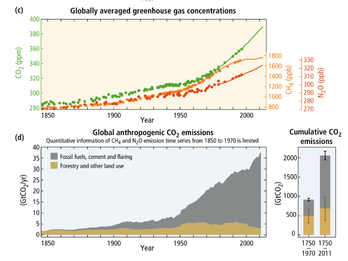{width="500" fig-align="center"}

A big part of our role as statisticians is to ask questions of both our data and our models. How were our data collected? Are they representative of the population? How much uncertainty do we have? Are our models valid? Are the assumptions reasonable? Does the model make sensible predictions? How much uncertainty do we have in our results? These skills are particularly crucial in applied areas such as environmental and ecological statistics.

::: {.callout-note icon="false"}
##  Example: Arctic sea ice cover

Submarines have been used to measure Arctic sea ice. Over time, the ice has shrunk both in terms of thickness and extent. We may soon see ice-free summers, which will have a devastating impact on sea life.

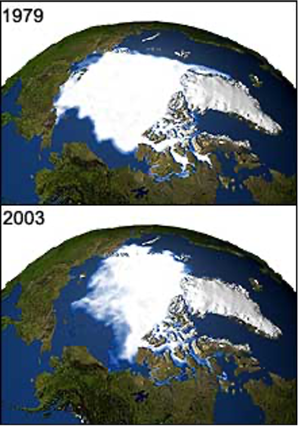{width="200" fig-align="center"}

This [interactive map](https://interactive.carbonbrief.org/when-will-the-arctic-see-its-first-ice-free-summer/) provides an illustration of the changes.
:::

::: {.callout-tip icon="false"}
##  Question

How might we quantify the trend in Arctic sea ice cover, and what problems might we encounter in aiming to do this?

`r hide("Solution")`

We might want to present this as a graph of total estimated sea ice cover over time, across many years. Some problems with this approach could be data availability over time (satellites or submarines not covering the whole area, or only at certain timepoints, and lack of data in earlier years), and the difficulty in estimating coverage at any timepoint from these measurements --- statistical approaches would be vital to estimate this and the associated uncertainty.

Note that the use of before and after images (like in the above example) might not be thought of as the best idea in statistics (since they could be misused, with particular years cherry-picked to back up an incorrect claim), but such images can be useful in illustrating a trend to the general public, as long as this is also presented with additional complete information about the general patterns.

`r unhide()`
:::


## Random and Systematic Errors

The observational **error** in a measurement is a single result, namely the difference between the measured and the true value. The error may include both a random and a systematic component.

**Random error** is variation that is observed randomly over a set of repeat measurements. As you make more measurements, these errors tend to average out and your estimates will improve in accuracy.

**Systematic error** is variation that remains constant over repeated measures. This is typically due to some feature of the measurement process. Making more measurements will not improve accuracy, since all new measurements will be affected in the same way. Systematic error can only be eliminated by identifying the cause of the error.

{fig-align="center" width="538"}

::: {.callout-tip icon="false"}
##  Question

For each of the examples below, consider whether the error is **random** or **systematic**.

-   A meter reads 0.01 even when measuring no sample. `r mcq(c("random", answer="systematic"))`
-   An old thermometer can only measure the temperature to the nearest 0.5 degrees. (e.g., 23.5 $^\circ$C becomes 23 $^\circ$C or 24 $^\circ$C) `r mcq(c(answer="random", "systematic"))`
-   A poorly designed rainfall monitor often leaks water on windy days. `r mcq(c("random", answer="systematic"))`
-   You are asked to measure the volume of an ice cube in a warm laboratory. `r mcq(c("random", answer="systematic"))`
-   To estimate the abundance of a fish species in a lake, scientists use a net with a mesh size equal to the average fish length. `r mcq(c("random", answer="systematic"))`
:::


## Measuring the quality of measurement


We often talk about the quality of a measurement process (or an associated estimate) in terms of accuracy, bias and precision.


The term **Bias** can refer to multiple aspects about the quality of a measurement/estimation.


-   *Measurement bias*: is the difference between the *average* of a series of measurements and the true value - mainly due to faulty measuring devices of procedures (systematic error).

-   *Sampling bias*: Under-representative sample of the target population (systematic error).

-   *Estimation bias*: Relates to the property of an estimator, i.e., $E(\hat{\theta})-\theta = 0$, for unbiased estimators, the bias (random error) decreases with increased sampling effort (See [supplementary material](supl_1.qdm) for more details).


Another important quantity is the **Precision**. Which is the closeness of agreement between independent measurements. Note that the precision does **NOT** relate to the true value.


Lastly, the **accuracy** of a measurementis the overall *distance* between the estimated (or observed) values and the **true** value. Note that there are several definition of what this *distance* mean some of which include the precision.


{fig-align="center"}


# The challenge of Environmental and Ecological data


Environmental and Ecological systems are inherently complex due to the large number of interrelated biological, physical, and social components. This complexity arises stochastic processes that operate across vastly different spatial and temporal scales. Adding to this complexity, analyzing these systems becomes a challenging task due to the heterogeneity of available data and the different sources of uncertainty that impact the quality of the data. Data collection methods vary widely and spatial and temporal sampling schemes may be too sparse to fully capture overall system behavior. Consequently, we often have to deal with issues such as outliers, missing values, and highly uncertain information.

Fortunately, many of these data quality issues can be addressed. This is typically done through a rigorous data *pre-processing* phase before formal analysis, and through statistical models that explicitly account for the observational process of how the data was collected.

Data pre-processing is crucial stage in any sort of ecological or environmental data analysis and it includes data cleaning, outlier detection, missing value treatment, handling censored data, transformation, and the creation of new derived variables. The goal is to create a robust, consistent dataset ready for analysis while carefully documenting all changes to preserve the integrity of the original information.

## Censored Data

**Censored data** are data where we are restricted in our knowledge about them in some way or other. Often this will be because we only know that the data value lies below a certain minimum value (or above a certain maximum). For example, if we had scales which only weighed up to 10kg, we would not know the exact weight of any object greater than 10kg.

For environmental data, it is more common to have data which are censored at some minimum value. This is because many pieces of measuring equipment will have an analytical **limit of detection**. A limit of detection is *the lowest concentration that can be distinguished with reasonable confidence from a blank* (a hypothetical sample with a value of zero). The limit of detection is often denoted $c_L$.

Censoring has a huge impact on how we interpret our data. The two plots below show the same data, but the right panel is 'censored' with two different limits of detection (some with an LOD of 0.5, others with an LOD of 1.5).

::: {layout-ncol="2"}
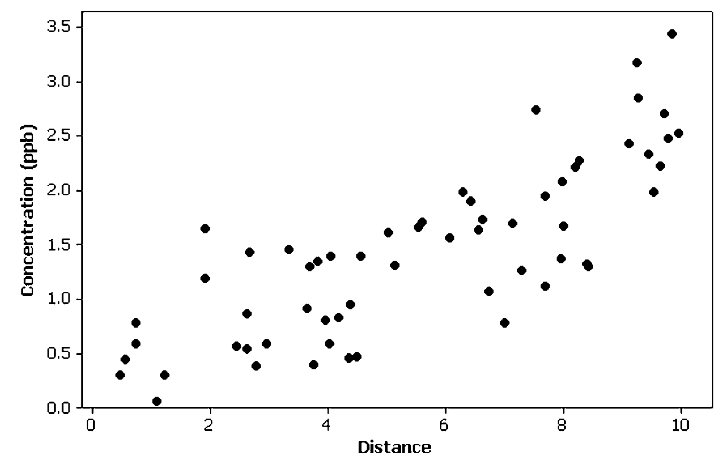{width="350"}

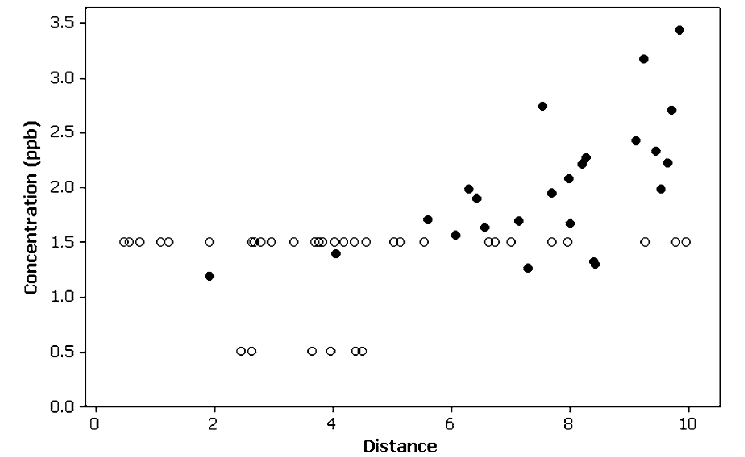{width="350"}
:::

Censored observations are not completely without information. We still know they are equal to or more extreme than the limit. For an LOD, we might therefore report the data point as either "not detected" or '$< c_L$'. Removing them from our study would not be sensible, since this would lead to us *overestimating* the mean and probably also *underestimating* the variance. We therefore need to find a way to incorporate these censored data points into our analysis.

We can't simply use the minimum value of the LOD. This would ignore the fact that the values are often *below* this. In the plot below, the LOD reduces after every 100 observations (e.g. because of better quality equipment), and this leads to an artificial trend.

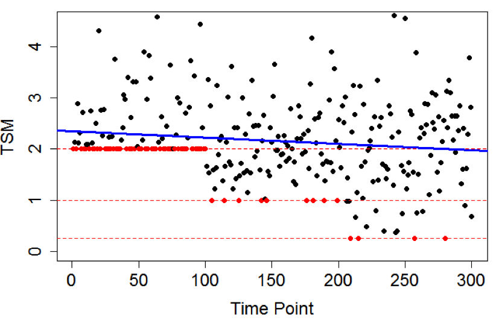{fig-align="center" width="408"}


### Simple Substitution

The simplest approach for dealing with LODs is via **simple substitution**. This involves taking the LOD value and multiplying it by a fixed constant, e.g. by replacing all $<c_L$ values with $0.5c_L$.

This approach is fairly popular because it is simple and easy to implement. However, it only works if there is a small proportion of censored data (maximum 10--15%). If there is a higher proportion, it tends to overestimate the mean.\

### Distribution-based approaches

It is generally preferable to use a more statistics-based approach which accounts for the data distribution. The basic idea is that we estimate the statistical distribution of the data in a way that takes into account the censoring. We can then use this estimated distribution to simulate values for our censored points.

Commonly used distribution-based approaches are **Maximum Likelihood**, **Kaplan-Meier**, and **Regression on Order Statistics**.

#### Maximum Likelihood

The maximum likelihood approach is a *parametric* approach. It requires us to specify a statistical **distribution** which is a close fit to the data. We then identify the **parameters** of this distribution that maximize the likelihood of obtaining a dataset like ours.

This ML approach has to take into account the likelihood of obtaining:

-   the observed values in our dataset
-   the correct proportion of data being censored, i.e. the proportion falling below our detection limit(s)

{fig-align="center" width="518"}

**Advantages**

-   Able to handle multiple limits of detection.
-   Good for estimating summary statistics with a suitably large sample size.
-   MLE explicitly accounts for the underlying distribution of the data (if known).

**Disadvantages**

-   More applicable to larger datasets (n \> 50).
-   Reliant on specifying the correct distribution, otherwise estimates can be incorrect.
-   Transforming data to fit a distribution can potentially cause biased estimators.

#### Kaplan-Meier Approach

The Kaplan-Meier approach is a *nonparametric* approach. I.e., it doesn't require a distributional assumption. It's often used in survival analysis for estimating summary statistics for right-censored data. However, it can be applied to left-censored data by 'flipping' the data and subtracting from a fixed constant.

In survival analysis, Kaplan-Meier estimates the probability that an observation will survive past a certain time. In our 'flipped' context, it gives the probability that an observation will fall below the limit of detection.


We can illustrate this using an example of cadmium levels in fish. Cadmium is a heavy metal identified as having potential health risks. We observe cadmium levels in fish livers in two different regions of the Rocky Mountains.

Due to variation in data collection, there are four different LODs (0.2, 0.3, 0.4 and 0.6 $\mu$g per litre).

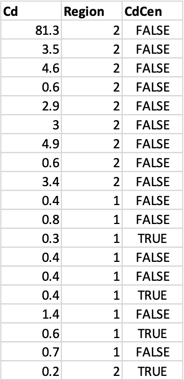{fig-align="center" width="160"}

Plotting the data shows the potential impact of censoring. The left panel shows all the data (plotting censored values as equal to the LOD), while the right panel excludes those which have been censored.

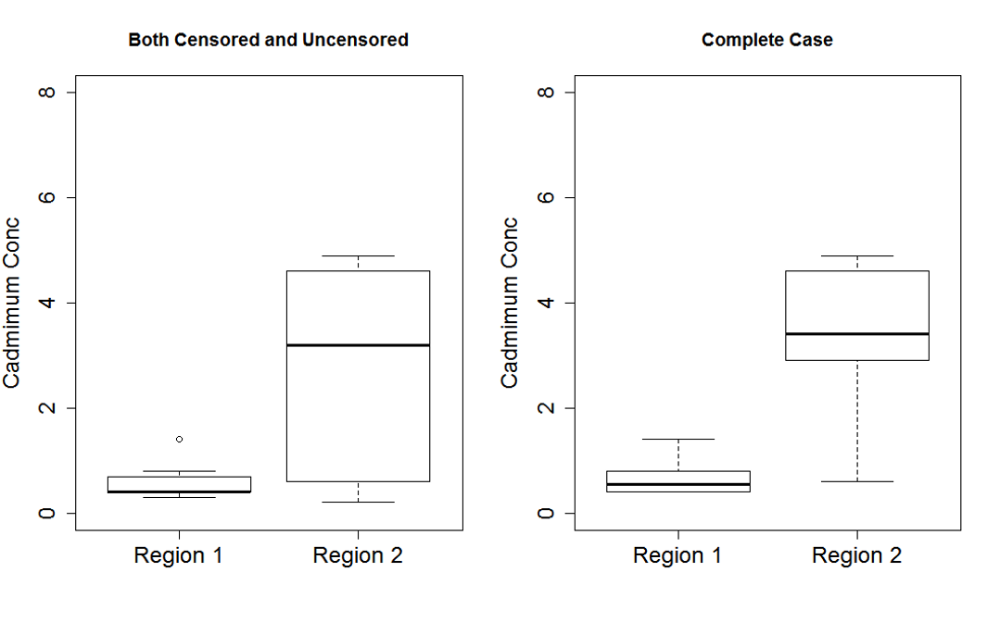{fig-align="center" width="380"}

We can use the NADA (Nondetects and Data Analysis) package in R. The `cenfit` function applies the Kaplan-Meier method. This package automatically 'flips' the data, since it is designed for environmental data.

```{r, eval=FALSE}
blinky <- cenfit(obs, censored, groups)
```

```         
           n  n.cen  median    mean      sd
groups=1   9      3     0.4   0.589   0.352
groups=2  10      1     3.0  10.540  25.069
```

There are clear differences between the locations in terms of both median and standard deviation.

The `cendiff` function tests for significant differences between the groups. This uses a chi-squared hypothesis test:

-   H0: Median cadmium levels are the same in Region 1 and Region 2
-   H1: Median cadmium levels are different in Region 1 and Region 2

```{r, eval=FALSE}
cendiff(obs, censored, groups)
```

```         
                N  Observed Expected (O-E)^2/E (O-E)^2/V
groups=1        9      2.84     6.13      1.76      7.02
groups=2        10     6.84     3.55      3.05      7.02

Chisq=7 on 1 degrees of freedom, p= 0.00808 
```

We can also plot the empirical cumulative distribution function (ECDF), taking into account the LODs. Note that this works in the opposite direction from regular survival plots due to the 'flipping' of the data.

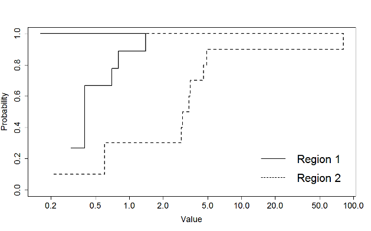{fig-align="center" width="365"}


**Advantages**

-   Nonparametric, so no need to assume underlying distribution.
-   Can easily account for multiple LODs.
-   Works for large numbers of censored datapoints ($>$ 50%).

**Disadvantages**

-   Quite simplistic --- identical to simple substitution if we only have one LOD.
-   Less reliable for values near and below the LOD.
-   The mean tends to be overestimated --- need to rely on median.

#### Regression on Order Statistics (ROS)

Regression on Order Statistics is a *semi-parametric* approach. I.e., it combines elements of parametric and nonparametric models. It follows a two-step approach:

1.  Plot the uncensored values on a probability plot (QQ plot) and use linear regression to approximate the parameters of the underlying data distribution.
2.  Use this fitted distribution to impute estimates for the censored values.

There is an assumption that the censored measures are normally (or lognormally) distributed.

::: {.callout-note icon="false"}
##  Example: Bathing water quality (continued)

The plot shows the uncensored points and their probability plot regression model. The `NADA` package in R uses lognormal as default. The plot suggests this is sensible. We then use this fitted model to estimate the values of the censored observations based on their normal quantiles.

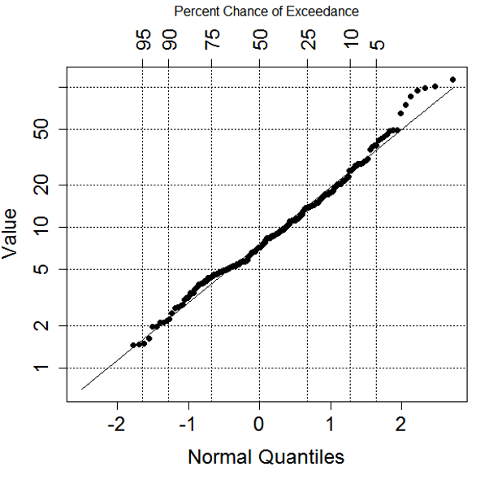{fig-align="center" width="298"}

We can compare our ROS approach to simple substitution for the bathing water example used earlier. The left panel (ROS) shows no trend present, the right panel (simple) has an artificial trend.

::: {layout-ncol="2"}
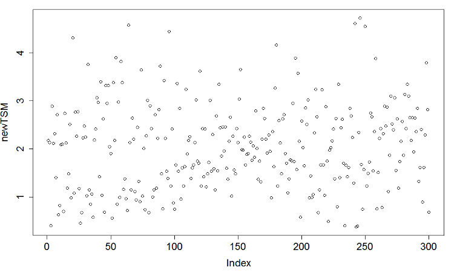


:::
::::

**Advantages**

-   Can be applied to a wide variety of environmental datasets.
-   Works with multiple LODs, but still not too simplistic with a single LOD.
-   Can be used with up to 80% censored datapoints.

**Disadvantages**

-   Semiparametric approach --- requires a distributional model to be assumed.
-   Specifically requires normality (or lognormality) for estimation of parameters.
-   Two-stage model introduces extra source of variability.


## Missing Data

Environmental and ecological data are very prone to missing values. Data can be missing for any number of reasons, and there is a whole discipline of statistics devoted to the topic. Here we will touch on the parts most relevant to environmental and ecological work: *why* gaps arise, *how* to classify them, and *what* we can do about them.

A useful first observation is that gaps appear in many different dimensions —across space (some locations are never visited), across time (a monitoring series starts late or stops early), and across the variables themselves (a site is visited but only some measurements are taken). Thinking about which dimension
a gap lives in, and why it arose, already tells us a great deal about how much damage it is likely to do [@bowler2024].


### Why are data missing?

Considering why gaps arise helps us anticipate their likely impact:

-   **Adverse weather** (rainfall, snow, drought, wind) can damage measuring
    equipment or prevent access to a location.
-   **Equipment failure** — instruments break, loggers stop recording.
-   **Samples lost or damaged** between collection and analysis.
-   **Monitoring networks change in size over time.** Data are effectively
    "missing" at a site before it was introduced, or after it was removed.
-   **Uneven sampling effort** — accessible, pleasant, or charismatic places get
    surveyed more than remote or difficult ones [@hossie2021].

The last two reasons are worth very relevant in ecological studies, because they are the ones most likely to be *systematic*: the absence of data is tied to some property of the site or the time, rather than being random. As we will see, that distinction is quite important in terms of which methods can be used to address missingess.


### Classes of missing data

Missing-data theory categorises missingness into three classes. To state them precisely it helps to introduce a *missingness indicator*. For each unit $i$ (a site, a time, a sample) define

$$
R_i = \begin{cases}
1 & \text{unit } i \text{ is observed},\\
0 & \text{unit } i \text{ is missing}.
\end{cases}
$$

The question in every case is the same: does the probability of being missing, $\Pr(R = 0)$, depend on the data — and if so, on which parts? 


#### Missing Completely at Random (MCAR)

Under **MCAR**, missingness is independent of both the observed and the unobserved data. The factors that drive sampling (and therefore the missingness) are unrelated to the environmental process we are interested in. Suppose, $Y$ be the variable of interest, $X$ an observed covariate and $Z$ a further variable driving the missing mechanism. In MCAR (@fig-missingness-mcar), missingness is driven entirely by $Z$, but $Z$ has no edge to  (i.e, no shared cause) with $X$ or $Y$. The only path out of $R$ is $R \leftarrow Z$, a dead end, so $R$ is independent of the data: $\Pr(R = 0 \mid Y, X) = \Pr(R = 0)$.

The probability of being missing is the same constant everywhere, regardless of the data. While this is the easie case to address, it almost never holds true in real ecological and environmetal datasets.


```{dot}
//| fig-cap: "MCAR — nodes: X observed covariate, Y response of interest, Z a driver of sampling, R missingness indicator. Edges: X → Y (covariate affects the response); Z → R (sampling drives missingness). Z is unrelated to X and Y, so nothing links R to the data."
//| fig-width: 2.4
//| echo: false
//| label: fig-missingness-mcar
digraph mcar {
  layout=neato; bgcolor="transparent";
  node [shape=circle, style=filled, fixedsize=true, width=0.5,
        fontname="Helvetica", fontcolor="white", fillcolor="#003865", color="#003865"];
  edge [color="#73726c", penwidth=1.2, arrowsize=0.7];
  X [pos="0,1!"];   Y [pos="1.3,1!"];
  Z [pos="0,0!"];   R [pos="1.3,0!", fillcolor="#C0392B", color="#C0392B"];
  X -> Y;
  Z -> R;
}
```


::: {.callout-warning icon="false"}
##   Excercise: MCAR

Based on the example shown in @fig-missingness-mcar, show that the missing pattern $R=0$ does not depend on the data by marginalizing over $Z$, i.e., show that $\Pr(R=0\mid Y,X) = \Pr(R=0)$.


`r hide("Solution")`

$$
\begin{aligned}
\Pr(R=0\mid Y,X) &= \int \Pr(R=0\mid Y,X,Z)Pr(Z\mid Y,X)dZ \quad \text{since } R \perp (Y,X) \mid Z\\
 &= \int \Pr(R=0\mid Z)\Pr(Z\mid Y,X)dZ \quad \text{since } Z \perp (Y,X) \Rightarrow \Pr(Z\mid Y,X) = \Pr(Z)  \\
&=\int \Pr(R=0|Z)\Pr(Z)dZ \quad \text{law of total probability} \\
&= \Pr(R=0)
\end{aligned}
$$
`r unhide()`

:::


#### Missing at Random (MAR)

Under **MAR**, missingness depends on one or more *observed* variables, but not on the value of the missing observations themselves. Covariates that affect the sampling probability may also affect the process of interest, but the data on all of those covariates is assumed to be available to us.

For example, elevation ($X$) might drive both bird abundance and the chance a site is surveyed (people avoid surveying high ground), but elevation is recorded
for every site. In the MAR (@fig-missingness-mar), every arrow into $R$ starts from an *observed* node ($X$ and $Z$). The path linking $R$ to $Y$ runs
$R \leftarrow X \rightarrow Y$, and conditioning on the observed $X$ blocks it, so $\Pr(R = 0 \mid Y, X) = \Pr(R = 0 \mid X) \neq \Pr(R = 0)$.


```{dot}
//| fig-cap: "MAR — same nodes, with X and Z both observed. Edges: X → Y (covariate affects the response); X → R and Z → R (missingness is driven by the observed covariates). No arrow from Y, or from any hidden cause, reaches R, so missingness depends only on observed data."
//| fig-width: 2.4
//| echo: false
//| label: fig-missingness-mar

digraph mar {
  layout=neato; bgcolor="transparent";
  node [shape=circle, style=filled, fixedsize=true, width=0.5,
        fontname="Helvetica", fontcolor="white", fillcolor="#003865", color="#003865"];
  edge [color="#73726c", penwidth=1.2, arrowsize=0.7];
  X [pos="0,1!"];   Y [pos="1.3,1!"];
  Z [pos="0,0!"];   R [pos="1.3,0!", fillcolor="#C0392B", color="#C0392B"];
  X -> Y;
  X -> R;
  Z -> R;
}
```


Notice that in MAR, the missingness depends on the observed $X$, but *not* on $Y$ once $X$ is accounted for. Two points to notice here:

-   **MAR is not the same as random sampling effort.** It does not mean effort is spread evenly across the landscape. It means the covariates that govern
    sampling are known and recorded, so that — conditional on them — the sampled and unsampled units do not differ systematically in $Y$.
-   **MAR does not require measuring *every* variable that affects $R$.** It only requires that, conditional on what we *do* observe, missingness no longer
    depends on the missing values. If a relevant driver is unknown, unavailable, or simply not modelled, the data slip into the next, harder class.
    
#### Missing Not at Random (MNAR)

Under **MNAR**, missingness depends either on (i) unobserved variables, or (ii) the variable of interest itself. For example, @fig-missingness-mnar, $Z$ is an *unknown*(unobserved) common cause that points to both $Y$ and $R$. Thus, the path $R \leftarrow Z \rightarrow Y$  stays open no matter what we condition on among the observed variables, so $R \not\perp Y \mid (X, Z)$ when $Z$ is unknown. Alternatively, a similar situation could arise when the process of interest itself $Y$ is what causes $R$ (@fig-missingness-mnar2). For example, pollution monitoring stations being placed in areas where pollution levels are high would cause that locations in less polluted areas to be underrepresented. 


::: {#fig-missingness-dags layout-ncol="2"}

```{dot}
//| fig-cap: "MNAR — same nodes, but Z is unobserved (grey, dashed). Edges: X → Y and Z → Y (the response is driven by both); Z → R (missingness is driven by Z). The hidden common cause Z links Y and R, so missingness stays tied to Y even after conditioning on the observed data."
//| fig-width: 2.4
//| echo: false
//| label: fig-missingness-mnar

digraph mnar {
  layout=neato; bgcolor="transparent";
  node [shape=circle, style=filled, fixedsize=true, width=0.5,
        fontname="Helvetica", fontcolor="white", fillcolor="#003865", color="#003865"];
  edge [color="#73726c", penwidth=1.2, arrowsize=0.7];
  X [pos="0,1!"];   Y [pos="1.3,1!"];
  Z [pos="0,0!", fillcolor="#9AA0A6", color="#5F5E5A",
     style="filled,dashed", fontcolor="#2C2C2A"];
  R [pos="1.3,0!", fillcolor="#C0392B", color="#C0392B"];
  X -> Y;
  Z -> Y;
  Z -> R;
}
```


```{dot}
//| fig-cap: "MNAR (value-dependent) — nodes: X, Z observed covariates, Y response of interest (has missing values), R missingness indicator (R = 0 if missing). Edges: X → Y (covariate affects the response); Z → R (an observed covariate affects missingness); Y → R (red) — the value of Y itself determines whether it is missing. Because this edge starts at Y, conditioning on the observed covariates cannot remove the dependence, so R stays tied to Y."
//| fig-width: 2.4
//| echo: false
//| label: fig-missingness-mnar2
digraph mnar_value {
  layout=neato; bgcolor="transparent";
  node [shape=circle, style=filled, fixedsize=true, width=0.5,
        fontname="Helvetica", fontcolor="white", fillcolor="#003865", color="#003865"];
  edge [color="#73726c", penwidth=1.2, arrowsize=0.7];
  X [pos="0,1!"];   Y [pos="1.3,1!"];
  Z [pos="0,0!"];   R [pos="1.3,0!", fillcolor="#C0392B", color="#C0392B"];
  X -> Y;
  Z -> R;
  Y -> R [color="#C0392B", penwidth=2.0];   // the missing value drives its own missingness
}
```

:::


MNAR is the most challenging class to deal with, because no amount of clever conditioning on observed data can recover the relationship — the information we
would need is, by definition, not in the dataset.


### Why the mechanism matters

The consequences of missingness for inference depend entirely on which mechanism is operating.

- Under **MCAR**, estimates of covariate effects on the response remain unbiased; we simply have a smaller, representative sample. The cost is only a loss of
precision. The catch is that MCAR is a strong assumption that rarely holds for real datasets, where observer error, natural variation, collinearity, and serial autocorrelation are the norm rather than the exception.

- Under **MAR**, estimates can still be unbiased — *provided* we model the relevant observed covariates with the correct functional form, and provided
those covariates genuinely explain the differences between sampled and unsampled units.

- Under **MNAR**, covariate-effect estimates are **biased**, and we also suffer a **loss of power**: the reduced effective sample size inflates standard errors and weakens our ability to detect real effects. As with any form of systematic error, the bias does not shrink as we collect more data.

::: {.callout-tip icon="false"}
##  Question

What causes of missing data do each of the three examples in the images below illustrate? Are these data missing at random?

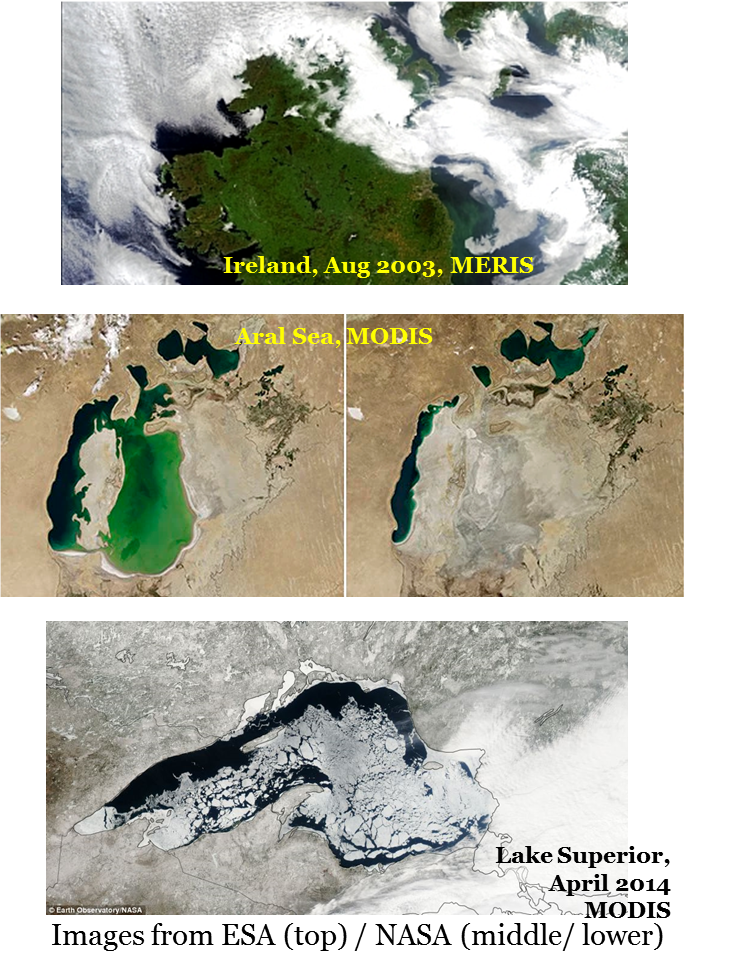{fig-align="center" width="449"}

-   Top image: MERIS data over Ireland. 

`r hide("Solution")` 
Cloud cover means that the satellite cannot observe the lakes, oceans or land. These data are not missing at random, since cloud cover is likely to change over the seasons.
`r unhide()`
-   Middle images: MODIS data over the Aral Sea, for two timepoints.

`r hide("Solution")` The Aral Sea has decreased in size over the years, due to human impacts. Suppose that we wish to measure chlorophyll levels in a certain location in the lake. The changing size of the lake means that some locations that had data in previous years will have missing data (since there is no water present at that location) in more recent years. The data are therefore not missing at random. 
`r unhide()`
-   Bottom image: MODIS data over Lake Superior. 
`r hide("Solution")` Ice cover means that the satellite cannot observe the lake water. These data are not missing at random, since ice cover occurs during the coldest times of the year. This may be problematic, if it occurs during peaks or troughs of patterns of the variable that we wish to measure (e.g., chlorophyll may reach its lowest values at the same time that ice cover appears and prevents the satellite from recording measurements).
`r unhide()`
:::


### Dealing with missing data

The technique we choose depends on the **type of missingness**. Most available methods are appropriate only for MCAR or MAR; MNAR is the most challenging class, so we focus our attention on the other two (remember that misclassifying MNAR as MAR is one of the commonest ways to draw the wrong conclusion).

#### Complete-case analysis

The simplest response is to discard any unit with a missing value and analyse what remains. If only a handful of points are missing (say $\approx 5\%$) and the data are MCAR, this is essentially harmless and we can proceed as usual. It is trivial to implement, but if the data are *not* MCAR it underestimates the true variability and produces biased results.


#### Subsampling

**Subsampling** thins the over-sampled units to even out sampling effort across space or time, improving the representativeness of the sample for inference at
the population level. Different sampling schemes (e.g., random, systematic or stratified) could be used to select the observational units to retain for our analysis. The limitations are that subsampling assumes a sample large enough to thin without impacting the precision, and it can fail to account for finer patterns in the data.

#### Weighting

**Weighting** assigns weights to spatial–temporal units to improve the sample's representativeness of a target population. The common approach is
**inverse-probability weighting (IPW)**:

1.  Estimate the probability that each unit is surveyed,
    $\pi_i = \Pr(R = 1 \mid X, Z, \ldots)$.
2.  Weight each observed unit by the inverse of that probability, $1/\pi_i$.
    Hard-to-survey sites have small $\pi_i$ and therefore large weights;
    easy-to-survey sites have large $\pi_i$ and small weights.
3.  Fit a model — such as a weighted regression — using these weights, so that
    every region of covariate space influences the result in proportion to how
    much it is under-represented.

For weighting to remove bias, the model for $\pi_i$ must include all the variables that make the data MAR. Even then, IPW has drawbacks. For example, the information in the incomplete cases is used *only* to estimate the weights and makes no contribution to the likelihood; weighted estimates can have high variance, because extreme weights from very small probabilities dominate; and ignoring the uncertainty in the *estimated* weights tends to produce overly conservative standard errors.

#### Imputation

**Imputation** predicts the missing values themselves via some statistical method, producing a completed dataset that can then be analysed. There are two
broad forms.

-   **Single imputation** involves generating one value in place of each missing value.
-   **Multiple imputation** involves generating several values in place of each missing value.

Single imputation has the advantage of being simpler, allowing for a straightforward analysis once the missing values have been estimated. Multiple imputation does a better job of accounting for the uncertainty of the imputation process, but it makes the final analysis more complex.


Our approach for generating the imputed value will vary depending on the context. In the simplest case, we may replace missing values with the overall mean  - usually only if we have very limited information. More commonly, we may use neighbouring values, or some form of seasonal mean. These will usually work reasonably well as long as we do not have too many missing data. A more complex approach is to fit a more general statistical model, perhaps taking account of other variables and/or using random components.

Alternatively, a **Bayesian framework** is especially natural for missing data: a missing value is simply another unknown quantity, so it is treated as an additional parameter and given a posterior distribution alongside everything else. Rather than imputing once and then pretending the filled-in values are certain, the Bayesian framework propagates the uncertainty in the missing data through to every downstream estimate.


## Outliers

An outlier is an extreme or unusual observation in our dataset. These will often (but not always) have a large influence on the outcomes of our analysis. We have to find ways to identify and deal with outliers.

There are two main categories of outlier: (1) genuine but extreme values, and (2) data errors. If we have a genuinely extreme value, we should try to accommodate these in our analysis. Not doing so would mean that we are ignoring a real feature of our data. There are robust modelling techniques that allow us to incorporate outliers. On the other hand, if we have an outlier due to data error, we can either try to correct it (where possible) or remove it, since this does not reflect a real observation.

### Identifying outliers

An outlier is an observation that does not follow the general trend of the rest of the data. It is often helpful to plot your data, since outliers are sometimes very obvious in boxplots or scatterplots or even maps! E.g., @fig-movebank shows an Elk's animal track with two unusual observations. To assess whether these are errors from the tracking device or genuine unusual movement patterns (e.g., escaping a predator), we could compute the velocity between points. This is done using the time stamp and the step length (the straight-line distance traveled). We can then assess how likely it is for the animal to have moved at that calculated speed.

[{#fig-movebank fig-align="center" width="340"}](https://www.movebank.org/cms/webapp?gwt_fragment=page=search_map)

Graphical techniques are a commonly used for detecting outliers, but sometimes identifying outliers visually is not straightforward and can become difficult with larger data sets. This has led to the development of a variety of outlier detection techniques. There are also several statistical approaches that can be applied to identify datapoints that are significantly different from the rest. These include (but are not limited to) *tests of discordancy*, *Chauvenet's criterion*, *Grubb's test* and *Dixon's test*.

#### Test of discordancy

This is a hypothesis test, where the null hypothesis is that each datapoint comes from a given data distribution F. We look at the maximum (or minimum) value of our sample, $x_{(n)}$ and test whether it is a reasonable sample from F. If the maximum (or minimum) value could reasonably come from this distribution, we have no outliers. If the maximum (or minimum) value is an outlier, we check the second highest (or lowest) and so on.

#### Chauvenet's criterion

This test assumes that our data are from a Normal distribution. For our dataset of size $n$, we calculate the mean ($\mu$) and standard deviation ($\sigma$). We then use the Normal probability density function to estimate the probability ($p$) of obtaining a value as extreme our more extreme than or suspected outlier. If $p \times n < 0.5$, then our value is considered to be an outlier.

#### Grubbs' test

Again, this test assumes that our data are from an N($\mu, \sigma^2$) distribution. The Grubbs' test statistic is the largest absolute deviation from this mean in terms of units of the standard deviation: $$G = \frac{\max\limits_{i=1,\ldots,n} |y_i - \mu|}{\sigma}.$$ This is compared to the $t(N-2)$ distribution to obtain a p-value. If we identify an outlier, we repeat the process for the next most extreme value.

#### Dixon's test

Rather than looking at the dataset as a whole, Dixon's test compares the outlier to the next most extreme value. Let the *gap* be the distance between our suspected outlier and the closest value, and the *range* be the full range of the dataset. Then we compare $Q = \frac{\mbox{gap}}{\mbox{range}}$ to a specifically designed reference table.

This test is only suitable if there is a single distinct suspected outlier. If there were two similar outliers, then the gap would not be large.

::: {.callout-note icon="false"}
##   Example: Effectiveness of mosquito sprays

The example dataset below shows the effectiveness of several mosquito sprays.

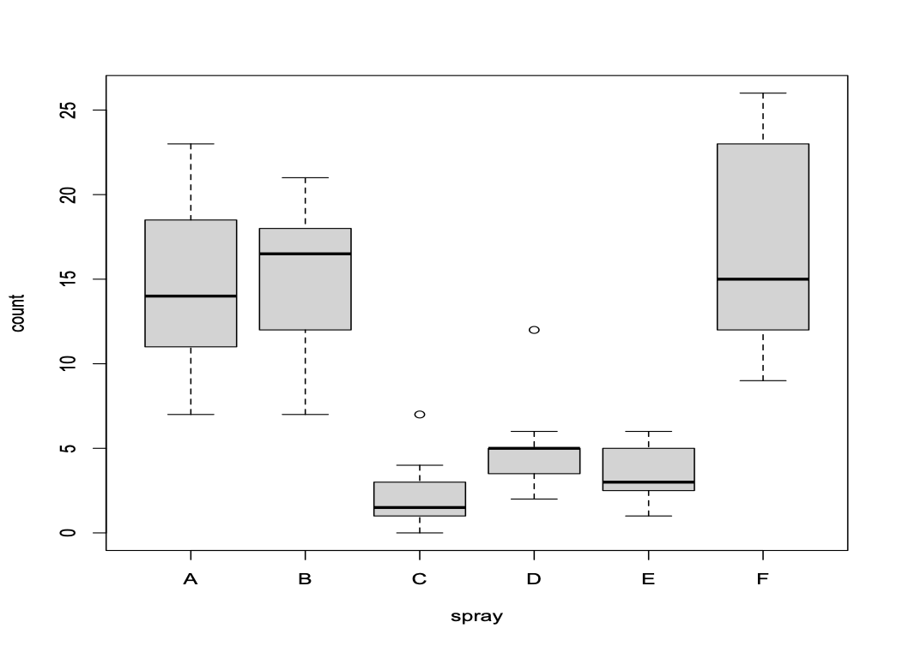{fig-align="center" width="476"}

The `outliers` package in R contains functions for Grubbs' and Dixon's tests. Here we apply the Grubbs' test to the insect spray data.

```{r, eval=FALSE}
grubbs.test(InsectSprays$count)
```

```         
Grubbs test for one outlier

data:  InsectSprays$count
G = 2.29062, U = 0.92506, p-value = 0.719
alternative hypothesis: highest value 26 is an outlier
```
:::

::: {.callout-tip icon="false"}
##  Question 

What conclusion can we draw from the results of the above test?

`r mcq(c(answer="There is no statistically significant evidence that the point with the highest value is an outlier", "There is statistically significant evidence that the point with the highest value is an outlier"))`

`r hide("Solution")`

Since the p-value for the Grubbs' test is greater than 0.05, we can conclude that there is no statistically significant evidence that the point with the highest value is an outlier.

`r unhide()`
:::

::: {.callout-note icon="false"}
##  Example: Effectiveness of mosquito sprays (continued)

We can also apply the Grubbs' test to the data for just one spray type (spray C).

```{r, eval=FALSE}
grubbs.test(InsectSprays$count[InsectSprays$spray=="C"])
```

```         
G = 2.48917, U = 0.38553, p-value = 0.0153
alternative hypothesis: highest value 7 is an outlier
```
:::

::: {.callout-tip icon="false"}
##  Question 

What conclusion can we draw from the results of the above test?

`r mcq(c("There is no statistically significant evidence that the point with the highest value is an outlier", answer="There is statistically significant evidence that the point with the highest value is an outlier"))`

`r hide("Solution")`

Since the p-value for the Grubbs' test is less than 0.05, we can conclude that there is statistically significant evidence that the point with the highest value is an outlier.

This is unsurprising from the plot, as since the point is drawn as a circle above the upper whisker of the boxplot, we see that R has identified this point as being more than 1.5 times the interquartile range above the upper quartile. Note, however, that this does not necessarily mean that this point is an outlier, so that a test was still required.

`r unhide()`
:::

### Dealing with outliers

We generally do not want to discard outliers. Sometimes, we can fit a model with and without them to assess their impact on the results. Additionally, we can use robust alternatives to summary statistics, for example median instead of mean, and median absolute deviation (MAD) instead of standard deviation.

The median absolute deviation is defined as: $$\mbox{MAD} = \mbox{median}|y_i - \tilde{y}|$$ where $\tilde{y}$ is the median of our dataset. In other words, we find all the distances between our points and the median, and then take the median of those distances.

