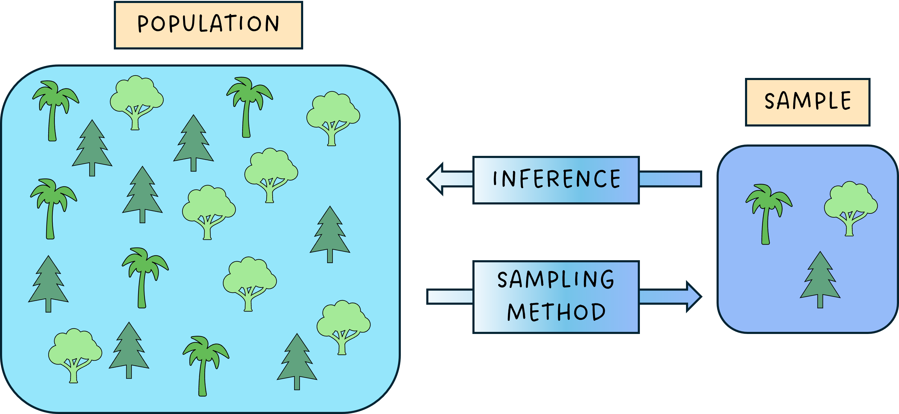
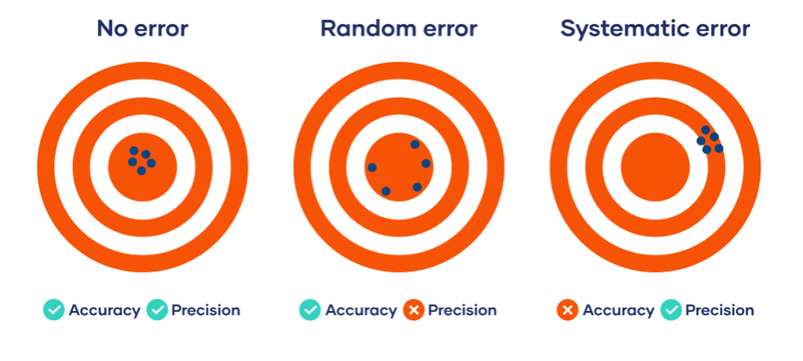

## From population to sample, and back

{fig-align="center"}

::: fragment
We never observe the **population**. A **sampling method** gives us a **sample**, and **inference** is the reasoning that takes us *back* — from what we saw to what we want to know.
:::

::: notes
Set the scene: every quantity we care about (mean abundance, occupancy, a regression slope) is a property of the population, but we only ever hold a sample. The whole lesson is about doing that backward arrow honestly — and being explicit about what we *don't* know.
:::

## Uncertainty and Error {.smaller}

We often use these words interchangeably — but they are not the same thing.

::::::: columns
:::: {.column width="50%"}
### Error

The difference between a **measured value** and the **"true value"** of the thing being measured.

::: fragment
-   A property of *accuracy*
-   Usually **unknown** — if we knew the true value, we wouldn't be measuring
:::
::::

:::: {.column width="50%"}
### Uncertainty

A **quantification of the variability** of the measurement result.

::: fragment
-   A property of *precision*
-   This is what we can actually **model and report**
:::
::::
:::::::

{fig-align="center" width="693"}

:::: fragment
::: {.callout-note appearance="simple"}
-   Practically, we account for uncertainty using common **statistical distributions** — which is where we go next.
:::
::::

::: notes
The dartboard analogy lands well here: error = how far the cluster sits from the bullseye (accuracy); uncertainty = how spread out the darts are (precision). You can be precise but biased, or unbiased but imprecise.
:::

## Recap: Continuous Distributions {.smaller background-color="#FFFFFF"}

```{r}
#| include: false
library(ggplot2)
library(patchwork)
library(MASS)
library(scales)
theme_set(theme_minimal(base_size = 13))
set.seed(123)
```

::::::::: panel-tabset
## Normal

::::: columns
::: {.column width="40%"}
$X$ is normal with mean $\mu$ and standard deviation $\sigma$ if its density is

$$
f(x) = \frac{1}{\sigma\sqrt{2\pi}}\,
e^{-\frac{1}{2}\left(\frac{x-\mu}{\sigma}\right)^2}
$$

$$
X \sim \mathcal{N}(\mu, \sigma^2), \quad -\infty < x < \infty
$$

*Why not use it for **all** environmental data?*
:::

::: {.column width="60%"}
```{r}
#| echo: false
d <- data.frame(x = rnorm(1000, mean = 200, sd = 10))
ggplot(d, aes(x = x)) +
  geom_histogram(aes(y = after_stat(density)), bins = 30,
                 fill = "lightblue", colour = "black", alpha = 0.7) +
  stat_function(fun = dnorm, args = list(mean = 200, sd = 10),
                colour = "navy", linewidth = 1) +
  labs(x = "Temperature", y = "Density")
```
:::
:::::

## log-Normal

$X$ is log-normal if its logarithm is normal:

$$
\ln(X) \sim \mathcal{N}(\mu, \sigma^2),
\qquad X \in (0, \infty)
$$

Useful for strictly positive, right-skewed data — concentrations, biomass.

```{r}
#| echo: false
#| fig-height: 3.5
#| fig-width: 8
#| fig-align: center
conc <- exp(rnorm(200, mean = 2, sd = 0.7))

p_raw <- ggplot(data.frame(x = conc), aes(x = x)) +
  geom_histogram(aes(y = after_stat(density)), bins = 25,
                 fill = "skyblue", alpha = 0.6) +
  labs(x = "Concentration", y = "Density")

p_log <- ggplot(data.frame(x = log(conc)), aes(x = x)) +
  geom_histogram(aes(y = after_stat(density)), bins = 25,
                 fill = "lightgreen", alpha = 0.6) +
  stat_function(fun = dnorm, args = list(mean = 2, sd = 0.7),
                colour = "darkgreen", linewidth = 1) +
  labs(x = "ln(Concentration)", y = "Density")

p_raw + p_log
```

## Exponential

::::: columns
::: {.column width="40%"}
$X$ is exponential with rate $\lambda > 0$ if

$$
f(x) = \lambda e^{-\lambda x}, \quad x \geq 0
$$

$\lambda$ is the event rate (events per unit time/distance):

-   Mean waiting time $E[X] = 1/\lambda$
-   Variance $\mathrm{Var}(X) = 1/\lambda^2$

*e.g.* $\lambda = 0.2$ events/hour → 5 hours between events.
:::

::: {.column width="60%"}
```{r}
#| echo: false
df <- data.frame(x = seq(0, 8, length.out = 200))
df$y1 <- dexp(df$x, rate = 0.5)
df$y2 <- dexp(df$x, rate = 1)
df$y3 <- dexp(df$x, rate = 2)

ggplot(df, aes(x = x)) +
  geom_line(aes(y = y1, colour = "λ = 0.5"), linewidth = 1.3) +
  geom_line(aes(y = y2, colour = "λ = 1"),   linewidth = 1.3) +
  geom_line(aes(y = y3, colour = "λ = 2"),   linewidth = 1.3) +
  scale_colour_manual(values = c("λ = 0.5" = "steelblue",
                                 "λ = 1" = "darkorange",
                                 "λ = 2" = "forestgreen")) +
  labs(x = "x (time/distance)", y = "f(x)", colour = "Rate (λ)") +
  theme(legend.position = c(0.85, 0.85),
        legend.background = element_rect(fill = "white", colour = "grey")) +
  scale_x_continuous(expand = c(0, 0)) +
  scale_y_continuous(expand = c(0, 0))
```
:::
:::::
:::::::::

## Recap: Discrete Distributions {.smaller background-color="#FFFFFF"}

:::::::::::: panel-tabset
## Poisson

::::: columns
::: {.column width="50%"}
$X$ is Poisson with rate $\lambda > 0$ if

$$
P(X = k) = \frac{\lambda^k e^{-\lambda}}{k!}, \quad k = 0, 1, \dots
$$

$X \sim \mathrm{Po}(\lambda)$, where $\lambda$ is the expected number of events per unit time/area/volume.

Note: $E[X] = \mathrm{Var}(X) = \lambda$.
:::

::: {.column width="50%"}
```{r}
#| echo: false
k <- 0:10
df <- data.frame(
  k = rep(k, 2),
  prob = c(dpois(k, 2), dpois(k, 5)),
  lambda = rep(c("λ = 2", "λ = 5"), each = length(k))
)

ggplot(df, aes(x = k, y = prob, fill = lambda)) +
  geom_col(width = 0.6, alpha = 0.8, colour = "black") +
  facet_wrap(~ lambda, ncol = 2, scales = "free_y") +
  scale_fill_manual(values = c("λ = 2" = "steelblue", "λ = 5" = "darkorange")) +
  labs(x = "Number of events (k)", y = "P(X = k)") +
  theme(legend.position = "none",
        strip.text = element_text(face = "bold"),
        panel.spacing = unit(1.5, "lines")) +
  scale_x_continuous(breaks = 0:10)
```
:::
:::::

## Binomial

::::: columns
::: {.column width="50%"}
$X$ is binomial with $n$ trials and success probability $p$ if

$$
P(X = k) = \binom{n}{k} p^k (1-p)^{n-k}, \quad k = 0, \dots, n
$$

$X \sim \mathrm{Bi}(n, p)$. Two common ecological readings:

-   **Survival:** $n$ animals, each survives with probability $p$
-   **Detection:** $n$ surveys, species detected with probability $p$
:::

::: {.column width="50%"}
```{r}
#| echo: false
#| fig-height: 5.5
#| fig-width: 4
df1 <- data.frame(k = 0:12, prob = dbinom(0:12, 12, 0.7))
p1 <- ggplot(df1, aes(k, prob)) +
  geom_col(fill = "steelblue", width = 0.7, alpha = 0.8, colour = "black") +
  geom_vline(xintercept = 12 * 0.7, colour = "red", linetype = "dashed") +
  labs(subtitle = "Survival: n = 12, p = 0.7",
       x = "Survivors", y = "Probability") +
  scale_x_continuous(breaks = 0:12) +
  scale_y_continuous(labels = percent_format(accuracy = 1))

df2 <- data.frame(k = 0:8, prob = dbinom(0:8, 8, 0.3))
p2 <- ggplot(df2, aes(k, prob)) +
  geom_col(fill = "darkorange", width = 0.7, alpha = 0.8, colour = "black") +
  geom_vline(xintercept = 8 * 0.3, colour = "red", linetype = "dashed") +
  labs(subtitle = "Detection: n = 8, p = 0.3",
       x = "Surveys with detection", y = "Probability") +
  scale_x_continuous(breaks = 0:8) +
  scale_y_continuous(labels = percent_format(accuracy = 1))

p1 / p2
```
:::
:::::

## Negative Binomial

::::: columns
::: {.column width="50%"}
For counts that are **more variable than Poisson** allows (overdispersion).

In the mean–dispersion form, $X \sim \mathrm{NegBin}(\mu, \theta)$ with

$$
E[X] = \mu, \qquad
\mathrm{Var}(X) = \mu + \frac{\mu^2}{\theta}
$$

-   $\mu$ = mean count
-   $\theta$ = dispersion (smaller $\theta$ → more overdispersion; $\theta \to \infty$ recovers Poisson)
:::

::: {.column width="50%"}
```{r}
#| echo: false
df <- data.frame(k = 0:20, prob = dnbinom(0:20, size = 2, mu = 5))
ggplot(df, aes(k, prob)) +
  geom_col(fill = "steelblue", width = 0.7, alpha = 0.8, colour = "black") +
  geom_vline(xintercept = 5, colour = "red", linetype = "dashed", linewidth = 1) +
  labs(subtitle = "μ = 5, θ = 2",
       x = "Count (k)", y = "P(X = k)") +
  scale_x_continuous(breaks = seq(0, 20, 2)) +
  scale_y_continuous(labels = percent_format(accuracy = 1))
```
:::
:::::
::::::::::::

## Example: Bathing Water Quality

-   All bathing water sites in Scotland are classified [**by SEPA**](https://bathingwaters.sepa.scot/) as "Excellent", "Good", "Sufficient" or "Poor" in terms of how much faecal bacteria (from sewage) they contain.

-   The minimum standard all beaches or bathing water must meet is "Sufficient".

-   The sites are classified based on the 90th and 95th percentiles of samples taken over the four most recent bathing seasons.

::: notes
Note: SEPA = Scottish Environment Protection Agency The classification uses percentiles because water quality can be highly variable - we care about the worst-case scenarios (90th/95th percentiles), not just average conditions.
:::

## Example: Bathing Water Quality

![Green is [excellent]{style="color:green;"} , [blue]{style="color:blue;"} is good, red is [sufficient]{style="color:red;"}](figures/BathingWater.png){fig-align="center"}

## Example: bathing water quality

-   The classification system assumes that bacterial concentrations at each site follow a **log-normal distribution**.

-   If this assumption does **not** hold, the classifications would **not be accurate**.

-   Therefore, it is **crucial** that we regularly assess this assumption to ensure the safety of our bathing water.

## Quantifying uncertainty

-   When presenting our results, it is important that we are clear about the uncertainty associated with them.

::: content-left
-   A common approach is to use a **standard uncertainty** ($u$), which is just the standard deviation, reported as:

$$\text{estimated value } \pm \text{ standard uncertainty}$$

-   The standard uncertainty, $u(\bar{\mathbf{x}})$, for the mean of a vector $\mathbf{x}$ of length $n$ is computed as follows: $$u(\bar{\mathbf{x}}) = \frac{sd(\mathbf{x})}{\sqrt{(n)}}$$
:::

------------------------------------------------------------------------

## Expanded uncertainty

::: incremental
-   More generally, we can use an **expanded uncertainty**, which is obtained by multiplying the standard uncertainty by a factor $k$.
-   You have already seen this in statistics as the key building block of a confidence interval.
-   The value of $k$ is chosen based on the quantiles of a standard normal distribution, with a value of $k=1.96$ (or $k=2$) giving a 95% confidence interval.
-   The 95% CI for the mean of **x** is given as $\bar{\mathbf{x}} \pm 1.96 \times u(\bar{\mathbf{x}}).$
:::

## Example: bathing water quality {.smaller}

-   In the bathing water example, we have 80 measurements of log(FS), with a mean of 3.861 and a standard deviation of 1.427.

::: incremental
1.  We can use these to compute the standard uncertainty of the mean log(FS) as $$u = \frac{1.427}{\sqrt{80}} = 0.160.$$

2.  This would therefore give a 95% confidence interval for the mean of log(FS) of $$3.861 \pm 1.96 \times 0.160 = (3.574, 4.175).$$

3.  A **95% confidence interval** is built so that, over repeated samples, 95% of such intervals would contain the true mean.
:::

::: fragment
An alternative approach to propagate the uncertainty of the quantities of interest is through prior knowledge (or lack of it) we have on the system.
:::

## The core {auto-animate="true" background-color="#FFFFFF"}

-   We have observed something.

```{r}
#| warning: false
#| message: false
#| echo: false
#| fig-align: center

library(cowplot) # needs install.packages("magick") to draw images
library(png)
library(FSAdata)
library(dplyr)

sturgeon <- readPNG("figures/pallid-sturgeon.png", native = TRUE)

Pallid = Pallid %>% mutate(w = w/1000,tl=tl/10) %>% select(w,tl)

p1 = Pallid %>% ggplot() + geom_point(aes(x=tl,y=w)) + labs(y="Weight (Kg)",x="Total Length (cm)") + ggtitle("Relationship between weight and length of Pallid Sturgeon in the Missouri River")

ggdraw() +  draw_plot(p1) + draw_image(sturgeon, scale = .7,y=0.25)

```

## The core {auto-animate="true" background-color="#FFFFFF"}

-   We have observed something.

-   We have questions.

```{r}
#| fig-align: center
#| echo: false

my_image <- readPNG("figures/question.png", native = TRUE)

ggdraw() +  draw_plot(p1  +

  annotate("text", x=120, y=10, label="Does the weight of pallid sturgeon vary\n with body length?", size = 6,

              color="#003366")) +

  draw_image(my_image, scale = .5,y=0.25)

# inset_element(p = my_image,

#                 left = 0.95,

#                 bottom = 0.55,

#                 right = 0.55,

#                 top = 0.95)

```

## The core {auto-animate="true" background-color="#FFFFFF"}

-   We have observed something.

-   We have questions.

-   We want answers!

## How do we find answers? {auto-animate="true"}

We need to make choices:

> -   Bayesian or frequentist?

> -   How do we model the data?

> -   How do we compute the answer?

## How do we find answers? {auto-animate="true"}

We need to make choices:

-   Bayesian or frequentist?

-   How do we model the data?

-   How do we compute the answer?

These questions are **not** independent.

## Bayesian or frequentist? {auto-animate="true" background-color="#FFFFFF"}

In a Bayesian framework

-   There are no "*true but unknown*" parameters !

```{r}
#| echo: false
temp <-expression(y == paste(beta[0], " + ", beta[1], "x"))

p2 = p1 +  annotate(geom="text", x=120, y=20, parse = T, label = as.character(temp),

              size=12)

p2

```

## Bayesian or frequentist? {auto-animate="true" background-color="#FFFFFF"}

In a Bayesian framework

-   There are no "*true but unknown*" parameters !

-   Every parameter is described by a probability distribution!

```{r}
#| echo: false
set.seed(100)

b0 = rnorm(100, -22, 0.05)

b1 = rnorm(100, 0.25, 0.01)

temp <-expression(y == paste(alpha, " + ", beta, "x"))

p3 = p2  +  geom_abline( slope = b1, intercept = b0, color = "grey", alpha = 0.5) + geom_point(aes(tl,w))

p3

```

## Bayesian or frequentist? {auto-animate="true" background-color="#FFFFFF"}

In a Bayesian framework

-   There are no "*true but unknown*" parameters !

-   Every parameter is described by a probability distribution!

-   Evidence from the data is used to update the belief we had before observing the data!

```{r}
#| message: false
#| echo: false
temp <-expression(y == paste(alpha, " + ", beta, "x"))

p3 + geom_smooth(aes(tl, w), method = "lm", fill = "red")

```


## Bayesian vs Frequentist {.smaller}

Back to the Model


::::: columns
::: {.column width="50%"}
$$
\text{Weight}_i = \underbrace{\beta_0 +\beta_1 \ \text{Length}_i}_{\text{Deterministic}} + \underbrace{\varepsilon_i}_{\text{Random}} \\ \varepsilon_i \sim N(0,\sigma^2) 
$$


:::
::: {.column width="50%"}

$$
\text{Weight}\ \mid \ \mu_i,\sigma^2 \sim N(\mu_i,\sigma^2)\\
\mu_i =\beta_0 +\beta_1 \  \text{Length}_i
$$
:::
:::::


::::: columns
::: {.column width="45%"}
*Frequentist reasoning*

-   $\theta  =\{\beta_0,\beta_1\}$ is fixed but unknown

> "Which $\theta$ best explain the observed data?" $\rightarrow p(y|\theta ,\sigma^2)$

-   Chooses values of $\theta$ that maximize the likelihood.

-   These are the estimates and its uncertainty its computed assuming that the experiment is hypothetically repeated over and over.
:::

::: {.column width="55%"}
*Bayesian reasoning*

-   $\theta =\{\beta_0,\beta_1\}$ is uncertain

> "Given the data I observed, what should I believe about $\theta$"?  $\rightarrow p(\theta |y,\sigma^2)$

-   Incorporate prior beliefs about the relationship between fish length and weight, then update these beliefs based on the data to form a new, "*posterior*" understanding of uncertainty.
:::
:::::


<!-- ## Bayesian thinking {.smaller} -->

<!-- **Scenario** -->

<!-- -   A disease affects 1 in 1,000 people (0.1% prevalence). -->

<!-- -   A test is: -->

<!--     -   99% sensitive (detects disease when present) -->

<!--     -   99% specific (negative when disease is absent) -->

<!-- You test **positive**. -->

<!-- A common frequentist-style interpretation is: -->

<!-- > "The test is 99% accurate, so there is a 99% chance I have the disease." -->

<!-- This is wrong, but it happens precisely because frequentist statistics does not directly answer: -->

<!-- > "What is the probability I have the disease given this positive result?" -->

<!-- That probability conditions on this specific observation, which is a *Bayesian question.* -->

<!-- ::: fragment -->
<!-- *What are we missing?* -->
<!-- ::: -->

<!-- ## Bayesian thinking {.smaller auto-animate="true"} -->

<!-- Prior -->

<!-- $$ -->

<!-- P(\text{Disease}) = 0.001 -->

<!-- $$ -->

<!-- Likelihoods -->

<!-- -   $P(+|\text{Disease} ) = 0.99$ -->

<!-- -   $P( - | ~\text{No Disease}) = 0.99  \class{fragment}{\rightarrow P(+|~ \text{No Disease}) = 0.01}$ -->

<!-- ## Bayesian thinking {.smaller auto-animate="true"} -->

<!-- Prior -->

<!-- $$ -->

<!-- P(\text{Disease}) = 0.001 -->

<!-- $$ -->

<!-- Likelihoods -->

<!-- -   $P(+|\text{Disease} ) = 0.99$ -->

<!-- -   $P( - | ~\text{No Disease}) = 0.99 \rightarrow P(+|~ \text{No Disease}) = 0.01$ -->

<!-- Posterior -->

<!-- $$ -->

<!-- P(\text{Disease}\|+) =? -->

<!-- $$ -->

<!-- ::: fragment -->
<!-- *Bayes' Rule* -->

<!-- $$ -->

<!-- P(A\|B) = \dfrac{P(B|A)\times P(A)}{P(B)} -->

<!-- $$ -->
<!-- ::: -->

<!-- ## Bayesian thinking {.smaller auto-animate="true"} -->

<!-- Prior -->

<!-- $$ -->

<!-- P(\text{Disease}) = 0.001 -->

<!-- $$ -->

<!-- Likelihoods -->

<!-- -   $P(+|\text{Disease} ) = 0.99$ -->

<!-- -   $P( - | ~\text{No Disease}) = 0.99 \rightarrow P(+|~ \text{No Disease}) = 0.01$ -->

<!-- Posterior -->

<!-- $$ -->

<!-- P(\text{Disease}\|+) = \dfrac{P(+|\text{Disease} ) \times P(\text{Disease})}{P(+)} -->

<!-- $$ -->

<!-- ::: fragment -->
<!-- > **Law of total probability**: Probability that the test is Positive in any situation, not just when the disease is present. -->
<!-- ::: -->

<!-- ## Bayesian thinking {.smaller auto-animate="true"} -->

<!-- Prior -->

<!-- $$ -->

<!-- P(\text{Disease}) = 0.001 -->

<!-- $$ -->

<!-- Likelihoods -->

<!-- -   $P(+|\text{Disease} ) = 0.99$ -->

<!-- -   $P( - | ~\text{No Disease}) = 0.99 \rightarrow P(+|~ \text{No Disease}) = 0.01$ -->

<!-- Posterior -->

<!-- $$ -->

<!-- P(\text{Disease}\|+) = \dfrac{P(+|\text{Disease} ) \times P(\text{Disease})}{P(+)} -->

<!-- $$ -->

<!-- $$ -->

<!-- P(+) = \underbrace{\overbrace{P(+|\text{Disease})}^{sensitivity}\times\overbrace{P(\text{Disease})}^{prevalence}}*{*\text{True positives}} + \underbrace{\overbrace{P(+|\text{no Disease})}^{1-specificity}\times\overbrace{P(1-\text{Disease})}^{1-prevalence}}{\text{True Negatives}} -->

<!-- $$ -->

<!-- ## Bayesian thinking {.smaller auto-animate="true"} -->

<!-- Prior -->

<!-- $$ -->

<!-- P(\text{Disease}) = \color{purple}{0.001} -->

<!-- $$ -->

<!-- Likelihoods -->

<!-- -   $P(+|\text{Disease} ) = \color{tomato}{0.99}$ -->

<!-- -   $P( - | ~\text{No Disease}) = 0.99 \rightarrow P(+|~ \text{No Disease}) = \color{orange}{0.01}$ -->

<!-- Posterior -->

<!-- $$ -->

<!-- P(\text{Disease}\mid+) = \dfrac{\color{tomato}{0.99} \times \color{purple}{0.001}}{\color{tomato}{0.99}\times\color{purple}{0.001} + \color{orange}{0.01} \times (1-\color{purple}{0.001}) } \approx 0.09 \~ (\\text{Only a 9% chance of disease}) -->

<!-- $$ -->

<!-- $$ -->

<!-- P(+) = \underbrace{\overbrace{P(+|\text{Disease})}^{\color{tomato}{sensitivity}}\times\overbrace{P(\text{Disease})}^{\color{purple}{prevalence}}}*{*\text{True positives}} + \underbrace{\overbrace{P(+|\text{no Disease})}^{\color{orange}{1-specificity}}\times\overbrace{P(1-\text{Disease})}^{1-\color{purple}{prevalence}}}{\text{True Negatives}} -->

<!-- $$ -->

<!-- ## Bayesian thinking {.smaller auto-animate="true"} -->

<!-- Prior -->

<!-- $$ -->

<!-- P(\text{Disease}) = \color{red}{0.2} -->

<!-- $$ -->

<!-- Likelihoods -->

<!-- -   $P(+|\text{Disease} ) = \color{tomato}{0.99}$ -->

<!-- -   $P( - | ~\text{No Disease}) = 0.99 \rightarrow P(+|~ \text{No Disease}) = \color{orange}{0.01}$ -->

<!-- Posterior -->

<!-- $$ -->

<!-- P(\text{Disease}\mid+) = \dfrac{\color{tomato}{0.99} \times \color{red}{0.2}}{\color{tomato}{0.99}\times\color{red}{0.2} + \color{orange}{0.01} \times (1-\color{red}{0.2}) } \approx 0.96 \~ (\\text{96% chance of disease!}) -->

<!-- $$ -->

<!-- $$ -->

<!-- P(+) = \underbrace{\overbrace{P(+|\text{Disease})}^{\color{tomato}{sensitivity}}\times\overbrace{P(\text{Disease})}^{\color{purple}{prevalence}}}*{*\text{True positives}} + \underbrace{\overbrace{P(+|\text{no Disease})}^{\color{orange}{1-specificity}}\times\overbrace{P(1-\text{Disease})}^{1-\color{purple}{prevalence}}}{\text{True Negatives}} -->

<!-- $$ -->

<!-- ## Bayesian thinking {.smaller} -->

<!-- Frequentist interpretation of "99% accurate": -->

<!-- > If we tested many people who truly have the disease, 99% would test positive. -->

<!-- and -->

<!-- > If we tested many people who do not have the disease, 99% would test negative. -->

<!-- These are **population-level**, **conditional-on-truth statements**. -->

<!-- Bayesian statistics starts from a different philosophy: -->

<!-- > Probability = degree of belief, given information -->

<!-- This allows us to ask directly: -->

<!-- > "How likely is the disease given the test result?" -->


## Bayesian Inference {.smaller auto-animate="true"}

-   In the Bayesian framework all unknown quantities in the model are treated as random variables, and the aim is to estimate the **joint posterior distribution** of the unknown parameters $\theta$ given the observed data $\mathbf{y}$.

-   We obtain this distribution through Bayes' theorem:

$$
\pi(\theta \mid \mathbf{y}) = \frac{\pi(\mathbf{y} \mid \theta)\pi(\theta)}{\pi(\mathbf{y})}
$$

-   Components:

    -   $\pi(\mathbf{y} \mid \theta)$ is the **likelihood** of $\mathbf{y}$ given parameters $\theta$

    -   $\pi(\theta)$ is the **prior distribution** of the parameters

    -   $\pi(\mathbf{y})$ is the **marginal likelihood** (normalizing constant):

    $$
    \pi(\mathbf{y}) = \int\_\Theta \pi(\mathbf{y} \mid \theta) \pi(\theta) d\theta
    $$

    -   marginalizing $\pi(\mathbf{y})$ means *integrating* out all the uncertainty on $\theta$

## Bayesian Inference (Computation) {.smaller background-color="#FFFFFF" auto-animate="true"}

:::::: columns
:::: {.column width="40%"}
::: incremental
-   When the posterior distribution lacks a closed-form solution, **computational methods** must be used to approximate it.

-   To efficiently estimate complex models, particularly those incorporating spatial and temporal **random effects**, the **Integrated Nested Laplace Approximation (INLA)** framework (Van Niekerk et al., 2023) provides a powerful alternative to traditional **Markov chain Monte Carlo (MCMC)** methods.
:::
::::

::: {.column width="60%"}
```{dot}
//| fig-width: 4
//| echo: false

digraph posterior {

    node[style = filled]

    A[label="Prior\l belief\l" fillcolor = "#0066CC" fontcolor = white]

    B[label="Observation\l model\l" fillcolor = "#FF6B6B" fontcolor = white]

    C[label="Bayes Theorem\n &\n Bayesian Computations\n" ]

    D[label="Posterior\n distribution\n" fillcolor = purple fontcolor = white]

    {A,B} -> {C} -> {D}

}

```

$$
\color{purple}{\pi(\mathbf{u},\theta|\mathbf{y})}\propto \color{#FF6B6B}{\pi(\mathbf{y}|\mathbf{u},\theta)}\color{#0066CC}{\pi(\mathbf{u}|\theta)\pi(\theta)}
$$
:::
::::::

