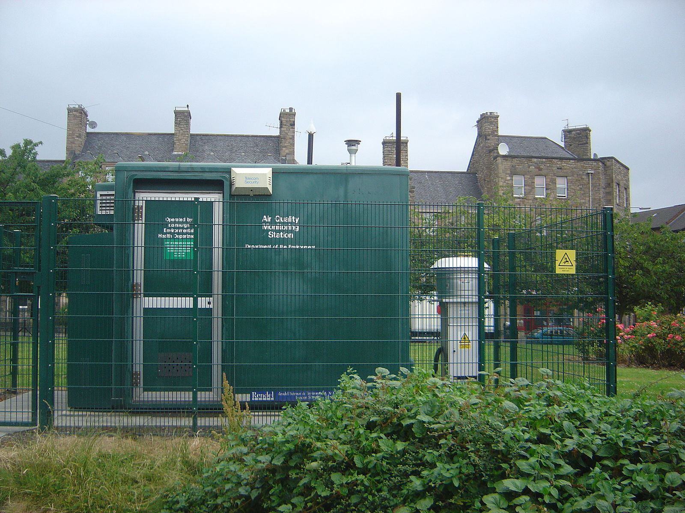
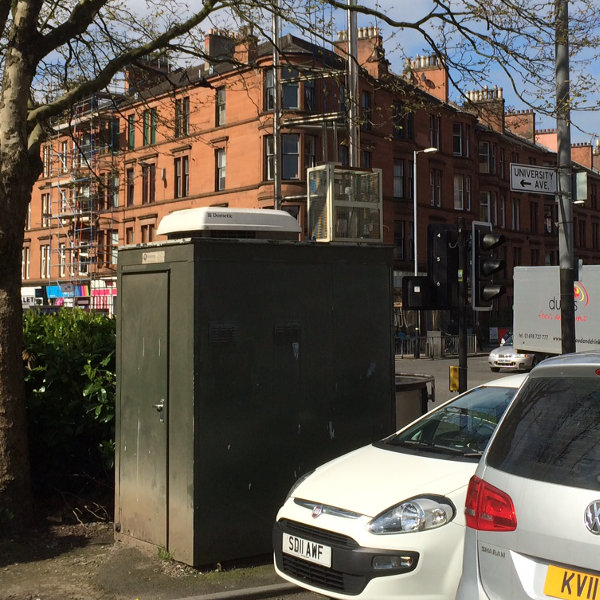
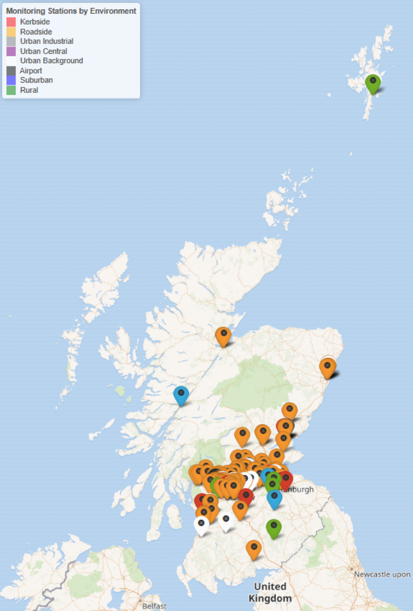
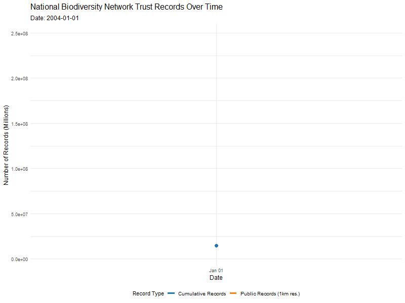
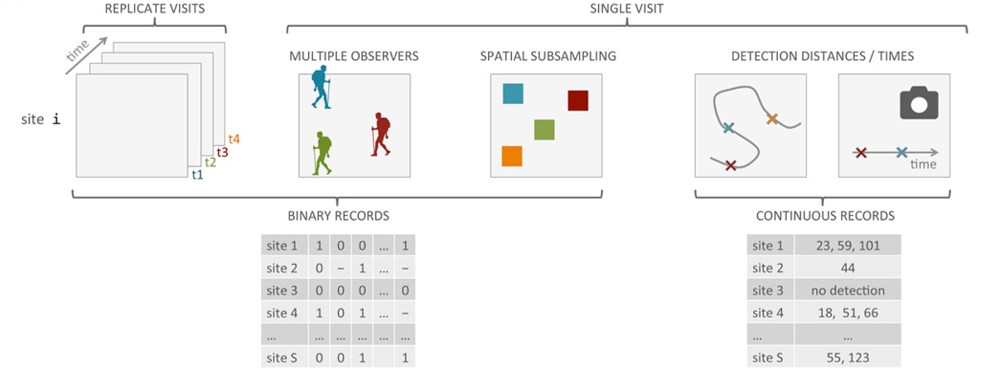
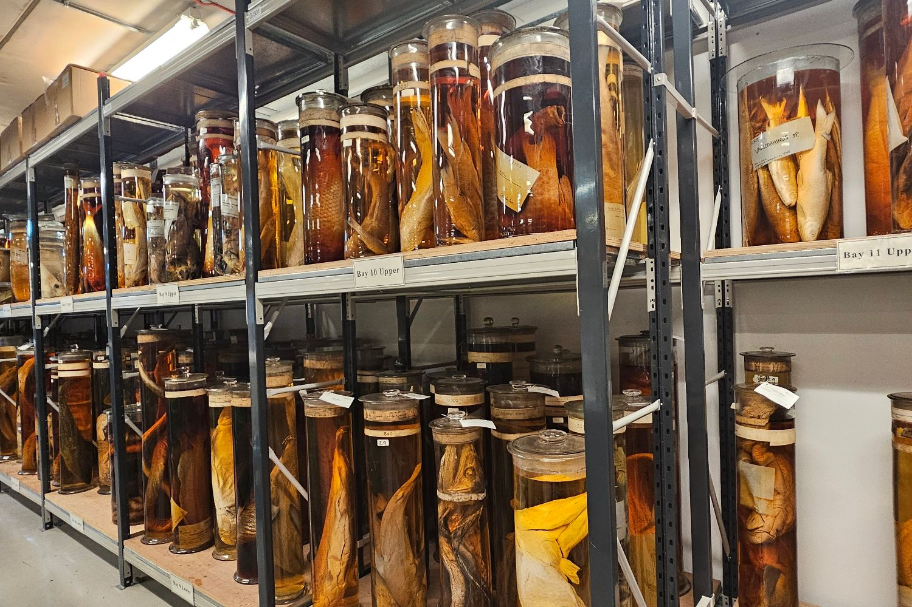
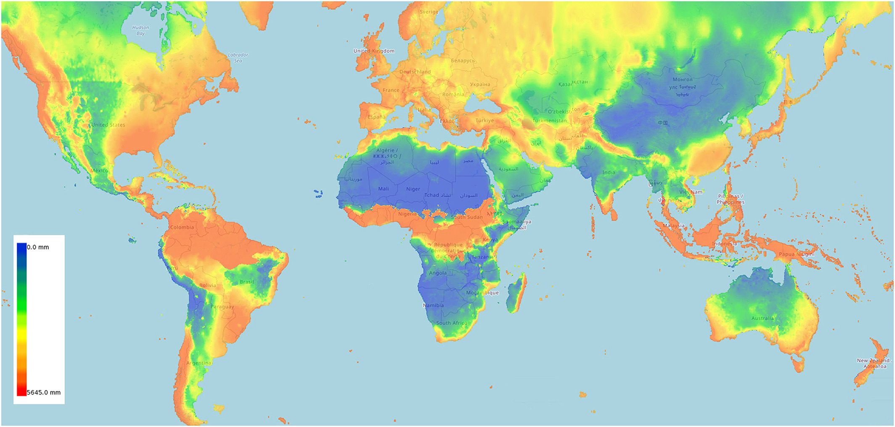

##  {background-image="river.png"}

::: {.blockquote style="color: #FFFFFF; background-color:rgb(38, 38, 38,0.8); font-size: 1.25em; padding: 20px; border-radius: 5px;"}
> "*Every breath of air we take, every mouthful of food that we take, comes from the natural world. And if we damage the natural world, we damage ourselves.*"
>
> Sir. David Attenborough
:::

## What is Environmental and Ecological Statistics? {.smaller}

-   Environmental and Ecological Statistics is an incredibly broad term covering any form of statistics **applied** to environmental and ecological issues.

-   Key themes include climate change, environmental regulation and biodiversity monitoring. This course focuses on this theme rather than a particular type of statistical methodology.

{fig-align="center"}

## Why do we need Environmental and Ecological Statistics? {.smaller auto-animate="true"}

::: {.blockquote style="color: #FFFFFF; background-color:rgb(38, 38, 38,0.1); font-size: 1em; padding: 20px; border-radius: 5px;"}
> Environmental and Ecological problems are complex. Complex questions must be answered with data, but environmental and ecological data are difficult and expensive to collect and gather.
:::

:::::::: columns
::::: {.column width="60%"}
::: fragment
**Big Questions**:
:::

::: incremental
-   Will change in the next 100 years, an if so how?\
-   Map the soil nutrients
-   Determining the air/soil/water pollution levels.
-   Estimate the population size of elephants in a given region and what environmental conditions makes them thrive
-   Where can I find gold?
-   Assessing if a specific bird meets the criteria for an endangered species.
:::
:::::

:::: {.column width="40%"}
::: fragment
**Skills it takes to answer these**:
:::
::::
::::::::

## Why do we need Environmental and Ecological Statistics? {.smaller auto-animate="true"}

::: {.blockquote style="color: #FFFFFF; background-color:rgb(38, 38, 38,0.1); font-size: 1em; padding: 20px; border-radius: 5px;"}
> Environmental and Ecological problems are complex. Complex questions must be answered with data, but environmental and ecological data are difficult and expensive to collect and gather.
:::

::::: columns
::: {.column width="60%"}
**Big Questions**:

-   [Will change in the next 100 years, an if so how?]{style="color:red;"}\
-   Map the soil nutrients
-   [Determining the air/soil/water pollution levels.]{style="color:red;"}
-   Estimate the population size of elephants in a given region and what environmental conditions makes them thrive
-   Where can I find gold?
-   Assessing if a specific bird meets the criteria for an endangered species.
:::

::: {.column width="40%"}
**Skills it takes to answer these**:

-   [Extreme Value Analysis]{style="color:red;"}
:::
:::::

## Why do we need Environmental and Ecological Statistics? {.smaller auto-animate="true"}

::: {.blockquote style="color: #FFFFFF; background-color:rgb(38, 38, 38,0.1); font-size: 1em; padding: 20px; border-radius: 5px;"}
> Environmental and Ecological problems are complex. Complex questions must be answered with data, but environmental and ecological data are difficult and expensive to collect and gather.
:::

::::: columns
::: {.column width="60%"}
**Big Questions**:

-   Will change in the next 100 years, an if so how?
-   [Map the soil nutrients]{style="color:red;"}
-   Determining the air/soil/water pollution levels.
-   Estimate the population size of elephants in a given region and what environmental conditions makes them thrive
-   [Where can I find gold?]{style="color:red;"}
-   Assessing if a specific bird meets the criteria for an endangered species.
:::

::: {.column width="40%"}
**Skills it takes to answer these**:

-   Extreme Value Analysis
-   [Surveying and Sampling]{style="color:red;"}
:::
:::::

## Why do we need Environmental and Ecological Statistics? {.smaller auto-animate="true"}

::: {.blockquote style="color: #FFFFFF; background-color:rgb(38, 38, 38,0.1); font-size: 1em; padding: 20px; border-radius: 5px;"}
> Environmental and Ecological problems are complex. Complex questions must be answered with data, but environmental and ecological data are difficult and expensive to collect and gather.
:::

::::: columns
::: {.column width="60%"}
**Big Questions**:

-   Will change in the next 100 years, an if so how?
-   [Map the soil nutrients]{style="color:red;"}
-   [Determining the air/soil/water pollution levels.]{style="color:red;"}
-   [Estimate the population size of elephants in a given region and what environmental conditions makes them thrive]{style="color:red;"}
-   Where can I find gold?
-   [Assessing if a specific bird meets the criteria for an endangered species.]{style="color:red;"}
:::

::: {.column width="40%"}
**Skills it takes to answer these**:

-   Extreme Value Analysis
-   Surveying and Sampling
-   [spatial and spatiotemporal modelling]{style="color:red;"}
:::
:::::

## Why do we need Environmental and Ecological Statistics? {.smaller auto-animate="true"}

::: {.blockquote style="color: #FFFFFF; background-color:rgb(38, 38, 38,0.1); font-size: 1em; padding: 20px; border-radius: 5px;"}
> Environmental and Ecological problems are complex. Complex questions must be answered with data, but environmental and ecological data are difficult and expensive to collect and gather.
:::

::::: columns
::: {.column width="60%"}
**Big Questions**:

-   Will change in the next 100 years, an if so how?
-   Map the soil nutrients
-   Determining the air/soil/water pollution levels.
-   [Estimate the population size of elephants in a given region and what environmental conditions makes them thrive]{style="color:red;"}
-   Where can I find gold?
-   Assessing if a specific bird meets the criteria for an endangered species.
:::

::: {.column width="40%"}
**Skills it takes to answer these**:

-   Extreme Value Analysis
-   Surveying and Sampling
-   spatial and spatiotemporal modelling
-   [remote sensing analysis]{style="color:red;"}
:::
:::::

## Why do we need Environmental and Ecological Statistics? {.smaller auto-animate="true"}

::: {.blockquote style="color: #FFFFFF; background-color:rgb(38, 38, 38,0.1); font-size: 1em; padding: 20px; border-radius: 5px;"}
> Environmental and Ecological problems are complex. Complex questions must be answered with data, but environmental and ecological data are difficult and expensive to collect and gather.
:::

::::: columns
::: {.column width="60%"}
**Big Questions**:

-   Will change in the next 100 years, an if so how?
-   Map the soil nutrients
-   Determining the air/soil/water pollution levels.
-   [Estimate the population size of elephants in a given region and what environmental conditions makes them thrive]{style="color:red;"}
-   Where can I find gold?
-   Assessing if a specific bird meets the criteria for an endangered species.
:::

::: {.column width="40%"}
**Skills it takes to answer these**:

-   Extreme Value Analysis
-   Surveying and Sampling
-   spatial and spatiotemporal modelling
-   remote sensing analysis
-   [animal movement model]{style="color:red;"}
:::
:::::

## Why do we need Environmental and Ecological Statistics? {.smaller auto-animate="true"}

::: {.blockquote style="color: #FFFFFF; background-color:rgb(38, 38, 38,0.1); font-size: 1em; padding: 20px; border-radius: 5px;"}
> Environmental and Ecological problems are complex. Complex questions must be answered with data, but environmental and ecological data are difficult and expensive to collect and gather.
:::

::::: columns
::: {.column width="60%"}
**Big Questions**:

-   Will change in the next 100 years, an if so how?
-   Map the soil nutrients
-   Determining the air/soil/water pollution levels.
-   [Estimate the population size of elephants in a given region and what environmental conditions makes them thrive]{style="color:red;"}
-   Where can I find gold?
-   [Assessing if a specific bird meets the criteria for an endangered species.]{style="color:red;"}
:::

::: {.column width="40%"}
**Skills it takes to answer these**:

-   Extreme Value Analysis
-   Surveying and Sampling
-   spatial and spatiotemporal modelling
-   remote sensing analysis
-   animal movement model
-   [point-process models]{style="color:red;"}
:::
:::::

## Why do we need Environmental and Ecological Statistics? {.smaller auto-animate="true"}

::: {.blockquote style="color: #FFFFFF; background-color:rgb(38, 38, 38,0.1); font-size: 1em; padding: 20px; border-radius: 5px;"}
> Environmental and Ecological problems are complex. Complex questions must be answered with data, but environmental and ecological data are difficult and expensive to collect and gather.
:::

::::: columns
::: {.column width="60%"}
**Big Questions**:

-   Will change in the next 100 years, an if so how?
-   Map the soil nutrients
-   Determining the air/soil/water pollution levels.
-   [Estimate the population size of elephants in a given region and what environmental conditions makes them thrive]{style="color:red;"}
-   Where can I find gold?
-   [Assessing if a specific bird meets the criteria for an endangered species.]{style="color:red;"}
:::

::: {.column width="40%"}
**Skills it takes to answer these**:

-   Extreme Value Analysis
-   Surveying and Sampling
-   spatial and spatiotemporal modelling
-   remote sensing analysis
-   animal movement model
-   point-process models
-   [Detection Methods]{style="color:red;"}
:::
:::::

## Media Coverage {.smaller}

This brings increased focus and interest in statistics as a subject, and how we are working to handle topics like climate change.

:::::: columns
:::: {.column width="50%"}
::: {style="height: 50px;"}
:::


::::

::: {.column width="50%"}
<https://www.bbc.co.uk/news/science-environment-46384067>

```{r}
#| echo: false
#| warning: false
#| message: false
#| eval: false

library(qrcode)

qr_code("https://www.bbc.co.uk/news/science-environment-46384067") |>
  generate_svg(
    "slides/figures/BBC_QR.svg",
    background = "transparent",
    show = FALSE
  )

```

{fig-align="center" width="388"}
:::
::::::

## BBC article graphs task {.smaller}

::::: columns
::: {.column width="50%"}
-   Choose one of the graphs in the BBC article.

-   Think about what the good and bad aspects (if any) are.

-   Discuss with your neighbour(s) and find out what they thought about their chosen graph.

-   Add some of your thoughts to Mentimeter,

    -   E.g. What graph you chose.

    -   What is the graph's purpose?

    -   Does it do a good job at serving this purpose?

    -   What did you like/dislike about the graph?
:::

::: {.column width="50%"}
{fig-align="center" width="347"}
:::
:::::

## Where's the statistics?

::: incremental
-   Measuring, sampling or monitoring environmental and ecological data, including variation and uncertainty.

-   Ecosystem assessment, detecting and modelling trends, including trends in time and space.

-   Modelling and understanding extreme data.

-   Environmental regulation and policy, and risk assessment.
:::

## What are we looking for?

We want to understand changes in the environment and species respond to these changes, in either time, space or both.

::: incremental
-   Are things getting better or worse? Where, when and by how much?
-   What is going to happen next?
-   Where do authorities need to take action, and how can we check if existing actions are working?
-   Also consider complex relationships between environmental variables and species habitats.
:::

## Examples: Air pollution {.smaller auto-animate="true"}

Only **one person in ten** lives in a city that complies with the World Health Organisation Air quality guidelines.

{fig-align="center"}

## Examples: Air pollution {.smaller auto-animate="true"}

Only **one person in ten** lives in a city that complies with the World Health Organisation Air quality guidelines.

::: incremental
-   The World Health Organisation estimates that 1 in 9 deaths worldwide are due to pollution.
-   The total annual cost of air pollution to the UK economy could be as much as £54 billion.
-   Fine particular matter was associated with an estimated 2,000 premature deaths and 22,500 lost life years in Scotland in 2010.
-   The Cleaner Air for Scotland strategy seeks to reduce air pollution across Scotland.
-   It aims to achieve the "ambitious vision for Scotland to have the best air quality in Europe"
:::

::: fragment
**How can we estimate air pollution across Scotland?**
:::

## Measuring Pollution {.smaller}

-   99 air quality monitoring stations have been set up across Scotland to capture PM$_{2.5}$, PM$_{10}$, NO$_{2}$, NO$_{x}$, SO$_{2}$ and O$_{3}$.

-   Live data available at \url{http://www.scottishairquality.scot/}

::: {layout-ncol="2"}



:::

## Monitoring Station Map

{fig-align="center"}

## Estimated PM 2.5 pollution across Scotland

What is missing from here?

::: {layout-ncol="2"}
{fig-align="center" width="451"}

{fig-align="center" width="414"}
:::


## Asking questions

-   A big part of our role as statisticians is to ask questions of both our data and our models.
-   How were our data collected? Are they representative of the population? How much uncertainty do we have?
-   Are our models valid? Are the assumptions reasonable? Does the model make sensible predictions? How much uncertainty do we have in our results?
-   These skills are particularly crucial in applied areas such as environmental and ecological statistics.


# Ecological and Environmental Data

## The new era of environmental and ecological data {.smaller background-color="#FFFFFF"}

-   Over the last decade, the information available for surveying and monitoring ecological and environmental resources has changed radically.

-   The rise of new technologies facilitates the access to large volumes of environmental and ecological data.

{fig-align="center" width="635"}

## The new era of environmental and ecological data {.smaller}

Today's ecological and environmental data landscape is overwhelmingly vast - far too extensive to cover comprehensively in one session!

Instead, we'll focus on key data sources



## Institutional Monitoring Programmes {.smaller auto-animate="true" background-color="#FFFFFF"}

::: incremental
-   primary source of information for long-term environmental assessment, producing **structured datasets**

-   *field surveys* conducted on established *monitoring networks* to track trends in species populations, habitat quality, and ecosystem processes

-   Planned Surveys produce **structured data** which involves constant monitoring schemes using standardised methods at sites on a regular basis.

-   Minimizing observational error & sampling biases.
:::

{fig-align="center"}

## Institutional Monitoring Programmes {.smaller auto-animate="true" background-color="#FFFFFF"}

-   primary source of information for long-term environmental assessment, producing **structured datasets**

-   *field surveys* conducted on established *monitoring networks* to track trends in species populations, habitat quality, and ecosystem processes

-   Planned Surveys produce **structured data** which involves constant monitoring schemes using standardised methods at sites on a regular basis.

-   Minimizing observational error & sampling biases.

-   These are **expensive** to collect and tend to be geographically and temporally restricted.

{fig-align="center"}

## Institutional Monitoring Programmes

::: custom-tiny
| Monitoring Scheme | Description |
|------------------------------------|------------------------------------|
| United Kingdom Butterfly Monitoring Scheme ([UKBMS](https://ukbms.org/)) | Protocolized sampling scheme run by butterfly conservation that has monitored changes in the abundance of butterflies throughout the United Kingdom since 1976. |
| UK Environmental Change Network ([ECN](https://ecn.ac.uk/)) | UK's long-term ecosystem monitoring and research programme that has produced a large collection of publicly available data sets including meteorological, biogeochemistry and biological data for different taxonomic groups [@rennie2020]. |
| National Hydrological Monitoring Programme ([NHMP](https://nrfa.ceh.ac.uk/nhmp)) | The NHMP, particulalry the National River Flow Archive conveys a national scale management of hydrological data within the UK hosted by the UKCEH since 1982 collating hydrometric data from gauging station networks operated by multiple agencies. |
| Natural Capital and Ecosystem Assessment ([NCEA](https://environment.data.gov.uk/natural-capital-ecosystem-assessment/about)) | Long-term environmental monitoring of natural capital including data from freshwater Surveillance Networks, ecosystem condition & soil health, forest inventory, estuary and coast surveillance, etc. |
| Breeding Bird Survey ([BBS](https://www.bto.org/)) | Main scheme for monitoring the population changes of the UK's common breeding birds. It covers all habitat types and monitors 110 common and widespread breeding birds using a randomised site selection. |
:::

## Citizen Science Programmes & Platforms {.smaller auto-animate="true" background-color="#FFFFFF"}

**Unstructured data** constitute the majority of available information.

-   **Citizen science** projects offer a cost-effective solution to investigate species distributions at large spatial and temporal scales.

{fig-align="center"}

## Citizen Science Programmes & Platforms {.smaller auto-animate="true" background-color="#FFFFFF"}

**Unstructured data** constitute the majority of available information.

-   **Citizen science** projects offer a cost-effective solution to investigate species distributions at large spatial and temporal scales.
-   Harnessing the power of CS data is not an easy task!

| Advantages 😄👍 | Disadvantages 😔👎 |
|------------------------------------|------------------------------------|
| Extensive taxonomic, spatial and temporal coverage. | Under-reporting of rare and inconspicuous species. |
| Eye-catching species that are easily identifiable by participants. | Varying recording skills and uneven sampling effort. |

## Sampling Bias in CS opportunistic data {.smaller}

Large volumes of CS data come from **Opportunistic surveys** where sampling effort is **biased** across space and time.

-   People visit more certain places than others.

![Elevation versus sampling effort (obtained through the Pl\@net Net App) in the French mediterranean region (Figure taken from [@botella2020]).](figures/sampling_eff_ex.png){fig-align="center"}

::: incremental
-   Small populations at lower elevation could be over-sampled.

-   If we assume sampling is evenly distributed, species distribution at higher elevation would be under-estimated
:::

## Biological Collections {.smaller}

:::::: columns
:::: {.column width="40%"}
::: incremental
-   Oldest form of historical data reservoirs driven originally by personal interest but provedn to be a key source of information for addressing modern global challenges

-   The Natural History Museum in London safeguards a collection of over 80 million specimens, spanning 4.5 billion years of Earth's history to the present.

-   Most historic collection were obtained in an opportunistic manner - largely dependent on the particular interests of the collector)

-   The information associated with each collection or specimen vary widely, limiting the environmental context.
:::
::::

::: {.column width="60%"}
{fig-align="center"}
:::
::::::

## Data Repositories & Portals {.smaller}

**Centralized, curated platforms** that aggregate, preserve, and disseminate environmental data


:::::: columns
:::: {.column width="60%"}

**Examples:**

-   Global Biodiversity Information Facility (GBIF)

-   National Biodiversity Network (NBN) Atlas

-   UK-SCAPE plant diversity trends

-   UK Lakes portal

**Key Features:**

-   Standardize heterogeneous datasets

-   Enable cross-disciplinary data sharing

-   Often include interactive **data portals** with:

    -   Visualization tools

    -   Web applications

    -   Programming interfaces (APIs)

    -   Data catalogues
    
::::
:::: {.column width="40%"}


::::
:::::: 

## Processed information products {.smaller}

Processed information products transform raw measurements into refined, analysis-ready resources tailored for decision-makers and researchers.

Unlike primary data repositories, these products undergo rigorous calibration, integration, and modelling to generate authoritative maps, indicators, and synthesized datasets.

::: {.callout-note appearance="simple" icon="false"}
## Example: Worlclim

-   [WorldClim](https://www.worldclim.org/) is a widely used set of global, high-resolution climate surfaces (raster maps) that provide interpolated estimates of historical and future projections of temperature, precipitation, and other bioclimatic variables.

-   These surfaces serve as the foundational data for species distribution modeling, ecological forecasting, and a vast range of other environmental research applications.

{fig-align="center" width="450"}
:::

## Remote sensing {.smaller}

:::::: columns
:::: {.column width="60%"}
Remote sensing refer the process of obtaining information of an object from a distance, typically from aircraft or satellites

::: incremental
-   Enables non-invasive monitoring of Earth's environment across vast scales, generating products like land cover maps and vegetation indices

-   Provides systematic, near-real-time data but has substantial uncertainties from sensor calibration, resolution constraints, and lower accuracy than field measurements

-   Requires validation with in-situ data to assess and ensure accuracy of remote sensing products
:::
::::

::: {.column width="40%"}
{fig-align="center"}
:::
::::::

## Remote sensing examples {.smaller}

::: {.callout-note icon="false"}
## Digital Elevation Models (DEMs) 

DEMs are digital representations of the earth's topographic surface providing a continuous and quantitative model of terrain morphology.

The accuracy of DEMs is determined primarily by the resolution of the model (the size of the area represented by each individual grid cell in a raster).

**Example**: Shuttle RaDAR Topography Mission (SRTM), aquired by NASA using a Synthetic Aperture Radar (SAR) instrument, provide elevation data for any country
:::

::: {.callout-note icon="false"}
## Land Cover Maps 

Land cover maps describe the physical material on the Earth's surface.

They are created by applying automated algorithms to satellite or aerial imagery to identify features such as grassland, woodland, rivers & lakes or man-made structures such as roads and buildings.

**Example**: UK CEH [Land Cover Maps](https://www.ceh.ac.uk/data/ukceh-land-cover-maps) provide consistent national-scale representations of surface vegetation and land use classes.
:::

::: {.callout-note icon="false"}
## NDVI Vegetation Index 

Vegetation indeces derived from remote sensing utilize spectral data from satellite or aerial sensors to quantify and monitor plant health, structure, and function across landscapes.

The Normalized Difference Vegetation Index (NDVI ranges from -1 to +1, where positive values indicating healthier, denser vegetation and negative values indicating surfaces like water, snow, or bare ground.
:::


## Research-Generated Data {.smaller}

Research-generated data repositories, such as [Dryad](https://datadryad.org/about) and [Zenodo](https://zenodo.org/), are cornerstone platforms in the modern scientific workflow, explicitly designed to uphold the principles of transparency, reproducibility, and open data access.

::::: columns
::: {.column width="50%"}
**Core Features:**

-   Researchers **actively deposit** datasets, code, and scripts

-   Assign **persistent DOIs** for citation and access

-   Enable **verification** and **replication** of findings
:::

::: {.column width="50%"}
**Impact:**

-   Detects errors & reduces redundancy

-   Accelerates scientific discovery

-   Transforms single studies into community resources

-   Safeguards scientific integrity
:::
:::::


## Summary points

-   **Environmental and Ecological statistics** is a broad term covering many different techniques.

-   It can involve:

    -   Decision-making
    -   Prediction
    -   Regulation
    -   Understanding

-   We need to communicate and present data and statistics to e.g. the public, government and subject-matter experts.

## Ecological and Environmental data sets {.scrollable}

::: custom-tiny
| Source 📅 | Advantages 😀 | Disadvantages 😒 |
|------------------------|------------------------|------------------------|
| Monitoring programmes | Minimises sources of bias through design | Costly and temporally and geographically restricted |
| Citizen Science | Cost effective, large spatio-temporal coverage | Biased towards certain species and places that are easy to access or of public interest. |
| Biological collections | Large historical collections preserved in collections. | The data associated with each collection varies widely. Also, information about the sampling is often missing and there are also important sources of spatial and taxonomic bias. |
| Data repositories | Store large collection of data sources which are often publicly available. | Data are often standardized (losing information) or summarised to a particular spatial resolution. Contain varying data source some of which can be biased. |
| Processed products | Undergo rigorous calibration, integration, and modelling to generate high quality data. | Not always licence-free or publicly available. |
| Research Generated Data | If available, they provide high quality data,scripts and code that can be cited and provides transparency and reproducibility. | *If available* sometimes is a big *If*. Also, sometimes code gets outdated or developers do not longer maintain it. |
:::


## References

-   Piegorsch, W. W., & Bailer, A. J. (2005). *Analyzing environmental data*. Wiley. (Available from the University Library as an e-book [here](https://go.exlibris.link/6wbh6zq0) ).

-   Barnett, V. (2004). *Environmental statistics: Methods and applications*. Wiley. (Available from the University Library as an e-book [here](https://go.exlibris.link/TbMBCTkV) ).

-   Manly, B. F. J. (2001). *Statistics for environmental science and management*. Chapman & Hall/CRC. (No e-book available, but [a physical copy is available from the University Library](https://go.exlibris.link/Jcyj94mj) ).
