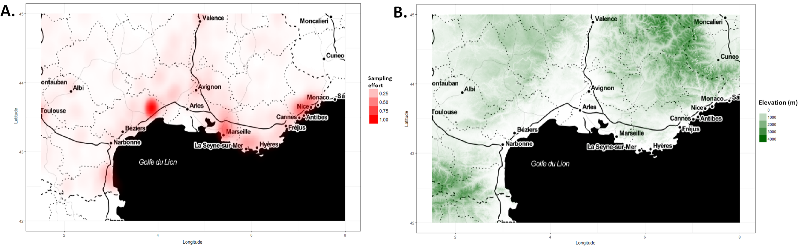

##  {background-image="river.png"}

::: {style="height: 100px;"}
:::

::: quote-gold
> "*Every breath of air we take, every mouthful of food that we take, comes from the natural world. And if we damage the natural world, we damage ourselves.*"
>
> Sir. David Attenborough
:::

## What is Environmental and Ecological Statistics? {.smaller}

-   Environmental and Ecological Statistics is an incredibly broad term covering any form of statistics **applied** to environmental and ecological issues.

-   Key themes include climate change, environmental regulation and biodiversity monitoring. This course focuses on this theme rather than a particular type of statistical methodology.

{fig-align="center"}

## Why do we need Environmental and Ecological Statistics? {.smaller auto-animate="true"}

::: {.blockquote style="color: #FFFFFF; background-color:rgb(38, 38, 38,0.1); font-size: 1em; padding: 20px; border-radius: 5px;"}
> Environmental and Ecological problems are complex. Complex questions must be answered with data, but environmental and ecological data are difficult and expensive to collect and gather.
:::

:::::::: columns
::::: {.column width="60%"}
::: fragment
**Big Questions**:
:::

::: incremental
-   Will change in the next 100 years, an if so how?\
-   Map the soil nutrients
-   Determining the air/soil/water pollution levels.
-   Estimate the population size of elephants in a given region and what environmental conditions makes them thrive
-   Where can I find gold?
-   Assessing if a specific bird meets the criteria for an endangered species.
:::
:::::

:::: {.column width="40%"}
::: fragment
**Skills it takes to answer these**:
:::
::::
::::::::

## Why do we need Environmental and Ecological Statistics? {.smaller auto-animate="true"}

::: {.blockquote style="color: #FFFFFF; background-color:rgb(38, 38, 38,0.1); font-size: 1em; padding: 20px; border-radius: 5px;"}
> Environmental and Ecological problems are complex. Complex questions must be answered with data, but environmental and ecological data are difficult and expensive to collect and gather.
:::

::::: columns
::: {.column width="60%"}
**Big Questions**:

-   [Will change in the next 100 years, an if so how?]{style="color:red;"}\
-   Map the soil nutrients
-   [Determining the air/soil/water pollution levels.]{style="color:red;"}
-   Estimate the population size of elephants in a given region and what environmental conditions makes them thrive
-   Where can I find gold?
-   Assessing if a specific bird meets the criteria for an endangered species.
:::

::: {.column width="40%"}
**Skills it takes to answer these**:

-   [Extreme Value Analysis]{style="color:red;"}
:::
:::::

## Why do we need Environmental and Ecological Statistics? {.smaller auto-animate="true"}

::: {.blockquote style="color: #FFFFFF; background-color:rgb(38, 38, 38,0.1); font-size: 1em; padding: 20px; border-radius: 5px;"}
> Environmental and Ecological problems are complex. Complex questions must be answered with data, but environmental and ecological data are difficult and expensive to collect and gather.
:::

::::: columns
::: {.column width="60%"}
**Big Questions**:

-   Will change in the next 100 years, an if so how?
-   [Map the soil nutrients]{style="color:red;"}
-   Determining the air/soil/water pollution levels.
-   Estimate the population size of elephants in a given region and what environmental conditions makes them thrive
-   [Where can I find gold?]{style="color:red;"}
-   Assessing if a specific bird meets the criteria for an endangered species.
:::

::: {.column width="40%"}
**Skills it takes to answer these**:

-   Extreme Value Analysis
-   [Surveying and Sampling]{style="color:red;"}
:::
:::::

## Why do we need Environmental and Ecological Statistics? {.smaller auto-animate="true"}

::: {.blockquote style="color: #FFFFFF; background-color:rgb(38, 38, 38,0.1); font-size: 1em; padding: 20px; border-radius: 5px;"}
> Environmental and Ecological problems are complex. Complex questions must be answered with data, but environmental and ecological data are difficult and expensive to collect and gather.
:::

::::: columns
::: {.column width="60%"}
**Big Questions**:

-   Will change in the next 100 years, an if so how?
-   [Map the soil nutrients]{style="color:red;"}
-   [Determining the air/soil/water pollution levels.]{style="color:red;"}
-   [Estimate the population size of elephants in a given region and what environmental conditions makes them thrive]{style="color:red;"}
-   Where can I find gold?
-   [Assessing if a specific bird meets the criteria for an endangered species.]{style="color:red;"}
:::

::: {.column width="40%"}
**Skills it takes to answer these**:

-   Extreme Value Analysis
-   Surveying and Sampling
-   [spatial and spatiotemporal modelling]{style="color:red;"}
:::
:::::

## Why do we need Environmental and Ecological Statistics? {.smaller auto-animate="true"}

::: {.blockquote style="color: #FFFFFF; background-color:rgb(38, 38, 38,0.1); font-size: 1em; padding: 20px; border-radius: 5px;"}
> Environmental and Ecological problems are complex. Complex questions must be answered with data, but environmental and ecological data are difficult and expensive to collect and gather.
:::

::::: columns
::: {.column width="60%"}
**Big Questions**:

-   Will change in the next 100 years, an if so how?
-   Map the soil nutrients
-   Determining the air/soil/water pollution levels.
-   [Estimate the population size of elephants in a given region and what environmental conditions makes them thrive]{style="color:red;"}
-   Where can I find gold?
-   Assessing if a specific bird meets the criteria for an endangered species.
:::

::: {.column width="40%"}
**Skills it takes to answer these**:

-   Extreme Value Analysis
-   Surveying and Sampling
-   spatial and spatiotemporal modelling
-   [remote sensing analysis]{style="color:red;"}
:::
:::::

## Why do we need Environmental and Ecological Statistics? {.smaller auto-animate="true"}

::: {.blockquote style="color: #FFFFFF; background-color:rgb(38, 38, 38,0.1); font-size: 1em; padding: 20px; border-radius: 5px;"}
> Environmental and Ecological problems are complex. Complex questions must be answered with data, but environmental and ecological data are difficult and expensive to collect and gather.
:::

::::: columns
::: {.column width="60%"}
**Big Questions**:

-   Will change in the next 100 years, an if so how?
-   Map the soil nutrients
-   Determining the air/soil/water pollution levels.
-   [Estimate the population size of elephants in a given region and what environmental conditions makes them thrive]{style="color:red;"}
-   Where can I find gold?
-   Assessing if a specific bird meets the criteria for an endangered species.
:::

::: {.column width="40%"}
**Skills it takes to answer these**:

-   Extreme Value Analysis
-   Surveying and Sampling
-   spatial and spatiotemporal modelling
-   remote sensing analysis
-   [animal movement model]{style="color:red;"}
:::
:::::

## Why do we need Environmental and Ecological Statistics? {.smaller auto-animate="true"}

::: {.blockquote style="color: #FFFFFF; background-color:rgb(38, 38, 38,0.1); font-size: 1em; padding: 20px; border-radius: 5px;"}
> Environmental and Ecological problems are complex. Complex questions must be answered with data, but environmental and ecological data are difficult and expensive to collect and gather.
:::

::::: columns
::: {.column width="60%"}
**Big Questions**:

-   Will change in the next 100 years, an if so how?
-   Map the soil nutrients
-   Determining the air/soil/water pollution levels.
-   [Estimate the population size of elephants in a given region and what environmental conditions makes them thrive]{style="color:red;"}
-   Where can I find gold?
-   [Assessing if a specific bird meets the criteria for an endangered species.]{style="color:red;"}
:::

::: {.column width="40%"}
**Skills it takes to answer these**:

-   Extreme Value Analysis
-   Surveying and Sampling
-   spatial and spatiotemporal modelling
-   remote sensing analysis
-   animal movement model
-   [point-process models]{style="color:red;"}
:::
:::::

## Why do we need Environmental and Ecological Statistics? {.smaller auto-animate="true"}

::: {.blockquote style="color: #FFFFFF; background-color:rgb(38, 38, 38,0.1); font-size: 1em; padding: 20px; border-radius: 5px;"}
> Environmental and Ecological problems are complex. Complex questions must be answered with data, but environmental and ecological data are difficult and expensive to collect and gather.
:::

::::: columns
::: {.column width="60%"}
**Big Questions**:

-   Will change in the next 100 years, an if so how?
-   Map the soil nutrients
-   Determining the air/soil/water pollution levels.
-   [Estimate the population size of elephants in a given region and what environmental conditions makes them thrive]{style="color:red;"}
-   Where can I find gold?
-   [Assessing if a specific bird meets the criteria for an endangered species.]{style="color:red;"}
:::

::: {.column width="40%"}
**Skills it takes to answer these**:

-   Extreme Value Analysis
-   Surveying and Sampling
-   spatial and spatiotemporal modelling
-   remote sensing analysis
-   animal movement model
-   point-process models
-   [Detection Methods]{style="color:red;"}
:::
:::::

## Media Coverage {.smaller}

This brings increased focus and interest in statistics as a subject, and how we are working to handle topics like climate change.

:::::: columns
:::: {.column width="50%"}
::: {style="height: 50px;"}
:::


::::

::: {.column width="50%"}
<https://www.bbc.co.uk/news/science-environment-46384067>

```{r}
#| echo: false
#| warning: false
#| message: false
#| eval: false

library(qrcode)

qr_code("https://www.bbc.co.uk/news/science-environment-46384067") |>
  generate_svg(
    "slides/figures/BBC_QR.svg",
    background = "transparent",
    show = FALSE
  )

```

{fig-align="center" width="388"}
:::
::::::

## In class activity: BBC article graphs  {.smaller}

::: {style="height: 31.25em"}
:::

**Tasks**


::::: columns
::: {.column width="50%"}


-   Choose one of the graphs in the BBC article.

-   Think about what the good and bad aspects (if any) are.

-   Discuss with your neighbour(s) and find out what they thought about their chosen graph.

-   Add some of your thoughts to Mentimeter,

    -   E.g. What graph you chose.

    -   What is the graph's purpose?

    -   Does it do a good job at serving this purpose?

    -   What did you like/dislike about the graph?
:::

::: {.column width="50%"}
{fig-align="center" width="347"}
:::
:::::

<!-- ## Where's the statistics? -->

<!-- ::: incremental -->
<!-- -   Measuring, sampling or monitoring environmental and ecological data, including variation and uncertainty. -->

<!-- -   Ecosystem assessment, detecting and modelling trends, including trends in time and space. -->

<!-- -   Modelling and understanding extreme data. -->

<!-- -   Environmental regulation and policy, and risk assessment. -->
<!-- ::: -->

## What are we looking for?

We want to understand changes in the environment and how species respond to these changes, in either time, space or both.

::: incremental
-   Are things getting better or worse? Where, when and by how much?
-   What is going to happen next?
-   Where do authorities need to take action, and how can we check if existing actions are working?
-   Also consider complex relationships between environmental variables and species habitats.
:::

## Examples: Air pollution {.smaller auto-animate="true"}

Only **one person in ten** lives in a city that complies with the World Health Organisation Air quality guidelines.

{fig-align="center"}

## Examples: Air pollution {.smaller auto-animate="true"}

Only **one person in ten** lives in a city that complies with the World Health Organisation Air quality guidelines.

::: incremental
-   The World Health Organisation estimates that 1 in 9 deaths worldwide are due to pollution.
-   The total annual cost of air pollution to the UK economy could be as much as £54 billion.
-   Fine particular matter was associated with an estimated 2,000 premature deaths and 22,500 lost life years in Scotland in 2010.
-   The Cleaner Air for Scotland strategy seeks to reduce air pollution across Scotland.
-   It aims to achieve the "ambitious vision for Scotland to have the best air quality in Europe"
:::

::: fragment
**How can we estimate air pollution across Scotland?**
:::

## Measuring Pollution {.smaller}

-   99 air quality monitoring stations have been set up across Scotland to capture PM$_{2.5}$, PM$_{10}$, NO$_{2}$, NO$_{x}$, SO$_{2}$ and O$_{3}$.

-   Live data available at \url{http://www.scottishairquality.scot/}

::: {layout-ncol="2"}


:::

## Monitoring Station Map

{fig-align="center"}

## Estimated PM 2.5 pollution across Scotland

What is missing from here?

::: {layout-ncol="2"}
{fig-align="center" width="362"}

{fig-align="center" width="414"}
:::

## Asking questions

-   A big part of our role as statisticians is to ask questions of both our data and our models.
-   How were our data collected? Are they representative of the population? How much uncertainty do we have?
-   Are our models valid? Are the assumptions reasonable? Does the model make sensible predictions? How much uncertainty do we have in our results?
-   These skills are particularly crucial in applied areas such as environmental and ecological statistics.

# Ecological and Environmental Data {background-image="river.png"}

## The new era of environmental and ecological data {.smaller background-color="#FFFFFF"}

-   Over the last decade, the information available for surveying and monitoring ecological and environmental resources has changed radically.

-   The rise of new technologies facilitates the access to large volumes of environmental and ecological data.

{fig-align="center" width="635"}

## The new era of environmental and ecological data {.smaller}

Today's ecological and environmental data landscape is overwhelmingly vast - far too extensive to cover comprehensively in one session!

Instead, we'll focus on key data sources



::: fragment
Most environmental data sits on a spectrum from **structured** to **unstructured** — defined by how much the *sampling process* is controlled.
:::

## Structured: institutional monitoring {.smaller background-color="#FFFFFF" auto-animate="TRUE"}

Primary source of information for long-term environmental assessment

-   Field surveys on established **monitoring networks**, using standardised methods at fixed sites on a regular schedule.
-   Designed to **minimise observational error and sampling bias**

{fig-align="center"}

## Structured: institutional monitoring {.smaller background-color="#FFFFFF" auto-animate="TRUE"}

Primary source of information for long-term environmental assessment

-   Field surveys on established **monitoring networks**, using standardised methods at fixed sites on a regular schedule.
-   Designed to **minimise observational error and sampling bias**
-   BUT: **expensive**, and geographically and temporally **restricted**.

{fig-align="center"}

## Structured: institutional monitoring {.smaller background-color="#FFFFFF" auto-animate="TRUE"}

Primary source of information for long-term environmental assessment

-   Field surveys on established **monitoring networks**, using standardised methods at fixed sites on a regular schedule.
-   Designed to **minimise observational error and sampling bias**
-   BUT: **expensive**, and geographically and temporally **restricted**.

| Scheme | What it monitors |
|------------------------------------|------------------------------------|
| [UKBMS](https://ukbms.org/) | Butterfly abundance across the UK since 1976 |
| [BBS](https://www.bto.org/) | Common breeding birds, randomised site selection |
| [ECN](https://ecn.ac.uk/) | Long-term ecosystem, meteorological & biological data |

## Unstructured: citizen science & collections {.smaller background-color="#FFFFFF" auto-animate="TRUE"}

**Unstructured data** constitute the majority of available information.

::::: columns
::: {.column width="50%"}
**Citizen science**

-   Cost-effective at large scales
-   Extensive taxonomic / spatial / temporal coverage

{fig-align="center"}
:::

::: {.column width="50%"}
**Biological collections**

-   Oldest historical data reservoir

-   Largely **opportunistic** — driven by collector interest

-   

    {fig-align="center"}
:::
:::::

## Unstructured: citizen science & collections {.smaller background-color="#FFFFFF" auto-animate="TRUE"}

**Unstructured data** constitute the majority of available information.

::::: columns
::: {.column width="50%"}
**Citizen science**

-   Cost-effective at large scales
-   Extensive taxonomic / spatial / temporal coverage
:::

::: {.column width="50%"}
**Biological collections**

-   Oldest historical data reservoir
-   Largely **opportunistic** — driven by collector interest
:::
:::::

::: {.callout-warning appearance="minimal"}
Harnessing the power of unstructured data is not an easy task!
:::

| Advantages 😄👍 | Disadvantages 😔👎 |
|------------------------------------|------------------------------------|
| Extensive taxonomic, spatial and temporal coverage. | Under-reporting of rare and inconspicuous species. |
| Eye-catching species that are easily identifiable by participants. | Varying recording skills and uneven sampling effort. |

## Sampling bias is the core problem {.smaller background-color="#FFFFFF"}

Opportunistic data have sampling effort that is **biased across space and time** — people visit some places far more than others.

{fig-align="center" width="55%"}

::: incremental
-   Small populations at lower elevation could be over-sampled.

-   If we assume sampling is evenly distributed, species distribution at higher elevation would be under-estimated

-   Correcting this is a statistical problem
:::

## Curated & derived products {.smaller background-color="#FFFFFF"}

When we don't collect data ourselves, we draw on **second-hand and modelled sources** — each adding its own layer of uncertainty.

::::: columns
::: {.column width="50%"}
**Aggregated repositories**

-   GBIF, NBN Atlas, Dryad, Zenodo
-   Standardise heterogeneous data; DOIs, APIs, portals

{fig-align="center" width="228"}
:::

::: {.column width="50%"}
**Processed & remote-sensed**

-   WorldClim climate surfaces
-   DEMs, land cover maps, NDVI

{fig-align="center" width="230"}
:::
:::::

## Curated & derived products {.smaller background-color="#FFFFFF" auto-animate="TRUE"}

When we don't collect data ourselves, we draw on **second-hand and modelled sources** — each adding its own layer of uncertainty.

::::: columns
::: {.column width="50%"}
**Aggregated repositories**

-   GBIF, NBN Atlas, Dryad, Zenodo
-   Standardise heterogeneous data; DOIs, APIs, portals
:::

::: {.column width="50%"}
**Processed & remote-sensed**

-   WorldClim climate surfaces
-   DEMs, land cover maps, NDVI
:::
:::::

:::: {.callout-warning appearance="simple" icon="true"}
::: {style="font-size: 1.8em;"}
Derived products are **modelled, not measured** — they carry calibration and resolution error, and often need validation against in-situ data.
:::
::::

## The common thread → uncertainty {background-color="#FFFFFF"}

Every source trades **coverage against bias and error**:

-   structured data: low bias, narrow coverage
-   unstructured data: broad coverage, high bias
-   derived products: convenient, but modelled and uncertain

::: fragment
No dataset gives us the truth directly. That is exactly why we need to be precise about **error**, **uncertainty**, and **inference** — which is where we go next.
:::

<!-- ## Institutional Monitoring Programmes {.smaller auto-animate="true" background-color="#FFFFFF"} -->

<!-- ::: incremental -->

<!-- -   primary source of information for long-term environmental assessment, producing **structured datasets** -->

<!-- -   *field surveys* conducted on established *monitoring networks* to track trends in species populations, habitat quality, and ecosystem processes -->

<!-- -   Planned Surveys produce **structured data** which involves constant monitoring schemes using standardised methods at sites on a regular basis. -->

<!-- -   Minimizing observational error & sampling biases. -->

<!-- ::: -->

<!-- {fig-align="center"} -->

<!-- ## Institutional Monitoring Programmes {.smaller auto-animate="true" background-color="#FFFFFF"} -->

<!-- -   primary source of information for long-term environmental assessment, producing **structured datasets** -->

<!-- -   *field surveys* conducted on established *monitoring networks* to track trends in species populations, habitat quality, and ecosystem processes -->

<!-- -   Planned Surveys produce **structured data** which involves constant monitoring schemes using standardised methods at sites on a regular basis. -->

<!-- -   Minimizing observational error & sampling biases. -->

<!-- -   These are **expensive** to collect and tend to be geographically and temporally restricted. -->

<!-- {fig-align="center"} -->

<!-- ## Institutional Monitoring Programmes -->

<!-- ::: custom-tiny -->

<!-- | Monitoring Scheme | Description | -->

<!-- |------------------------------------|------------------------------------| -->

<!-- | United Kingdom Butterfly Monitoring Scheme ([UKBMS](https://ukbms.org/)) | Protocolized sampling scheme run by butterfly conservation that has monitored changes in the abundance of butterflies throughout the United Kingdom since 1976. | -->

<!-- | UK Environmental Change Network ([ECN](https://ecn.ac.uk/)) | UK's long-term ecosystem monitoring and research programme that has produced a large collection of publicly available data sets including meteorological, biogeochemistry and biological data for different taxonomic groups [@rennie2020]. | -->

<!-- | National Hydrological Monitoring Programme ([NHMP](https://nrfa.ceh.ac.uk/nhmp)) | The NHMP, particulalry the National River Flow Archive conveys a national scale management of hydrological data within the UK hosted by the UKCEH since 1982 collating hydrometric data from gauging station networks operated by multiple agencies. | -->

<!-- | Natural Capital and Ecosystem Assessment ([NCEA](https://environment.data.gov.uk/natural-capital-ecosystem-assessment/about)) | Long-term environmental monitoring of natural capital including data from freshwater Surveillance Networks, ecosystem condition & soil health, forest inventory, estuary and coast surveillance, etc. | -->

<!-- | Breeding Bird Survey ([BBS](https://www.bto.org/)) | Main scheme for monitoring the population changes of the UK's common breeding birds. It covers all habitat types and monitors 110 common and widespread breeding birds using a randomised site selection. | -->

<!-- ::: -->

<!-- ## Citizen Science Programmes & Platforms {.smaller auto-animate="true" background-color="#FFFFFF"} -->

<!-- **Unstructured data** constitute the majority of available information. -->

<!-- -   **Citizen science** projects offer a cost-effective solution to investigate species distributions at large spatial and temporal scales. -->

<!-- {fig-align="center"} -->

<!-- ## Citizen Science Programmes & Platforms {.smaller auto-animate="true" background-color="#FFFFFF"} -->

<!-- **Unstructured data** constitute the majority of available information. -->

<!-- -   **Citizen science** projects offer a cost-effective solution to investigate species distributions at large spatial and temporal scales. -->

<!-- -   Harnessing the power of CS data is not an easy task! -->

<!-- | Advantages 😄👍 | Disadvantages 😔👎 | -->

<!-- |------------------------------------|------------------------------------| -->

<!-- | Extensive taxonomic, spatial and temporal coverage. | Under-reporting of rare and inconspicuous species. | -->

<!-- | Eye-catching species that are easily identifiable by participants. | Varying recording skills and uneven sampling effort. | -->

<!-- ## Sampling Bias in CS opportunistic data {.smaller} -->

<!-- Large volumes of CS data come from **Opportunistic surveys** where sampling effort is **biased** across space and time. -->

<!-- -   People visit more certain places than others. -->

<!-- ![Elevation versus sampling effort (obtained through the Pl\@net Net App) in the French mediterranean region (Figure taken from [@botella2020]).](figures/sampling_eff_ex.png){fig-align="center"} -->

<!-- ::: incremental -->

<!-- -   Small populations at lower elevation could be over-sampled. -->

<!-- -   If we assume sampling is evenly distributed, species distribution at higher elevation would be under-estimated -->

<!-- ::: -->

<!-- ## Biological Collections {.smaller} -->

<!-- :::::: columns -->

<!-- :::: {.column width="40%"} -->

<!-- ::: incremental -->

<!-- -   Oldest form of historical data reservoirs driven originally by personal interest but provedn to be a key source of information for addressing modern global challenges -->

<!-- -   The Natural History Museum in London safeguards a collection of over 80 million specimens, spanning 4.5 billion years of Earth's history to the present. -->

<!-- -   Most historic collection were obtained in an opportunistic manner - largely dependent on the particular interests of the collector) -->

<!-- -   The information associated with each collection or specimen vary widely, limiting the environmental context. -->

<!-- ::: -->

<!-- :::: -->

<!-- ::: {.column width="60%"} -->

<!-- {fig-align="center"} -->

<!-- ::: -->

<!-- :::::: -->

<!-- ## Data Repositories & Portals {.smaller} -->

<!-- **Centralized, curated platforms** that aggregate, preserve, and disseminate environmental data -->

<!-- :::::: columns -->

<!-- :::: {.column width="60%"} -->

<!-- **Examples:** -->

<!-- -   Global Biodiversity Information Facility (GBIF) -->

<!-- -   National Biodiversity Network (NBN) Atlas -->

<!-- -   UK-SCAPE plant diversity trends -->

<!-- -   UK Lakes portal -->

<!-- **Key Features:** -->

<!-- -   Standardize heterogeneous datasets -->

<!-- -   Enable cross-disciplinary data sharing -->

<!-- -   Often include interactive **data portals** with: -->

<!--     -   Visualization tools -->

<!--     -   Web applications -->

<!--     -   Programming interfaces (APIs) -->

<!--     -   Data catalogues -->

<!-- :::: -->

<!-- :::: {.column width="40%"} -->

<!--  -->

<!-- :::: -->

<!-- ::::::  -->

<!-- ## Processed information products {.smaller} -->

<!-- Processed information products transform raw measurements into refined, analysis-ready resources tailored for decision-makers and researchers. -->

<!-- Unlike primary data repositories, these products undergo rigorous calibration, integration, and modelling to generate authoritative maps, indicators, and synthesized datasets. -->

<!-- ::: {.callout-note appearance="simple" icon="false"} -->

<!-- ## Example: Worlclim -->

<!-- -   [WorldClim](https://www.worldclim.org/) is a widely used set of global, high-resolution climate surfaces (raster maps) that provide interpolated estimates of historical and future projections of temperature, precipitation, and other bioclimatic variables. -->

<!-- -   These surfaces serve as the foundational data for species distribution modeling, ecological forecasting, and a vast range of other environmental research applications. -->

<!-- {fig-align="center" width="450"} -->

<!-- ::: -->

<!-- ## Remote sensing {.smaller} -->

<!-- :::::: columns -->

<!-- :::: {.column width="60%"} -->

<!-- Remote sensing refer the process of obtaining information of an object from a distance, typically from aircraft or satellites -->

<!-- ::: incremental -->

<!-- -   Enables non-invasive monitoring of Earth's environment across vast scales, generating products like land cover maps and vegetation indices -->

<!-- -   Provides systematic, near-real-time data but has substantial uncertainties from sensor calibration, resolution constraints, and lower accuracy than field measurements -->

<!-- -   Requires validation with in-situ data to assess and ensure accuracy of remote sensing products -->

<!-- ::: -->

<!-- :::: -->

<!-- ::: {.column width="40%"} -->

<!-- {fig-align="center"} -->

<!-- ::: -->

<!-- :::::: -->

<!-- ## Remote sensing examples {.smaller} -->

<!-- ::: {.callout-note icon="false"} -->

<!-- ## Digital Elevation Models (DEMs)  -->

<!-- DEMs are digital representations of the earth's topographic surface providing a continuous and quantitative model of terrain morphology. -->

<!-- The accuracy of DEMs is determined primarily by the resolution of the model (the size of the area represented by each individual grid cell in a raster). -->

<!-- **Example**: Shuttle RaDAR Topography Mission (SRTM), aquired by NASA using a Synthetic Aperture Radar (SAR) instrument, provide elevation data for any country -->

<!-- ::: -->

<!-- ::: {.callout-note icon="false"} -->

<!-- ## Land Cover Maps  -->

<!-- Land cover maps describe the physical material on the Earth's surface. -->

<!-- They are created by applying automated algorithms to satellite or aerial imagery to identify features such as grassland, woodland, rivers & lakes or man-made structures such as roads and buildings. -->

<!-- **Example**: UK CEH [Land Cover Maps](https://www.ceh.ac.uk/data/ukceh-land-cover-maps) provide consistent national-scale representations of surface vegetation and land use classes. -->

<!-- ::: -->

<!-- ::: {.callout-note icon="false"} -->

<!-- ## NDVI Vegetation Index  -->

<!-- Vegetation indeces derived from remote sensing utilize spectral data from satellite or aerial sensors to quantify and monitor plant health, structure, and function across landscapes. -->

<!-- The Normalized Difference Vegetation Index (NDVI ranges from -1 to +1, where positive values indicating healthier, denser vegetation and negative values indicating surfaces like water, snow, or bare ground. -->

<!-- ::: -->

<!-- ## Research-Generated Data {.smaller} -->

<!-- Research-generated data repositories, such as [Dryad](https://datadryad.org/about) and [Zenodo](https://zenodo.org/), are cornerstone platforms in the modern scientific workflow, explicitly designed to uphold the principles of transparency, reproducibility, and open data access. -->

<!-- ::::: columns -->

<!-- ::: {.column width="50%"} -->

<!-- **Core Features:** -->

<!-- -   Researchers **actively deposit** datasets, code, and scripts -->

<!-- -   Assign **persistent DOIs** for citation and access -->

<!-- -   Enable **verification** and **replication** of findings -->

<!-- ::: -->

<!-- ::: {.column width="50%"} -->

<!-- **Impact:** -->

<!-- -   Detects errors & reduces redundancy -->

<!-- -   Accelerates scientific discovery -->

<!-- -   Transforms single studies into community resources -->

<!-- -   Safeguards scientific integrity -->

<!-- ::: -->

<!-- ::::: -->

<!-- ## Summary points -->

<!-- -   **Environmental and Ecological statistics** is a broad term covering many different techniques. -->

<!-- -   It can involve: -->

<!--     -   Decision-making -->

<!--     -   Prediction -->

<!--     -   Regulation -->

<!--     -   Understanding -->

<!-- -   We need to communicate and present data and statistics to e.g. the public, government and subject-matter experts. -->

<!-- ## Ecological and Environmental data sets {.scrollable} -->

<!-- ::: custom-tiny -->

<!-- | Source 📅 | Advantages 😀 | Disadvantages 😒 | -->

<!-- |------------------------|------------------------|------------------------| -->

<!-- | Monitoring programmes | Minimises sources of bias through design | Costly and temporally and geographically restricted | -->

<!-- | Citizen Science | Cost effective, large spatio-temporal coverage | Biased towards certain species and places that are easy to access or of public interest. | -->

<!-- | Biological collections | Large historical collections preserved in collections. | The data associated with each collection varies widely. Also, information about the sampling is often missing and there are also important sources of spatial and taxonomic bias. | -->

<!-- | Data repositories | Store large collection of data sources which are often publicly available. | Data are often standardized (losing information) or summarised to a particular spatial resolution. Contain varying data source some of which can be biased. | -->

<!-- | Processed products | Undergo rigorous calibration, integration, and modelling to generate high quality data. | Not always licence-free or publicly available. | -->

<!-- | Research Generated Data | If available, they provide high quality data,scripts and code that can be cited and provides transparency and reproducibility. | *If available* sometimes is a big *If*. Also, sometimes code gets outdated or developers do not longer maintain it. | -->

<!-- ::: -->

# Inference & uncertainty quantification {background-image="river.png"}

## Inference: From population to sample, and back

{fig-align="center" width="589"}

::: fragment
We never observe the **population**. A **sampling method** gives us a **sample**, and **inference** is the reasoning that takes us *back* — from what we saw to what we want to know.
:::

::: notes
Set the scene: every quantity we care about (mean abundance, occupancy, a regression slope) is a property of the population, but we only ever hold a sample. The whole lesson is about doing that backward arrow honestly — and being explicit about what we *don't* know.
:::

## Uncertainty and Error {.smaller}

We often use these words interchangeably — but they are not the same thing.

::::::: columns
:::: {.column width="50%"}
### Error

The difference between a **measured value** and the **"true value"** of the thing being measured.

::: fragment
-   A property of *accuracy*
-   Usually **unknown** — if we knew the true value, we wouldn't be measuring
:::
::::

:::: {.column width="50%"}
### Uncertainty

A **quantification of the variability** of the measurement result.

::: fragment
-   A property of *precision*
-   This is what we can actually **model and report**
:::
::::
:::::::

{fig-align="center" width="588"}

:::: fragment
::: {.callout-note appearance="simple"}
-   Practically, we account for uncertainty using **statistical distributions**.
:::
::::

::: notes
The dartboard analogy lands well here: error = how far the cluster sits from the bullseye (accuracy); uncertainty = how spread out the darts are (precision). You can be precise but biased, or unbiased but imprecise.
:::

## Recap: Continuous Distributions {.smaller background-color="#FFFFFF"}

```{r}
#| include: false
library(ggplot2)
library(patchwork)
library(MASS)
library(scales)
theme_set(theme_minimal(base_size = 13))
set.seed(123)
```

::::::::: panel-tabset
## Normal

::::: columns
::: {.column width="40%"}
$X$ is normal with mean $\mu$ and standard deviation $\sigma$ if its density is

$$
f(x) = \frac{1}{\sigma\sqrt{2\pi}}\,
e^{-\frac{1}{2}\left(\frac{x-\mu}{\sigma}\right)^2}
$$

$$
X \sim \mathcal{N}(\mu, \sigma^2), \quad -\infty < x < \infty
$$

*Why not use it for **all** environmental data?*
:::

::: {.column width="60%"}
```{r}
#| echo: false
d <- data.frame(x = rnorm(1000, mean = 200, sd = 10))
ggplot(d, aes(x = x)) +
  geom_histogram(aes(y = after_stat(density)), bins = 30,
                 fill = "lightblue", colour = "black", alpha = 0.7) +
  stat_function(fun = dnorm, args = list(mean = 200, sd = 10),
                colour = "navy", linewidth = 1) +
  labs(x = "Temperature", y = "Density")
```
:::
:::::

## log-Normal

$X$ is log-normal if its logarithm is normal:

$$
\ln(X) \sim \mathcal{N}(\mu, \sigma^2),
\qquad X \in (0, \infty)
$$

Useful for strictly positive, right-skewed data — concentrations, biomass.

```{r}
#| echo: false
#| fig-height: 3.5
#| fig-width: 8
#| fig-align: center
conc <- exp(rnorm(200, mean = 2, sd = 0.7))

p_raw <- ggplot(data.frame(x = conc), aes(x = x)) +
  geom_histogram(aes(y = after_stat(density)), bins = 25,
                 fill = "skyblue", alpha = 0.6) +
  labs(x = "Concentration", y = "Density")

p_log <- ggplot(data.frame(x = log(conc)), aes(x = x)) +
  geom_histogram(aes(y = after_stat(density)), bins = 25,
                 fill = "lightgreen", alpha = 0.6) +
  stat_function(fun = dnorm, args = list(mean = 2, sd = 0.7),
                colour = "darkgreen", linewidth = 1) +
  labs(x = "ln(Concentration)", y = "Density")

p_raw + p_log
```

## Exponential

::::: columns
::: {.column width="40%"}
$X$ is exponential with rate $\lambda > 0$ if

$$
f(x) = \lambda e^{-\lambda x}, \quad x \geq 0
$$

$\lambda$ is the event rate (events per unit time/distance):

-   Mean waiting time $E[X] = 1/\lambda$
-   Variance $\mathrm{Var}(X) = 1/\lambda^2$

*e.g.* $\lambda = 0.2$ events/hour → 5 hours between events.
:::

::: {.column width="60%"}
```{r}
#| echo: false
df <- data.frame(x = seq(0, 8, length.out = 200))
df$y1 <- dexp(df$x, rate = 0.5)
df$y2 <- dexp(df$x, rate = 1)
df$y3 <- dexp(df$x, rate = 2)

ggplot(df, aes(x = x)) +
  geom_line(aes(y = y1, colour = "λ = 0.5"), linewidth = 1.3) +
  geom_line(aes(y = y2, colour = "λ = 1"),   linewidth = 1.3) +
  geom_line(aes(y = y3, colour = "λ = 2"),   linewidth = 1.3) +
  scale_colour_manual(values = c("λ = 0.5" = "steelblue",
                                 "λ = 1" = "darkorange",
                                 "λ = 2" = "forestgreen")) +
  labs(x = "x (time/distance)", y = "f(x)", colour = "Rate (λ)") +
  theme(legend.position = c(0.85, 0.85),
        legend.background = element_rect(fill = "white", colour = "grey")) +
  scale_x_continuous(expand = c(0, 0)) +
  scale_y_continuous(expand = c(0, 0))
```
:::
:::::
:::::::::

## Recap: Discrete Distributions {.smaller background-color="#FFFFFF"}

:::::::::::: panel-tabset
## Poisson

::::: columns
::: {.column width="50%"}
$X$ is Poisson with rate $\lambda > 0$ if

$$
P(X = k) = \frac{\lambda^k e^{-\lambda}}{k!}, \quad k = 0, 1, \dots
$$

$X \sim \mathrm{Po}(\lambda)$, where $\lambda$ is the expected number of events per unit time/area/volume.

Note: $E[X] = \mathrm{Var}(X) = \lambda$.
:::

::: {.column width="50%"}
```{r}
#| echo: false
k <- 0:10
df <- data.frame(
  k = rep(k, 2),
  prob = c(dpois(k, 2), dpois(k, 5)),
  lambda = rep(c("λ = 2", "λ = 5"), each = length(k))
)

ggplot(df, aes(x = k, y = prob, fill = lambda)) +
  geom_col(width = 0.6, alpha = 0.8, colour = "black") +
  facet_wrap(~ lambda, ncol = 2, scales = "free_y") +
  scale_fill_manual(values = c("λ = 2" = "steelblue", "λ = 5" = "darkorange")) +
  labs(x = "Number of events (k)", y = "P(X = k)") +
  theme(legend.position = "none",
        strip.text = element_text(face = "bold"),
        panel.spacing = unit(1.5, "lines")) +
  scale_x_continuous(breaks = 0:10)
```
:::
:::::

## Binomial

::::: columns
::: {.column width="50%"}
$X$ is binomial with $n$ trials and success probability $p$ if

$$
P(X = k) = \binom{n}{k} p^k (1-p)^{n-k}, \quad k = 0, \dots, n
$$

$X \sim \mathrm{Bi}(n, p)$. Two common ecological readings:

-   **Survival:** $n$ animals, each survives with probability $p$
-   **Detection:** $n$ surveys, species detected with probability $p$
:::

::: {.column width="50%"}
```{r}
#| echo: false
#| fig-height: 5.5
#| fig-width: 4
df1 <- data.frame(k = 0:12, prob = dbinom(0:12, 12, 0.7))
p1 <- ggplot(df1, aes(k, prob)) +
  geom_col(fill = "steelblue", width = 0.7, alpha = 0.8, colour = "black") +
  geom_vline(xintercept = 12 * 0.7, colour = "red", linetype = "dashed") +
  labs(subtitle = "Survival: n = 12, p = 0.7",
       x = "Survivors", y = "Probability") +
  scale_x_continuous(breaks = 0:12) +
  scale_y_continuous(labels = percent_format(accuracy = 1))

df2 <- data.frame(k = 0:8, prob = dbinom(0:8, 8, 0.3))
p2 <- ggplot(df2, aes(k, prob)) +
  geom_col(fill = "darkorange", width = 0.7, alpha = 0.8, colour = "black") +
  geom_vline(xintercept = 8 * 0.3, colour = "red", linetype = "dashed") +
  labs(subtitle = "Detection: n = 8, p = 0.3",
       x = "Surveys with detection", y = "Probability") +
  scale_x_continuous(breaks = 0:8) +
  scale_y_continuous(labels = percent_format(accuracy = 1))

p1 / p2
```
:::
:::::

## Negative Binomial

::::: columns
::: {.column width="50%"}
For counts that are **more variable than Poisson** allows (overdispersion).

In the mean–dispersion form, $X \sim \mathrm{NegBin}(\mu, \theta)$ with

$$
E[X] = \mu, \qquad
\mathrm{Var}(X) = \mu + \frac{\mu^2}{\theta}
$$

-   $\mu$ = mean count
-   $\theta$ = dispersion (smaller $\theta$ → more overdispersion; $\theta \to \infty$ recovers Poisson)
:::

::: {.column width="50%"}
```{r}
#| echo: false
df <- data.frame(k = 0:20, prob = dnbinom(0:20, size = 2, mu = 5))
ggplot(df, aes(k, prob)) +
  geom_col(fill = "steelblue", width = 0.7, alpha = 0.8, colour = "black") +
  geom_vline(xintercept = 5, colour = "red", linetype = "dashed", linewidth = 1) +
  labs(subtitle = "μ = 5, θ = 2",
       x = "Count (k)", y = "P(X = k)") +
  scale_x_continuous(breaks = seq(0, 20, 2)) +
  scale_y_continuous(labels = percent_format(accuracy = 1))
```
:::
:::::
::::::::::::

## Example: Bathing Water Quality

::: {style="height: 3em"}
:::

-   All bathing water sites in Scotland are classified [**by SEPA**](https://bathingwaters.sepa.scot/) as "Excellent", "Good", "Sufficient" or "Poor" in terms of how much faecal bacteria (from sewage) they contain.

-   The minimum standard all beaches or bathing water must meet is "Sufficient".

-   The sites are classified based on the 90th and 95th percentiles of samples taken over the four most recent bathing seasons.

::: notes
Note: SEPA = Scottish Environment Protection Agency The classification uses percentiles because water quality can be highly variable - we care about the worst-case scenarios (90th/95th percentiles), not just average conditions.
:::

## Example: Bathing Water Quality {auto-animate="TRUE"}

![Green is [excellent]{style="color:green;"} , [blue]{style="color:blue;"} is good, red is [sufficient]{style="color:red;"}](figures/BathingWater.png){fig-align="center"}

## Example: Bathing Water Quality {auto-animate="TRUE"}

::: r-stack
![Green is [excellent]{style="color:green;"}, [blue]{style="color:blue;"} is good, red is [sufficient]{style="color:red;"}](figures/BathingWater.png){style="opacity:0.4;"}

{width="500"}
:::

{fig-align="center" width="414"}

## Example: bathing water quality

::: {style="height: 3em"}
:::

-   The classification system assumes that bacterial concentrations at each site follow a **log-normal distribution**.

-   If this assumption does **not** hold, the classifications would **not be accurate**.

-   Therefore, it is **crucial** that we regularly assess this assumption to ensure the safety of our bathing water.

## Quantifying uncertainty

-   When presenting our results, it is important that we are clear about the uncertainty associated with them.

::: content-left
-   A common approach is to use a **standard uncertainty** ($u$), which is just the standard deviation, reported as:

$$\text{estimated value } \pm \text{ standard uncertainty}$$

-   The standard uncertainty, $u(\bar{\mathbf{x}})$, for the mean of a vector $\mathbf{x}$ of length $n$ is computed as follows: $$u(\bar{\mathbf{x}}) = \frac{sd(\mathbf{x})}{\sqrt{(n)}}$$
:::

------------------------------------------------------------------------

## Expanded uncertainty

::: incremental
-   More generally, we can use an **expanded uncertainty**, which is obtained by multiplying the standard uncertainty by a factor $k$.
-   You have already seen this in statistics as the key building block of a confidence interval.
-   The value of $k$ is chosen based on the quantiles of a standard normal distribution, with a value of $k=1.96$ (or $k=2$) giving a 95% confidence interval.
-   The 95% CI for the mean of **x** is given as $\bar{\mathbf{x}} \pm 1.96 \times u(\bar{\mathbf{x}}).$
-   By the **CLT**, many estimators are approximately Normal around the true value in large samples, giving the **Wald interval** $\hat\theta \pm 1.96\,\text{se}(\hat\theta)$.
:::

## Example: bathing water quality {.smaller}

-   In the bathing water example, we have 80 measurements of log(FS), with a mean of 3.861 and a standard deviation of 1.427.

::: incremental
1.  We can use these to compute the standard uncertainty of the mean log(FS) as $$u = \frac{1.427}{\sqrt{80}} = 0.160.$$

2.  This would therefore give a 95% confidence interval for the mean of log(FS) of $$3.861 \pm 1.96 \times 0.160 = (3.574, 4.175).$$

3.  A **95% confidence interval** is built so that, over repeated samples, 95% of such intervals would contain the true mean.
:::

::: fragment
An alternative approach to propagate the uncertainty of the quantities of interest is through prior knowledge (or lack of it) we have on the system.
:::

## The core {auto-animate="true" background-color="#FFFFFF"}

-   We have observed something.

```{r}
#| warning: false
#| message: false
#| echo: false
#| fig-align: center

library(cowplot) # needs install.packages("magick") to draw images
library(png)
library(FSAdata)
library(dplyr)

sturgeon <- readPNG("figures/pallid-sturgeon.png", native = TRUE)

Pallid = Pallid %>% mutate(w = w/1000,tl=tl/10) %>% select(w,tl)

p1 = Pallid %>% ggplot() + geom_point(aes(x=tl,y=w)) + labs(y="Weight (Kg)",x="Total Length (cm)") + ggtitle("Relationship between weight and length of Pallid Sturgeon in the Missouri River")

ggdraw() +  draw_plot(p1) + draw_image(sturgeon, scale = .7,y=0.25)

```

## The core {auto-animate="true" background-color="#FFFFFF"}

-   We have observed something.

-   We have questions.

```{r}
#| fig-align: center
#| echo: false

my_image <- readPNG("figures/question.png", native = TRUE)

ggdraw() +  draw_plot(p1  +

  annotate("text", x=120, y=10, label="Does the weight of pallid sturgeon vary\n with body length?", size = 6,

              color="#003366")) +

  draw_image(my_image, scale = .5,y=0.25)

# inset_element(p = my_image,

#                 left = 0.95,

#                 bottom = 0.55,

#                 right = 0.55,

#                 top = 0.95)

```

## The core {auto-animate="true" background-color="#FFFFFF"}

-   We have observed something.

-   We have questions.

-   We want answers!

## How do we find answers? {auto-animate="true"}

We need to make choices:

> -   Bayesian or frequentist?

> -   How do we model the data?

> -   How do we compute the answer?

## How do we find answers? {auto-animate="true"}

We need to make choices:

-   Bayesian or frequentist?

-   How do we model the data?

-   How do we compute the answer?

These questions are **not** independent.

## Bayesian or frequentist? {auto-animate="true" background-color="#FFFFFF"}

In a Bayesian framework

-   There are no "*true but unknown*" parameters !

```{r}
#| echo: false
#| fig-align: center 
#| 
temp <-expression(y == paste(beta[0], " + ", beta[1], "x"))

p2 = p1 +  annotate(geom="text", x=120, y=20, parse = T, label = as.character(temp),

              size=12)

p2

```

## Bayesian or frequentist? {auto-animate="true" background-color="#FFFFFF"}

In a Bayesian framework

-   There are no "*true but unknown*" parameters !

-   Every parameter is described by a probability distribution!

```{r}
#| echo: false
#| fig-align: center 
set.seed(100)

b0 = rnorm(100, -22, 0.05)

b1 = rnorm(100, 0.25, 0.01)

temp <-expression(y == paste(alpha, " + ", beta, "x"))

p3 = p2  +  geom_abline( slope = b1, intercept = b0, color = "grey", alpha = 0.5) + geom_point(aes(tl,w))

p3

```

## Bayesian or frequentist? {auto-animate="true" background-color="#FFFFFF"}

In a Bayesian framework

-   There are no "*true but unknown*" parameters !

-   Every parameter is described by a probability distribution!

-   Evidence from the data is used to update the belief we had before observing the data!

```{r}
#| message: false
#| echo: false
#| fig-align: center
#| 
temp <-expression(y == paste(alpha, " + ", beta, "x"))

p3 + geom_smooth(aes(tl, w), method = "lm", fill = "red")

```

## Bayesian or frequentist? {background-color="#FFFFFF"}

The **linear predictor** $\eta$ gives the mean of $y$ (or a function of the mean) at each value of $x$ *given* the model components.

```{r}
#| fig-width: 10
#| fig-height: 6
#| echo: false
#| fig-align: center 

# Simulated model (you can skip actual data)
intercept <- 0
slope <- 1
sigma <- 0.6

# Choose some x-values to place the distributions
x_vals <- c(1, 2, 3)
x_labels <- c("x[1]", "x[2]", "x[k]")

# Build the distributions
dist_data <- lapply(seq_along(x_vals), function(i) {
  x0 <- x_vals[i]
  y_hat <- intercept + slope * x0
  y_seq <- seq(y_hat - 3 * sigma, y_hat + 3 * sigma, length.out = 100)
  dens <- dnorm(y_seq, mean = y_hat, sd = sigma)
  scaled_dens <- dens / max(dens) * 0.4  # Controls width of the curves

  data.frame(
    x = x0 + scaled_dens,
    x_mirror = x0 - scaled_dens,
    y = y_seq,
    group = i,
    x_label = x_labels[i],
    y_hat = y_hat
  )
}) %>% bind_rows()

# Extract points for mean markers
means_df <- dist_data %>%
  group_by(group) %>%
  summarize(
    x = mean(x),
    x0 = mean((x + x_mirror) / 2),
    y = mean(y),
    x_label = first(x_label)
  ) %>%
  mutate(labels =  c(
  "eta[1] == beta[0] + beta[1]*x[1]",
  "eta[2] == beta[0] + beta[1]*x[2]",
  "eta[k] == beta[0] + beta[1]*x[k]"
))

# Plot
p1 = ggplot() +
  # Left and right sides of the Gaussian "violins"
  #geom_path(data = dist_data, aes(x = x, y = y, group = group), color = "steelblue", linewidth = 0.6) +
  geom_path(data = dist_data, aes(x = x_mirror, y = y, group = group), color = "steelblue", linewidth = 0.6) +

  # Dashed regression line
  geom_abline(intercept = intercept, slope = slope, linetype = "dashed") +

  geom_vline(xintercept = x_vals) +

  geom_point(data = data.frame(x = runif(50,0,4)) %>%
               mutate(y = intercept + slope * x + rnorm(50)),
             aes(x,y), alpha = 0.3) +

  # Red points at mean
  geom_point(data = means_df, aes(x = x0, y = y), color = "darkred", size = 3) +

  # Red horizontal segments from point to left tail of density
  geom_segment(data = means_df, aes(x = x0 - 0.4, xend = x0, y = y, yend = y),
               color = "darkred", linewidth = 0.7) +

  # X-axis labels
  scale_x_continuous(breaks = x_vals, labels = parse(text = x_labels), expand = expansion(mult = c(0.1, 0.1))) +
  labs(x = "x", y = "y") +
  coord_cartesian(ylim = c(-1, 6),
                  xlim = c(0.5, 3.5)) +
  theme(
    axis.title = element_text(size = 14),
    axis.text = element_text(size = 13),
    panel.grid = element_blank()
  ) +
  geom_segment(data = means_df,
               aes(x = x0 + 0.6, xend = x0 + 0.05,
                   y = y - 0.8, yend = y + 0.05),
               arrow = arrow(length = unit(0.2, "cm")),
               color = "black",
               linewidth = 0.5) +
  geom_text(data = means_df,
            aes(x = x0 + 0.2, y = y - 1.1, label = labels),
            parse = TRUE,
            hjust = 0,
            size = 6)

p1

```

In this case $E(y_i|\beta_0, \beta_i) = \eta_i = \beta_0 + \beta_1 x_i$

::: notes
-   $\eta$ gives the mean of $y$ at each value of $x$ - the systematic part of the model.
-   The three labelled points$\eta_1, \eta_2, \eta_k$ are just that line evaluated at three specific covariate values $x_1, x_2, x_k$ the dark red dots sitting on the line).
-   at each $x$, $y$ is not a single value but a distribution where each bell curve is the conditional density $p(y \mid x)$
-   So the line tells you where the distribution is centred, and the curves tell you how $y$ scatters around that centre.
-   The curves all have the same width at every $x$, That's constant variance $\sigma^2$ assumption
-   We decomposes the model into its two ingredients: a deterministic mean structure (the line, $\beta_0 + \beta_1 x$) and a stochastic error structure (the identical Gaussian curves, $\sigma^2$
:::

## Bayesian vs Frequentist {.smaller}

Back to the Model

::::: columns
::: {.column width="50%"}
$$
\text{Weight}_i = \underbrace{\beta_0 +\beta_1 \ \text{Length}_i}_{\text{Deterministic}} + \underbrace{\varepsilon_i}_{\text{Random}} \\ \varepsilon_i \sim N(0,\sigma^2) 
$$
:::

::: {.column width="50%"}
$$
\text{Weight}\ \mid \ \mu_i,\sigma^2 \sim N(\mu_i,\sigma^2)\\
\mu_i =\beta_0 +\beta_1 \  \text{Length}_i
$$
:::
:::::

::::: columns
::: {.column width="45%"}
*Frequentist reasoning*

-   $\theta  =\{\beta_0,\beta_1\}$ is fixed but unknown

> "Which $\theta$ best explain the observed data?" $\rightarrow p(y|\theta ,\sigma^2)$

-   Chooses values of $\theta$ that maximize the likelihood.

-   These are the estimates and its uncertainty its computed assuming that the experiment is hypothetically repeated over and over.
:::

::: {.column width="55%"}
*Bayesian reasoning*

-   $\theta =\{\beta_0,\beta_1\}$ is uncertain

> "Given the data I observed, what should I believe about $\theta$"? $\rightarrow p(\theta |y,\sigma^2)$

-   Incorporate prior beliefs about the relationship between fish length and weight, then update these beliefs based on the data to form a new, "*posterior*" understanding of uncertainty.
:::
:::::

<!-- ## Bayesian thinking {.smaller} -->

<!-- **Scenario** -->

<!-- -   A disease affects 1 in 1,000 people (0.1% prevalence). -->

<!-- -   A test is: -->

<!--     -   99% sensitive (detects disease when present) -->

<!--     -   99% specific (negative when disease is absent) -->

<!-- You test **positive**. -->

<!-- A common frequentist-style interpretation is: -->

<!-- > "The test is 99% accurate, so there is a 99% chance I have the disease." -->

<!-- This is wrong, but it happens precisely because frequentist statistics does not directly answer: -->

<!-- > "What is the probability I have the disease given this positive result?" -->

<!-- That probability conditions on this specific observation, which is a *Bayesian question.* -->

<!-- ::: fragment -->

<!-- *What are we missing?* -->

<!-- ::: -->

<!-- ## Bayesian thinking {.smaller auto-animate="true"} -->

<!-- Prior -->

<!-- $$ -->

<!-- P(\text{Disease}) = 0.001 -->

<!-- $$ -->

<!-- Likelihoods -->

<!-- -   $P(+|\text{Disease} ) = 0.99$ -->

<!-- -   $P( - | ~\text{No Disease}) = 0.99  \class{fragment}{\rightarrow P(+|~ \text{No Disease}) = 0.01}$ -->

<!-- ## Bayesian thinking {.smaller auto-animate="true"} -->

<!-- Prior -->

<!-- $$ -->

<!-- P(\text{Disease}) = 0.001 -->

<!-- $$ -->

<!-- Likelihoods -->

<!-- -   $P(+|\text{Disease} ) = 0.99$ -->

<!-- -   $P( - | ~\text{No Disease}) = 0.99 \rightarrow P(+|~ \text{No Disease}) = 0.01$ -->

<!-- Posterior -->

<!-- $$ -->

<!-- P(\text{Disease}\|+) =? -->

<!-- $$ -->

<!-- ::: fragment -->

<!-- *Bayes' Rule* -->

<!-- $$ -->

<!-- P(A\|B) = \dfrac{P(B|A)\times P(A)}{P(B)} -->

<!-- $$ -->

<!-- ::: -->

<!-- ## Bayesian thinking {.smaller auto-animate="true"} -->

<!-- Prior -->

<!-- $$ -->

<!-- P(\text{Disease}) = 0.001 -->

<!-- $$ -->

<!-- Likelihoods -->

<!-- -   $P(+|\text{Disease} ) = 0.99$ -->

<!-- -   $P( - | ~\text{No Disease}) = 0.99 \rightarrow P(+|~ \text{No Disease}) = 0.01$ -->

<!-- Posterior -->

<!-- $$ -->

<!-- P(\text{Disease}\|+) = \dfrac{P(+|\text{Disease} ) \times P(\text{Disease})}{P(+)} -->

<!-- $$ -->

<!-- ::: fragment -->

<!-- > **Law of total probability**: Probability that the test is Positive in any situation, not just when the disease is present. -->

<!-- ::: -->

<!-- ## Bayesian thinking {.smaller auto-animate="true"} -->

<!-- Prior -->

<!-- $$ -->

<!-- P(\text{Disease}) = 0.001 -->

<!-- $$ -->

<!-- Likelihoods -->

<!-- -   $P(+|\text{Disease} ) = 0.99$ -->

<!-- -   $P( - | ~\text{No Disease}) = 0.99 \rightarrow P(+|~ \text{No Disease}) = 0.01$ -->

<!-- Posterior -->

<!-- $$ -->

<!-- P(\text{Disease}\|+) = \dfrac{P(+|\text{Disease} ) \times P(\text{Disease})}{P(+)} -->

<!-- $$ -->

<!-- $$ -->

<!-- P(+) = \underbrace{\overbrace{P(+|\text{Disease})}^{sensitivity}\times\overbrace{P(\text{Disease})}^{prevalence}}*{*\text{True positives}} + \underbrace{\overbrace{P(+|\text{no Disease})}^{1-specificity}\times\overbrace{P(1-\text{Disease})}^{1-prevalence}}{\text{True Negatives}} -->

<!-- $$ -->

<!-- ## Bayesian thinking {.smaller auto-animate="true"} -->

<!-- Prior -->

<!-- $$ -->

<!-- P(\text{Disease}) = \color{purple}{0.001} -->

<!-- $$ -->

<!-- Likelihoods -->

<!-- -   $P(+|\text{Disease} ) = \color{tomato}{0.99}$ -->

<!-- -   $P( - | ~\text{No Disease}) = 0.99 \rightarrow P(+|~ \text{No Disease}) = \color{orange}{0.01}$ -->

<!-- Posterior -->

<!-- $$ -->

<!-- P(\text{Disease}\mid+) = \dfrac{\color{tomato}{0.99} \times \color{purple}{0.001}}{\color{tomato}{0.99}\times\color{purple}{0.001} + \color{orange}{0.01} \times (1-\color{purple}{0.001}) } \approx 0.09 \~ (\\text{Only a 9% chance of disease}) -->

<!-- $$ -->

<!-- $$ -->

<!-- P(+) = \underbrace{\overbrace{P(+|\text{Disease})}^{\color{tomato}{sensitivity}}\times\overbrace{P(\text{Disease})}^{\color{purple}{prevalence}}}*{*\text{True positives}} + \underbrace{\overbrace{P(+|\text{no Disease})}^{\color{orange}{1-specificity}}\times\overbrace{P(1-\text{Disease})}^{1-\color{purple}{prevalence}}}{\text{True Negatives}} -->

<!-- $$ -->

<!-- ## Bayesian thinking {.smaller auto-animate="true"} -->

<!-- Prior -->

<!-- $$ -->

<!-- P(\text{Disease}) = \color{red}{0.2} -->

<!-- $$ -->

<!-- Likelihoods -->

<!-- -   $P(+|\text{Disease} ) = \color{tomato}{0.99}$ -->

<!-- -   $P( - | ~\text{No Disease}) = 0.99 \rightarrow P(+|~ \text{No Disease}) = \color{orange}{0.01}$ -->

<!-- Posterior -->

<!-- $$ -->

<!-- P(\text{Disease}\mid+) = \dfrac{\color{tomato}{0.99} \times \color{red}{0.2}}{\color{tomato}{0.99}\times\color{red}{0.2} + \color{orange}{0.01} \times (1-\color{red}{0.2}) } \approx 0.96 \~ (\\text{96% chance of disease!}) -->

<!-- $$ -->

<!-- $$ -->

<!-- P(+) = \underbrace{\overbrace{P(+|\text{Disease})}^{\color{tomato}{sensitivity}}\times\overbrace{P(\text{Disease})}^{\color{purple}{prevalence}}}*{*\text{True positives}} + \underbrace{\overbrace{P(+|\text{no Disease})}^{\color{orange}{1-specificity}}\times\overbrace{P(1-\text{Disease})}^{1-\color{purple}{prevalence}}}{\text{True Negatives}} -->

<!-- $$ -->

<!-- ## Bayesian thinking {.smaller} -->

<!-- Frequentist interpretation of "99% accurate": -->

<!-- > If we tested many people who truly have the disease, 99% would test positive. -->

<!-- and -->

<!-- > If we tested many people who do not have the disease, 99% would test negative. -->

<!-- These are **population-level**, **conditional-on-truth statements**. -->

<!-- Bayesian statistics starts from a different philosophy: -->

<!-- > Probability = degree of belief, given information -->

<!-- This allows us to ask directly: -->

<!-- > "How likely is the disease given the test result?" -->

## Bayesian Inference {.smaller auto-animate="true"}

-   In the Bayesian framework all unknown quantities in the model are treated as random variables, and the aim is to estimate the **joint posterior distribution** of the unknown parameters $\theta$ given the observed data $\mathbf{y}$.

-   We obtain this distribution through Bayes' theorem:

$$
\pi(\theta \mid \mathbf{y}) = \frac{\pi(\mathbf{y} \mid \theta)\pi(\theta)}{\pi(\mathbf{y})}
$$

-   Components:

    -   $\pi(\mathbf{y} \mid \theta)$ is the **likelihood** of $\mathbf{y}$ given parameters $\theta$

    -   $\pi(\theta)$ is the **prior distribution** of the parameters

    -   $\pi(\mathbf{y})$ is the **marginal likelihood** (normalizing constant):

    $$
    \pi(\mathbf{y}) = \int_\Theta \pi(\mathbf{y} \mid \theta) \pi(\theta) d\theta
    $$

    -   marginalizing $\pi(\mathbf{y})$ means *integrating* out all the uncertainty on $\theta$

## Bayesian Inference (Computation) {.smaller background-color="#FFFFFF" auto-animate="true"}

::::::: columns
::::: {.column width="40%"}
For Bayesian inference, when the posterior distribution lacks a closed-form solution, **computational methods** must be used to approximate it.

::: incremental
-   sample-based — **Markov chain Monte Carlo (MCMC)** (see ABM course), or
-   numerical — **Integrated Nested Laplace Approximation (INLA)** (Van Niekerk et al., 2023).
:::

::: fragment
-   This is **not a Bayesian course** as we won't go over the computational/implementation details in depth.
-   We will use Bayesian stats as our *inferential tool* when needed [^1]
:::
:::::

::: {.column width="60%"}
```{dot}
//| fig-width: 4
//| echo: false

digraph posterior {

    node[style = filled]

    A[label="Prior\l belief\l" fillcolor = "#0066CC" fontcolor = white]

    B[label="Observation\l model\l" fillcolor = "#FF6B6B" fontcolor = white]

    C[label="Bayes Theorem\n &\n Bayesian Computations\n" ]

    D[label="Posterior\n distribution\n" fillcolor = purple fontcolor = white]

    {A,B} -> {C} -> {D}

}

```

$$
\color{purple}{\pi(\mathbf{u},\theta|\mathbf{y})}\propto \color{#FF6B6B}{\pi(\mathbf{y}|\mathbf{u},\theta)}\color{#0066CC}{\pi(\mathbf{u}|\theta)\pi(\theta)}
$$
:::
:::::::

[^1]: A summary document outlining Bayesian computation is provided as supplementary material.

## Important Note {background-color="#FFFFFF" auto-animate="true"}

:::::: columns
:::: {.column width="35%"}
Three things worth keeping separate:

::: incremental
-   **Model** — what process generated the data.
-   **Inference** — how we reason from data to the unknowns.
-   **Implementation** — how we actually *compute* the answer.
:::
::::

::: {.column width="65%"}
```{dot}
//| fig-width: 6
//| echo: false


digraph layers {
  rankdir = TB
  bgcolor = "transparent"
  edge [arrowsize = 0.8, color = "#444444"]

  node [shape = plaintext, style = "", fontsize = 20, fontname = "Helvetica-Bold", fontcolor = "#555555"]
  L1 [label = "MODEL"]
  L2 [label = "INFERENCE"]
  L3 [label = "IMPLEMENTATION"]
  L1 -> L2 -> L3 [style = invis]

  node [shape = box, style = "filled,rounded", fontsize = 15, fontname = "Helvetica"]
     M [label = "yᵢ ~ N(μᵢ, σ²)\nμᵢ = β₀ + β₁xᵢ", fillcolor = "#0066CC", fontcolor = white]
  Cls [label = "Classical", fillcolor = "#2E8B57", fontcolor = white]
  Bay [label = "Bayesian", fillcolor = "#9B59B6", fontcolor = white]

  node [fontsize = 14, fillcolor = "#E69F00", fontcolor = white]
  OLS [label = "OLS"]; MLE [label = "MLE"]
  MCMC [label = "MCMC"]; INLA [label = "INLA"]

  M -> Cls; M -> Bay
  Cls -> OLS; Cls -> MLE
  Bay -> MCMC; Bay -> INLA

  {rank = same; L1; M}
  {rank = same; L2; Cls; Bay}
  {rank = same; L3; OLS; MLE; MCMC; INLA}
}
```
:::
::::::

<!-- ## Where does ecological data come from? {.smaller background-color="#FFFFFF"} -->

<!-- Most environmental data sits on a spectrum from **structured** to **unstructured** — defined by how much the *sampling process* is controlled. -->

<!-- ::: fragment -->

<!-- |                | Structured                          | Unstructured          | -->

<!-- |------------------------|------------------------|------------------------| -->

<!-- | **Collection** | standardised protocols, fixed sites | opportunistic, ad-hoc | -->

<!-- | **Coverage**   | limited in space & time             | broad in space & time | -->

<!-- | **Cost**       | high                                | low                   | -->

<!-- | **Bias**       | minimised by design                 | often severe          | -->

<!-- ::: -->

<!-- ::: fragment -->

<!-- That trade-off — **coverage vs. bias** — is the thread running through everything that follows. -->

<!-- ::: -->

<!-- ::: notes -->

<!-- \~1 min. This table is the spine of the whole section. Every source we look at is a point on this spectrum, and the trade-off it sets up is exactly what motivates the inference lecture. -->

<!-- ::: -->

## References


-   Barnett, V. (2004). *Environmental statistics: Methods and applications*. Wiley. (Available from the University Library as an e-book [here](https://go.exlibris.link/TbMBCTkV) ).

-  Botella, C., Joly, A., Monestiez, P., Bonnet, P., & Munoz, F. (2020). Bias in presence-only niche models related to sampling effort and species niches: Lessons for background point selection. PLoS One, 15(5), e0232078.

-   Manly, B. F. J. (2001). *Statistics for environmental science and management*. Chapman & Hall/CRC. (No e-book available, but [a physical copy is available from the University Library](https://go.exlibris.link/Jcyj94mj) ).

-   Piegorsch, W. W., & Bailer, A. J. (2005). *Analyzing environmental data*. Wiley. (Available from the University Library as an e-book [here](https://go.exlibris.link/6wbh6zq0) ).

