# Data Quality {background-image="river.png"}

## Understanding uncertainty {.smaller auto-animate="TRUE" background-color="#FFFFFF"}

::: {style="height: 3em"}
:::

-   Understanding and measuring quantities is a fundamental part of all science, not just statistics.
-   As scientists, we use data to understand the process which we are investigating.
-   These data have two main sources of uncertainty or error:
    -   **Inherent variability** of the process itself (the thing we are measuring is variable).
    -   **Imprecise knowledge** of the process (our measurements may not be accurate).

::: {layout-ncol="2"}
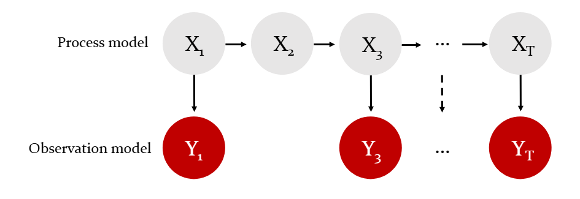

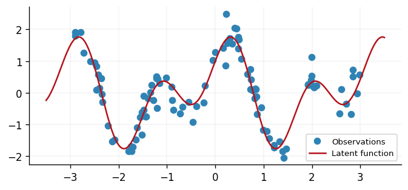
:::

## Understanding uncertainty {.smaller auto-animate="TRUE" background-color="#FFFFFF"}

-   Understanding and measuring quantities is a fundamental part of all science, not just statistics.
-   As scientists, we use data to understand the process which we are investigating.
-   These data have two main sources of uncertainty or error:
    -   **Inherent variability** of the process itself (the thing we are measuring is variable).
    -   **Imprecise knowledge** of the process (our measurements may not be accurate).

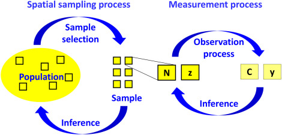{fig-align="center"}

## Example: Climate change trends {background-color="#FFFFFF"}

-   These plots illustrate the trends in several climate change measures.
-   Both sources of variability will be present, but how much of each?

::: {layout-ncol="2"}
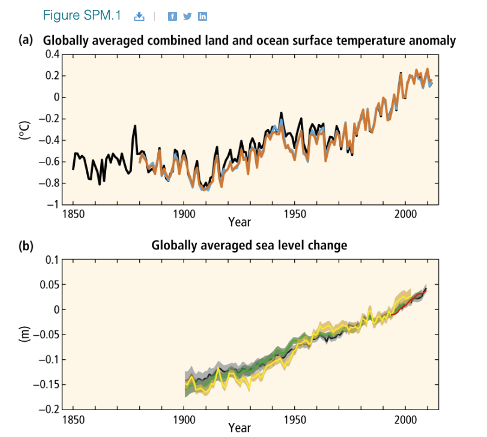{width="422"}

{width="541"}
:::

## Observational Random Error

::: {style="height: 3em"}
:::

**Observational Error** in a measurement is the difference between the measured value and the true value.

-   This error may include both **random** and **systematic** components.

**Random error**: Variation observed randomly over repeat measurements.

→ With more measurements, these errors average out (improves accuracy).

## Observational Systematic Error

::: {style="height: 3em"}
:::

**Systematic error**: Variation that remains constant over repeated measures.

-   Typically due to some feature of the measurement process.
-   Making more measurements **will not improve accuracy** (all affected equally).
-   Can only be eliminated by identifying and correcting the cause.

## Error Identification Exercise {.smaller background-color="#FFFFFF"}

For each example, identify whether the error is **random** or **systematic**:

::::: columns
::: {.column width="40%"}
1.  **A meter reads 0.01 even when measuring no sample.**

2.  **An old thermometer can only measure to the nearest 0.5 degrees.**

3.  **A poorly designed rainfall monitor often leaks water on windy days.**

4.  **To estimate the abundance of a fish species in a lake, scientists use a net with a mesh size equal to the average fish length**
:::

::: {.column width="60%"}
{fig-align="center" width="405"}
:::
:::::

::: fragmet
We often talk about the *quality of a measurement process* (or an associated estimate) in terms of **accuracy**, **bias** and **precision**.
:::

## Measuring the quality of measurement

**Bias**:

::: incremental
-   *Measurement bias*: is the difference between the *average* of a series of measurements and the true value - mainly due to faulty measuring devices of procedures (systematic error).

-   *Sampling bias*: Under-representative sample of the target population (systematic error).

-   *Estimation bias*: Relates to the property of an estimator, i.e., $E(\hat{\theta})-\theta = 0$, for unbiased estimators, the bias (random error) decreases with increased sampling effort (*See supplementary material for more details).*
:::

## Measuring the quality of measurement

::: incremental
-   **Precision** is the closeness of agreement between independent measurements. Precision does **NOT** relate to the true value.

-   **Accuracy** overall *distance* between the estimated (or observed) values and the **true** value. There are several definition of what this *distance* mean some of which include the precision (see @walther2005)
:::

{fig-align="center"}

## Measuring the quality of measurement {background-color="#FFFFFF"}

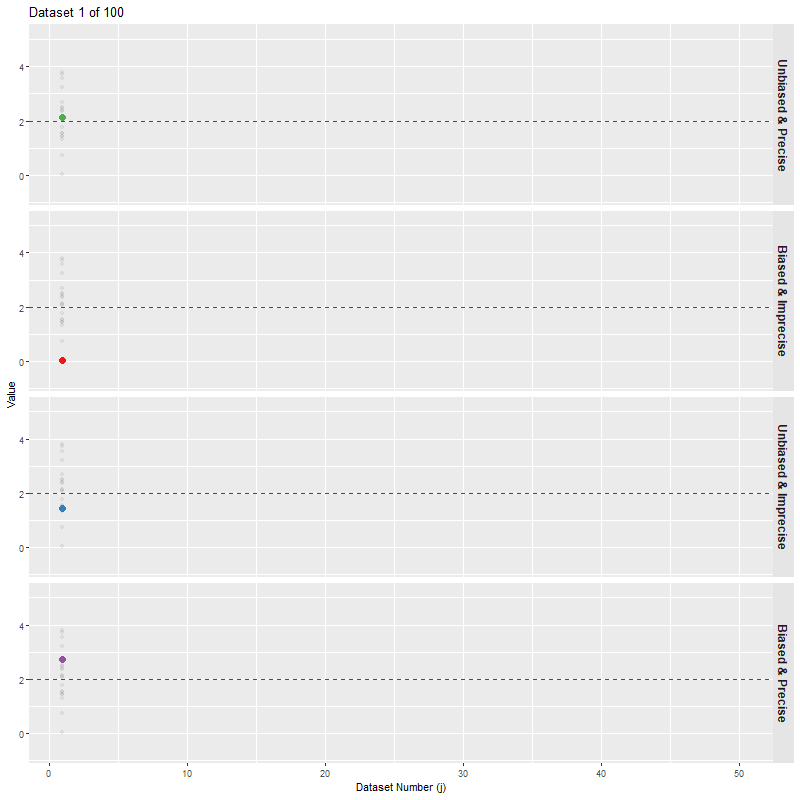{fig-align="center"}

# Dealing with observational errors {background-image="river.png"}

## The challenge of Environmental data  {auto-animate="TRUE"}

Environmental and Ecological systems are inherently complex.

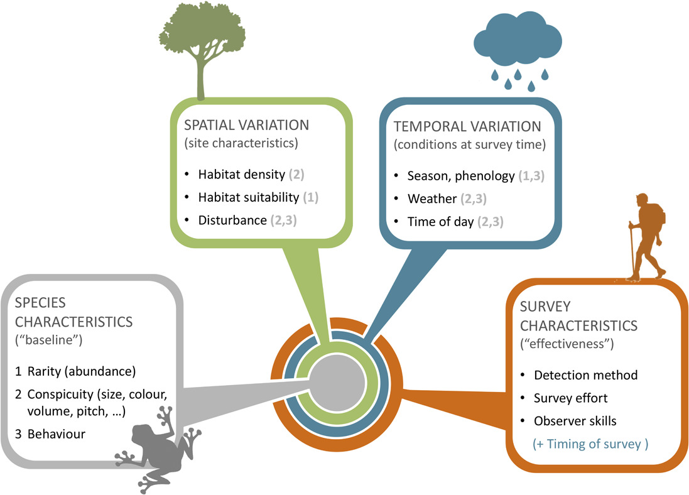{fig-align="center" width="553"}

::: fragment
Need to account for heterogeneity of available data and for the mechanisms of how data is collected!
:::

## The challenge of Environmental data {auto-animate="TRUE"}

Environmental and Ecological systems are inherently complex.

::::::: columns
:::: {.column width="45%"}
{fig-align="center" width="553"}

::: fragment
-   We often have to deal with issues such as **outliers**, **missing values** or highly **uncertain** information.
:::
::::

:::: {.column width="55%"}
::: incremental
-   Sometimes we can address these issues directly during modelling

    $$
    \underbrace{\text{y}_i}_{\text{observations}} = \underbrace{z_i}_{\text{truth}} + (\text{error})_i
    $$

-   Other times we address these during the **data pre-processing** step.
:::
::::
:::::::

## Limit of Detection {background-image="river.png"}

## Censored Data {auto-animate="true"}

::: {style="height: 3em"}
:::

-   **Censored data** are data where [we are restricted in our knowledge about them]{style="filter: blur(5px);"} in some way or other.

-   Often this will be because [we only know that]{style="filter: blur(5px);"} the data value lies below a certain [minimum value]{style="filter: blur(5px);"} (or [above]{style="filter: blur(5px);"} a certain maximum).

-   For example, [if we had scales which only]{style="filter: blur(5px);"} weighed up to [10kg, we would not know]{style="filter: blur(5px);"} the exact weight [of any object greater than]{style="filter: blur(5px);"} 10kg.

## Censored Data {auto-animate="true"}

::: {style="height: 3em"}
:::

-   **Censored data** are data where we are restricted in our knowledge about them in some way or other.

-   Often this will be because we only know that the data value lies below a certain minimum value (or above a certain maximum).

-   For example, if we had scales which only weighed up to 10kg, we would not know the exact weight of any object greater than 10kg.

## Limits of Detection

-   For environmental data, it is more common to have data which are censored at some minimum value.

-   This is because many pieces of measuring equipment will have an analytical **limit of detection**.

::: {.callout-note icon="false"}
## Definition

A limit of detection is the lowest concentration that can be distinguished with reasonable confidence from a "blank", i.e. a hypothetical sample with a value of zero.

-   Analytical instruments produce a signal even when a blank is analysed.

-   The limit of detection is often denoted $c_L$.
:::

## Limits of Detection

::: {.callout-tip icon="false"}
## Example

Your environmental monitoring device measures a pollutant concentration of 0.05 ppm, but the instrument's Limit of Detection (LoD, $c_L$) is 0.1 ppm. Is this 0.05 ppm a measurement of real pollution?
:::

{fig-align="center" width="405"}

## Step 1. Measuring a Blank Sample

First we analyse *blank samples*. Their readings form a distribution centred $\mu_0 \approx 0$ with standard deviation $\sigma_0$.

```{r}
#| echo: false
#| message: false
#| warning: false
#| fig-width: 7.5
#| fig-height: 3.2
#| fig-align: center
set.seed(1)

library(ggplot2)

navy <- "#003366"

b <- data.frame(x = rnorm(2000, 0, 1))

mu0 <- 0
sigma0 <- 1

ggplot(b, aes(x)) +
  geom_histogram(aes(y = after_stat(density)),
                 bins = 30,
                 fill = "#9ecae1",
                 colour = "white",
                 alpha = 0.85) +
  stat_function(fun = dnorm,
                args = list(mean = mu0, sd = sigma0),
                colour = navy,
                linewidth = 1) +
  ## vertical line at mu0 (clipped properly via annotate)
  annotate("segment",
           x = mu0, xend = mu0,
           y = 0, yend =  dnorm(0,0,1),
           colour = "tomato",
           linewidth = 1) +
  ## sigma shown as horizontal bracket around mean
  annotate("segment",
           x = mu0 - sigma0, xend = mu0 + sigma0,
           y = 0.01, yend = 0.01,
           colour = "darkorange",
           linewidth = 1.2) +
  annotate(geom = "text", x = 0, y = dnorm(0,0,1)+0.05,
           col="tomato",
           size=8,
           label = list('mu[0]'),
           hjust = "left", parse = TRUE)+
    annotate(geom = "text", x =  mu0 + sigma0, y = 0.045,
           col="darkorange",
           size=8,
           label = list('sigma[0]'),
           hjust = "left", parse = TRUE)+

  labs(x = "blank reading", y = NULL) +

  theme_minimal(base_size = 13) +
  theme(axis.text.y = element_blank(),
        panel.grid = element_blank())
```

-   The blank has true concentration zero, but repeated measurements vary because of instrument noise.

-   The standard deviation $\sigma_0$ measures the **precision of the instrument**.

## Step 2. Define the Limit of Detection

A measurement must be sufficiently larger than the blank before we are willing to call it a detection.

One common rule is

$$
c_L=\mu_0+3\sigma_0
$$

```{r}
#| echo: false
#| message: false
#| warning: false
#| fig-width: 7.5
#| fig-height: 3.2
#| fig-align: center
set.seed(1)

library(ggplot2)
library(dplyr)

navy <- "#003366"

b <- data.frame(x = rnorm(2000, 0, 1))

mu0 <- 0
sigma0 <- 1

lod <- mu0 + 3*sigma0

ggplot(b, aes(x)) +
  geom_histogram(aes(y = after_stat(density)),
                 bins = 30,
                 fill = "#9ecae1",
                 colour = "white",
                 alpha = 0.85) +
  stat_function(fun = dnorm,
                args = list(mean = mu0, sd = sigma0),
                colour = navy,
                linewidth = 1) +
  geom_vline(xintercept = lod,
                colour = "black",
                linewidth = 1.2,
                linetype = 2) +
  annotate(geom = "text", x = lod-1, y = dnorm(0,0,1),
           col="black",
           size=8,
           label = list('C[L]'),
           hjust = "left", parse = TRUE)+
    annotate("segment",
           x = mu0 , xend = mu0 + 3*sigma0,
           y = 0.075, yend = 0.075,
           colour = "purple",
           linewidth = 1.2)+
    annotate(geom = "text", x =  mu0 + sigma0 , y = 0.12,
           col="purple",
           size=8,
           label = list('3*sigma[0]'),
           hjust = "left", parse = TRUE)+
  
  ## vertical line at mu0 (clipped properly via annotate)
  annotate("segment",
           x = mu0, xend = mu0,
           y = 0, yend =  dnorm(0,0,1),
           colour = "tomato",
           linewidth = 1) +
  ## sigma shown as horizontal bracket around mean
  annotate("segment",
           x = mu0 - sigma0, xend = mu0 + sigma0,
           y = 0.01, yend = 0.01,
           colour = "darkorange",
           linewidth = 1.2) +
  annotate(geom = "text", x = 0, y = dnorm(0,0,1)+0.05,
           col="tomato",
           size=8,
           label = list('mu[0]'),
           hjust = "left", parse = TRUE)+
    annotate(geom = "text", x =  mu0 + sigma0, y = 0.045,
           col="darkorange",
           size=8,
           label = list('sigma[0]'),
           hjust = "left", parse = TRUE)+

  labs(x = "blank reading", y = NULL) +

  theme_minimal(base_size = 13) +
  theme(axis.text.y = element_blank(),
        panel.grid = element_blank())
```

The LoD is determined **before measuring the environmental samples**.

## Step 3. Measuring Environmental Samples {auto-animate="TRUE"}

We now use the same instrument to measure real samples.

```{r}
#| echo: false
#| message: false
#| warning: false
#| fig-width: 8.5
#| fig-height: 3.2
#| fig-align: center
set.seed(2)

mu0 <- 0
sigma0 <- 1
lod <- mu0 + 3 * sigma0

# simulated "measured" environmental data
y <- rlnorm(40, meanlog = 1.25, sdlog = 0.7)
df <- data.frame(sample = 1:40, value = y)

df$status <- ifelse(df$value < lod, "< LoD", "Detected")

ggplot(df, aes(x = sample, y = value)) +

  geom_point( size = 2.8) +

  labs(x = "Sample", y = "Measured concentration", colour = "") 
```

## Step 3. Measuring Environmental Samples {auto-animate="TRUE"}

We now use the same instrument to measure real samples.

```{r}
#| echo: false
#| message: false
#| warning: false
#| fig-width: 8.5
#| fig-height: 3.2
#| fig-align: center
set.seed(2)

mu0 <- 0
sigma0 <- 1
lod <- mu0 + 3 * sigma0

# simulated "measured" environmental data
y <- rlnorm(40, meanlog = 1.25, sdlog = 0.7)
df <- data.frame(sample = 1:40, value = y)

df$status <- ifelse(df$value < lod, "< LoD", "Detected")

ggplot(df, aes(x = sample, y = value)) +

  geom_point(aes(colour = status), size = 2.8) +

  geom_hline(yintercept = lod,
             linetype = "dashed",
             linewidth = 1,
             colour = "red") +

  annotate("text",
           x = 35,
           y = lod,
           label = "LoD",
           colour = "red",
           vjust = -0.8) +
  theme(legend.position = "none")+


  labs(x = "Sample", y = "Measured concentration", colour = "") 
```

::: fragmet
-   Some values are above the detection limit.

-   Others fall below it and cannot be reliably distinguished from a blank (**not necessarily zero**).
:::

::: notes
Too close to the background noise for us to distinguish confidently from a blank.
:::

## Impact of Censoring {.smaller auto-animate="true" background-color="#FFFFFF"}

-   Censoring has a huge impact on how we interpret our data.

-   The two plots below show the same data, but the right panel is 'censored' with two different limits of detection (some with an LOD of 0.5, others with an LOD of 1.5).

::: {layout-ncol="2"}


:::

## Dealing with LODs

-   Censored observations are not completely without information. We still know they are equal to or more extreme than the limit.

-   For a LOD, we might therefore report the datapoint as either "not detected" or "$< c_L$".

-   Removing them from our study would not be sensible, since this would lead to us overestimating the mean and probably also underestimating the variance.

-   We need to find a way to incorporate these censored datapoints into our analysis.

## Dealing with LODs (Continued) {background-color="#FFFFFF"}

-   We can't simply use the minimum value of the LOD. This would ignore the fact that the values are often *below* this.

-   In the plot below, the LOD reduces after every 100 observations (e.g. because of better quality equipment), and this leads to an artificial trend.

{fig-align="center" width="70%"}

## Simple Substitution

-   The simplest approach for dealing with LODs is via **simple substitution**.

-   This involves taking the LOD value and multiplying it by a fixed constant, e.g. replacing all $<c_L$ values with $0.5c_L$.

-   This approach is fairly popular because it is simple and easy to implement.

-   However, this approach only works if there is a small proportion of censored data (maximum 10–15%). If there is a higher proportion, it tends to overestimate the mean.

## Distribution-based Approaches

-   It is generally preferable to use a more statistics-based approach which accounts for the data distribution.

-   The basic idea is that we estimate the statistical distribution of the data in a way that takes into account the censoring.

-   We can then use this estimated distribution to simulate values for our censored points.

-   Commonly used distribution-based approaches are **Maximum Likelihood**, **Kaplan-Meier** and **Regression on Order Statistics**.

## Maximum Likelihood Approach

-   The maximum likelihood (ML) approach is a *parametric* approach, i.e. it requires us to specify a statistical **distribution** that is a close fit to the data.

-   We then identify the **parameters** of this distribution that maximise the likelihood of obtaining a dataset like ours.

-   This ML approach has to take into account the likelihood of obtaining:

    -   the observed values in our dataset.
    -   the correct proportion of data being censored, i.e. falling below our detection limit(s).

## Maximum Likelihood Approach (Visualization) {background-color="#FFFFFF"}

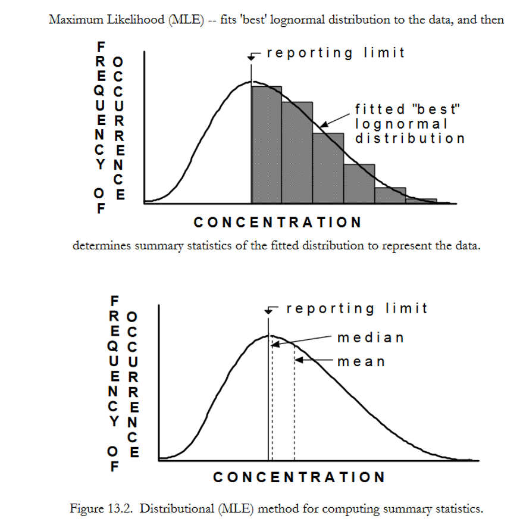{fig-align="center" width="90%"}

## Maximum Likelihood Approach: Pros and Cons

::::: columns
::: {.column width="50%"}
**Advantages**

-   Able to handle multiple limits of detection.

-   Good for estimating summary statistics with a suitably large sample size.

-   MLE explicitly accounts for the underlying distribution of the data (if known).
:::

::: {.column width="50%"}
**Disadvantages**

-   More applicable to larger datasets (n \> 50).

-   Reliant on specifying the correct distribution, otherwise estimates can be incorrect.

-   Transforming data to fit a distribution can potentially cause biased estimators.
:::
:::::

## Kaplan-Meier Approach

-   The Kaplan-Meier approach is a *nonparametric* approach, i.e. it doesn't require a distributional assumption.

-   It's often used in survival analysis for estimating summary statistics for right-censored data.

-   However, it can be applied to left-censored data by 'flipping' the data and subtracting from a fixed constant.

-   In survival analysis, Kaplan-Meier estimates the probability that an observation will survive past a certain time.

-   In our 'flipped' context, it gives the probability that an observation will fall below the limit of detection.

## Example: Cadmium in Fish {background-color="#FFFFFF"}

::::: columns
::: {.column width="70%"}
-   Cadmium is a heavy metal identified as having potential health risks.

-   We observed cadmium levels in fish livers in two different regions of the Rocky Mountains.

-   Due to variation in data collection, there are four different LODs (0.2, 0.3, 0.4 and 0.6 µg per litre).

{fig-align="center" width="250"}
:::

::: {.column width="30%"}
```{r}
#| echo: false
#| message: false
#| warning: false

library(gt)
library(patchwork)
library(dplyr)
library(NADA)
library(ggplot2)
cad_data <-data.frame(Cd=
                        c(81.3,3.5,4.6,0.6,2.9,3,4.9,0.6,3.4,0.4,0.8,0.3,0.4,0.4,0.4,1.4,0.6,0.7,0.2),
 Region = as.factor(c(rep(2,9),rep(1,9),2)),
 CdCen = c(rep(FALSE,11),TRUE,FALSE,FALSE,TRUE,FALSE,TRUE,FALSE,TRUE))
data(Cadmium)
gt(Cadmium)
```
:::
:::::

## Example: Cadmium in Fish (Visualization) {background-color="#FFFFFF"}

-   Plotting the data shows the potential impact of censoring.

-   The left panel shows all the data (plotting censored values as equal to the LOD), while the right panel excludes those which have been censored.

```{r}
#| echo: false
#| fig-align: center
Cadmium %>% filter(Cd<80)%>%
  ggplot(aes(y=Cd,x=as.factor(Region),fill=as.factor(Region))) +
  geom_boxplot() +
  labs(y = "Cadmium Concentration", x= "Regions", title = "Censored + Uncensored")+
  theme(legend.position = "none") + 
Cadmium %>% filter(CdCen == FALSE&Cd<80) %>%
  ggplot(aes(y=Cd,x=as.factor(Region),fill=as.factor(Region))) +
  geom_boxplot() +
  labs(y = "Cadmium Concentration", x= "Regions", title = "Uncensored")+
  theme(legend.position = "none")

```

## Using the Kaplan-Meier Approach in R

-   We can use the `NADA` (Nondetects and Data Analysis) package in R.

-   The `cenfit` function applies the Kaplan-Meier method. This package automatically 'flips' the data, since it is designed for environmental data.

```{r}
#| message: false
#| warning: false

library(NADA)
cenfit(obs = Cadmium$Cd,censored = Cadmium$CdCen,groups = Cadmium$Region)
```

-   There are clear differences between the locations in terms of both median and standard deviation.

## Statistical Testing with Kaplan-Meier {.smaller}

-   The `cendiff` function tests for significant differences between the groups.

-   This uses a chi-squared hypothesis test:

    -   $H_0$: Median cadmium levels are the same in Region 1 and Region 2

    -   $H_1$: Median cadmium levels are different in Region 1 and Region 2

```{r}
cendiff(obs = Cadmium$Cd,censored = Cadmium$CdCen,groups = Cadmium$Region)

```

-   The p-value is very small, so there is a statistically significant difference between the groups.

## ECDF Plot

-   We can also plot the empirical cumulative distribution function (ECDF), taking into account the LODs.

-   Note that this works in the opposite direction from regular survival plots due to the 'flipping' of the data.

```{r}
#| echo: false
#| fig-align: center
plot(cenfit(obs = Cadmium$Cd,censored = Cadmium$CdCen,groups = Cadmium$Region))
legend("bottomright",c("Region 1","Region 2"),lty = 1:2)
```

## Kaplan-Meier Approach: Pros and Cons

::::: columns
::: {.column width="50%"}
**Advantages**

-   Nonparametric — no need to assume underlying distribution.

-   Can easily account for multiple LODs.

-   Works for large numbers of censored datapoints (\>50%).
:::

::: {.column width="50%"}
**Disadvantages**

-   Quite simplistic — identical to simple substitution if we only have one LOD.

-   Less reliable for values near and below the LOD.

-   The mean tends to be overestimated — need to rely on median.
:::
:::::

## Regression on Order Statistics (ROS)

-   Regression on Order Statistics is a *semi-parametric* approach, i.e. it combines elements of parametric and nonparametric models.

-   It follows a two-step approach:

    1.  Plot the uncensored values on a probability plot (QQ plot) and use linear regression to approximate the parameters of the underlying data distribution.

    2.  Use this fitted distribution to impute estimates for the censored values.

-   There is an assumption that the censored measures are normally (or lognormally) distributed.

## ROS: Implementation {background-color="#FFFFFF"}

::::: columns
::: {.column width="60%"}
-   The plot shows the uncensored points and their probability plot regression model.

-   The `NADA` package in R uses lognormal as default. The plot suggests that this is sensible.

-   We then use this fitted model to estimate the values of the censored observations, based on their normal quantiles.
:::

::: {.column width="40%"}
{fig-align="center"}
:::
:::::

## ROS vs Simple Substitution {background-color="#FFFFFF"}

-   We can compare our ROS approach to simple substitution for the bathing water example used earlier.

-   The left panel (ROS) shows no trend present; the right panel (simple substitution) has an artificial trend.

::: {layout-ncol="2"}


:::

## ROS: Pros and Cons

::::: columns
::: {.column width="50%"}
**Advantages**

-   Can be applied to a wide variety of environmental datasets.

-   Works with multiple LODs, but still not too simplistic with a single LOD.

-   Can be used with up to 80% censored datapoints.
:::

::: {.column width="50%"}
-   **Disadvantages**

-   Semiparametric approach — requires a distributional model to be assumed.

-   Specifically requires normality (or lognormality) for estimation of parameters.

-   Two-stage model introduces extra source of variability.
:::
:::::

# Missing Data {background-image="river.png"}

## Missing Data {background-color="#FFFFFF"}

::::: columns
::: {.column width="50%"}
-   Environmental & Ecological data are very prone to missing values.

-   Data can be missing for any number of reasons.

-   There's a whole discipline of statistics related to this. We will focus on specific methods commonly used in environmental and ecological statistics.
:::

::: {.column width="50%"}
Environmental and ecological data can have gaps in different dimensions

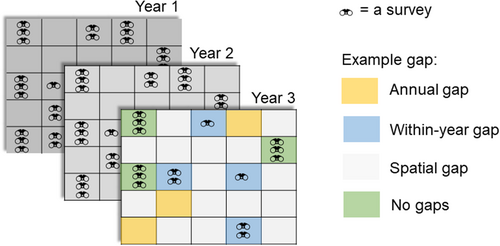{fig-align="center"}
:::
:::::

## Causes of Missing Data

Considering why these gaps arise can help us understand their likely impact.

::: incremental
-   Adverse weather (e.g., rainfall, snow, drought and wind) can affect measuring equipment or prevent access to the location.

-   Failure of scientific equipment.

-   Samples being lost or damaged.

-   Monitoring networks change in size over time. (Data are "missing" before the site is introduced or after it is removed.)

-   Uneven sampling effort (see @hossie2021)
:::

## Classes of missing data {.smaller auto-animate="true"}

Missing data theory categorizes missing data into three classes.

:::::: columns
::: {.column width="33.33%"}
**Missing Completely at Random** (MCAR)

{fig-align="center" width="350"}
:::

::: {.column width="33.33%"}
**Missing at Random** (MAR)

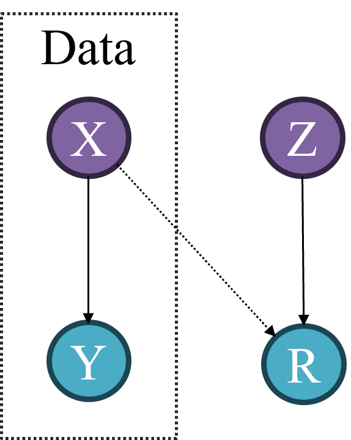{fig-align="center" width="350"}
:::

::: {.column width="33.33%"}
**Missing Not at Random** (MNAR)

{fig-align="center" width="350"}
:::
::::::

## Classes of missing data {.smaller auto-animate="true"}

Missing data theory categorizes missing data into three classes.

:::::: columns
::: {.column width="60%"}
**Missing Completely at Random** (MCAR)

-   Data missingness is independent of both observed and unobserved data.

-   For example, factors affecting sampling, and causing missingness, are independent of those affecting the environmental process of interest.

{fig-align="center" width="250"}
:::

::: {.column width="20%"}
**Missing at Random** (MAR)

{fig-align="center" width="350"}
:::

::: {.column width="20%"}
**Missing Not at Random** (MNAR)

{fig-align="center" width="350"}
:::
::::::

::: notes
**Example**

-   Y = abundance of birds

-   X = Precipitation

-   $R_i = \begin{cases}1 & \text{if site is surveyed}\\ 0 & \text{if site is missed}\end{cases}$

-   Z = closeness to primary road

Under MCAR we want to know if $R$ depends on the data $Y,X$, so we marginalize over $Z$

$$
\begin{aligned}
Pr(R=0\mid Y,X) &= \int Pr(R=0\mid Y,X,Z)Pr(Z\mid Y,X)dZ \quad \text{since } R \perp (Y,X) \mid Z\\
 &= \int Pr(R=0\mid Z)Pr(Z\mid Y,X)dZ \quad \text{since } Z \perp (Y,X) \Rightarrow Pr(Z\mid Y,X) = Pr(Z)  \\
&=\int Pr(R=0|Z)Pr(Z)dZ \quad \text{apply law of total probability} \\
&= Pr(R=0)
\end{aligned}
$$
:::

## Classes of missing data {.smaller auto-animate="true"}

Missing data theory categorizes missing data into three classes.

:::::: columns
::: {.column width="20%"}
**Missing Completely at Random** (MCAR)

{fig-align="center" width="350"}
:::

::: {.column width="60%"}
**Missing at Random** (MAR)

-   *Known Unknowns*: Data missingness depends on one or more observed variables and do not depend on the value of the missing observations themselves.

-   Covariates that affect sampling probability also affect the process of interest, but data are available on all these covariates . (MAR $\neq$ random sampling effort)

{fig-align="center" width="250"}
:::

::: {.column width="20%"}
**Missing Not at Random** (MNAR)

{fig-align="center" width="350"}
:::
::::::

::: notes
MAR in biodiversity monitoring does not mean that sampling effort is randomly distributed in the landscape. Rather, it means that the covariates affecting sampling are known and that there are available covariate data to explain fully the differences between sampled and non-sampled sites/times. If any of the relevant factors affecting sampling and species are unknown, unavailable or not modelled, the missing data become MNAR

**Example**

-   Y= abundance of birds

-   X = elevation

-   Z = Closeness to primary road

    Elevation affects both the abundance but also can causes missingness (people do not survey high-elevation regions)

MAR does **not** require that you measure **all** variables that affect R. It only requires that, **conditional on what you observe**, missingness does not depend on missing Y.

$$
\begin{aligned}
Pr(R=0\mid Y,X) &= \int Pr(R=0\mid X, Z)Pr(Z\mid Y,X)dZ \\
\quad \text{since } Z \perp (Y,X) &\Rightarrow Pr(Z\mid Y,X) = Pr(Z \mid X)  \\
&=\int Pr(R=0|X,Z)Pr(Z\mid X)dZ \quad \text{law of total probability for the conditional} \\
&= Pr(R=0 \mid X) \neq Pr(R=0)
\end{aligned}
$$
:::

## Classes of missing data {.smaller auto-animate="true"}

Missing data theory categorizes missing data into three classes.

:::::: columns
::: {.column width="20%"}
**Missing Completely at Random** (MCAR)

{fig-align="center" width="350"}
:::

::: {.column width="20%"}
**Missing at Random** (MAR)

{fig-align="center" width="350"}
:::

::: {.column width="60%"}
**Missing Not at Random** (MNAR)

-   Data missingness depends on either (i) unobserved variables (*Unknown unknowns*) or (ii) the missing values themselves.

{fig-align="center" width="250"}
:::
::::::

::: notes
**Example** $R \not\perp Y |(X,Z)$

-   Y= abundance of birds

-   X = elevation

-   Z = Closeness to primary road

-   At low bird abundance, birds are harder to detect, so you mistakenly record the site as “unsampled” or missing.
:::

## Classes of missing data {.smaller auto-animate="true"}

Missing data theory categorizes missing data into three classes.

:::::: columns
::: {.column width="20%"}
**Missing Completely at Random** (MCAR)

{fig-align="center" width="350"}
:::

::: {.column width="20%"}
**Missing at Random** (MAR)

{fig-align="center" width="350"}
:::

::: {.column width="60%"}
**Missing Not at Random** (MNAR)

-   Data missingness depends on either (i) **unobserved variables** (*Unknown unknowns*) or (ii) the missing values themselves.

-   E.g., when factors affecting sampling and the process of interest are unknown, unavailable or not modelled .

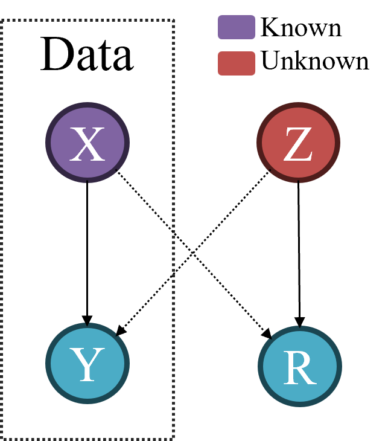{fig-align="center" width="300"}
:::
::::::

::: notes
**Example** $R \not\perp Y |(X,Z)$ if $Z$ is unknown.

-   Y= abundance of birds

-   X = elevation

-   Z = Closeness to primary road

-   Birds avoid roads due to traffic levels.
:::

## Classes of missing data {.smaller auto-animate="true"}

Missing data theory categorizes missing data into three classes.

:::::: columns
::: {.column width="20%"}
**Missing Completely at Random** (MCAR)

{fig-align="center" width="350"}
:::

::: {.column width="20%"}
**Missing at Random** (MAR)

{fig-align="center" width="350"}
:::

::: {.column width="60%"}
**Missing Not at Random** (MNAR)

-   Data missingness depends on either (i) unobserved variables (*Unknown unknowns*) or (ii) **the missing values themselves**.

-   E.g., when the process of ecological process interest itself affect the sampling.

{fig-align="center" width="250"}
:::
::::::

::: notes
**Example** $R \not\perp Y |(X,Z)$ if $Z$ is unknown.

-   Y= abundance of birds

-   X = elevation

-   Z = Closeness to primary road

-   At low bird abundance, birds are harder to detect, so you mistakenly record the site as “unsampled” or missing.
:::

## Implication of missing Data in Ecology {.smaller auto-animate="true" background-color="#FFFFFF"}

The consequences for inference depend on the missingness mechanism

:::::: columns
::: {.column width="33.33%"}
**MCAR**

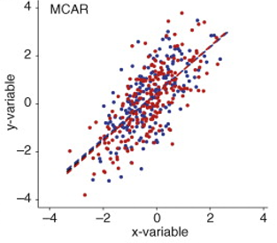{fig-align="center" width="442"}
:::

::: {.column width="33.33%"}
**MAR**

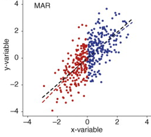{fig-align="center" width="442"}
:::

::: {.column width="33.33%"}
**MNAR**

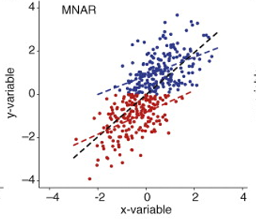{fig-align="center" width="442"}
:::
::::::

## Implication of missing Data in Ecology {.smaller auto-animate="true" background-color="#FFFFFF"}

The consequences for inference depend on the missingness mechanism

:::::: columns
::: {.column width="60%"}
**MCRS**

-   Unbiased estimated effect of the covariate(s) on the response.

-   Strong assumption that rarely is valid for real datasets.

{fig-align="center" width="300"}
:::

::: {.column width="20%"}
**MAR**

{fig-align="center" width="442"}
:::

::: {.column width="20%"}
**MNAR**

{fig-align="center" width="442"}
:::
::::::

::: notes
-   Strong assumption that rarely is valid for real datasets where observer error, natural variation, collinearity, and serial autocorrelation are common.
:::

## Implication of missing Data in Ecology {.smaller auto-animate="true" background-color="#FFFFFF"}

The consequences for inference depend on the missingness mechanism

:::::: columns
::: {.column width="20%"}
**MCAR**

{fig-align="center" width="442"}
:::

::: {.column width="60%"}
**MAR**

-   Unbiased estimated effect of the covariate(s) on the response, provided the correct functional form.

-   Assume that these variables are known and explain fully the differences between sampled and non-sampled sites/times.

{fig-align="center" width="300"}
:::

::: {.column width="20%"}
**MNAR**

{fig-align="center" width="442"}
:::
::::::

## Implication of missing Data in Ecology {.smaller auto-animate="true" background-color="#FFFFFF"}

The consequences for inference depend on the missingness mechanism

:::::: columns
::: {.column width="20%"}
**MCAR**

{fig-align="center" width="442"}
:::

::: {.column width="20%"}
**MAR**

{fig-align="center" width="442"}
:::

::: {.column width="60%"}
**MNAR**

-   **Biased** estimated effect of the covariate(s) on the response.

-   **Loss of Power:** Reduced sample size leads to larger standard errors and weaker statistical significance.

{fig-align="center" width="300"}
:::
::::::

## Examples of missing data

Let's go over some examples

{fig-align="center"}

## Dealing with Missing Data

-   The technique we use to deal with missing data depends on the **type of missingness**.

-   **complete-case analysis:**

    -   If there are a handful of datapoints (e.g., $\approx 5\%$) MCAR we can essentially ignore this and carry out our analysis as usual.
    -   It is simple to implement but if data are not MCAR it can underestimates sample variability and produces biased results .

-   Most solutions are only appropriate for MCAR or MAR - being MNAR the most challenging class of missing data to deal with. Thus, we will focus our attention to the other two classes.

## Dealing with Missing Data {background-color="#FFFFFF" auto-animate="true"}

::::::: columns
:::: {.column width="60%"}
::: {style="height: 3em"}
:::

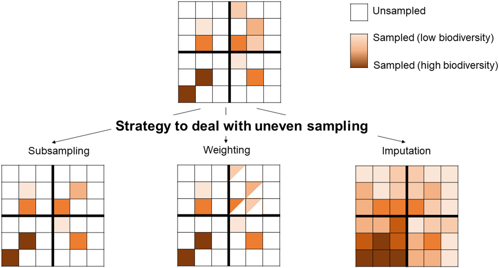
::::

:::: {.column width="40%"}
Imagine that the landscape is divided into four quarters.

-   Suppose that the sites on top right quarter are easier to survey. What would happen if we conducted a complete case analysis?

::: fragment
-   We would overrepresent sites that are easy to survey.
:::
::::
:::::::

## Dealing with Missing Data {.smaller background-color="#FFFFFF" auto-animate="true"}

:::::::: columns
::::: {.column width="60%"}
::: {style="height: 3em"}
:::


::: fragment
-   **Subsampling**: Subsample units to reduce the unevenness of sampling effort across space or time.
:::
:::::

:::: {.column width="40%"}
> The aim is to improve the representativeness of the sample for statistical inference at the population level.

::: incremental
-   Different sub-sampling schemes can be implemented to reduce the missing data cuased by uneven sampling (e.g, environmental and geographical stratified sampling)
-   Assumes large sample size that can be subsampled and can fail to account for patterns in dataset.
:::
::::
::::::::

::: notes
-   In random subsampling, two sites are randomly subsampled from the oversampled quarter to create a data set with an even sampling coverage across quarters.
:::

## Dealing with Missing Data {.smaller background-color="#FFFFFF" auto-animate="true"}

::::::: columns
:::: {.column width="60%"}
::: {style="height: 3em"}
:::


-   **Weighting**: assign weights to spatial-temporal units to achieve improved sample representativeness of some target population.
::::

:::: {.column width="40%"}
::: incremental
-   Inverse-probability weighting (IPW)

1.  Estimate the probability that each unit is surveyed. i.e, $\pi_i = \mathrm{Pr}(R\mid X,Z,\ldots)$
2.  Weight each observed unit by the inverse of that probability $1/\pi_i$. For example:
    -   Hard-to-survey sites $\rightarrow$ small $\pi_i$ $\rightarrow$ large weight
    -   Easy-to-survey sites $\rightarrow$ large $\pi_i$ $\rightarrow$ small weight
3.  Fit a model like weighted regression using these weights.
:::
::::
:::::::

::: notes
-   In weighting, data from the oversampled quarter are down-weighted in the statistical model so data from all quarters similarly influence the modelled results. (This model must include all variables that make missingness MAR.)
:::

## Dealing with Missing Data {.smaller background-color="#FFFFFF" auto-animate="true"}

::::::: columns
:::: {.column width="60%"}
::: {style="height: 3em"}
:::


-   **Weighting**: assign weights to spatial-temporal units to achieve improved sample representativeness of some target population.
::::

:::: {.column width="40%"}
Inverse-probability weighting (IPW):

::: incremental
-   information in the incomplete cases is only used to determine the weights (no contribution of to the likelihood)
-   weighted estimates can have high variance since extreme weights (small probabilities) can dominate estimates.
-   Ignoring uncertainty in estimated weights leads to overly conservative standard errors.
:::
::::
:::::::

## Dealing with Missing Data {.smaller background-color="#FFFFFF" auto-animate="true"}

::::::: columns
:::: {.column width="60%"}
::: {style="height: 3em"}
:::


-   **Imputation**: Imputation is a process that involves predicting the missing values via some form of statistical method.
::::

:::: {.column width="40%"}
::: fragment
-   There are two main forms of imputation:
:::
::::
:::::::

## Dealing with Missing Data {.smaller background-color="#FFFFFF" auto-animate="true"}

:::::: columns
::: {.column width="60%"}
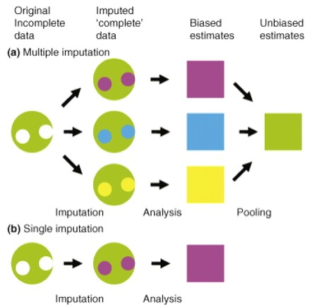

-   **Imputation**: Imputation is a process that involves predicting the missing values via some form of statistical method.
:::

:::: {.column width="40%"}
-   There are two main forms of imputation:

::: incremental
-   **Single imputation** involves generating one value in place of each missing value.

    -   Simple and straightforward analysis.

-   **Multiple imputation** generate random draws from the observed data distribution. Each full dataset is then analyzed separately, and the results are combined

    -   Does a better job of accounting for the uncertainty of the imputation process, but makes the final analysis more complex.
:::
::::
::::::

## How Do We Impute?

-   Our approach for generating the imputed value will vary depending on the context.

-   In the simplest case, we may replace missing values with the overall mean (usually only if we have very limited information).

-   More commonly, we may use neighbouring values, or some form of seasonal mean.

-   A more complex approach is to fit a more general statistical model, perhaps taking account of other variables and/or using random components.

    -   Bayesian framework is especially useful for dealing with missing values, as these are treated as "unknown" parameters in our model.

# Outliers {background-image="river.png"}

## What is an Outlier?

-   An outlier is an extreme or unusual observation in our dataset.

-   These will often (but not always) have a large influence on the outcomes of our analysis.

-   We have to find ways to identify and deal with outliers.

-   Can you think of any examples of outliers?

## Types of Outliers

There are two main categories of outlier:

1.  **Genuine but extreme values**
    -   Accommodate these in our analysis
    -   Ignoring them would mean ignoring a real feature of our data
    -   Robust modeling techniques can incorporate outliers
2.  **Data errors**
    -   Try to correct (where possible) or remove
    -   Do not reflect real observations

## Finding Outliers

-   It is often helpful to **plot your data**
    -   Sometimes outliers are very obvious in boxplots or scatterplots
-   Elk's animal track with two unusual observations, how can we assess if these are outliers?

[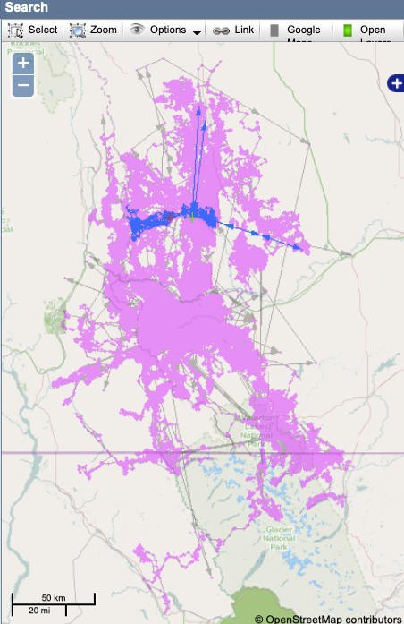{#fig-movebank fig-align="center" width="340"}](https://www.movebank.org/cms/webapp?gwt_fragment=page=search_map)

## Finding Outliers

-   It is often helpful to **plot your data**
    -   Sometimes outliers are very obvious in boxplots or scatterplots
-   **Statistical approaches** for identifying datapoints significantly different from the rest:
    -   Tests of discordancy
    -   Chauvenet's criterion
    -   Grubbs's test
    -   Dixon's test

::: callout-note
Check notes material for a more detailed description of these tests
:::

## References
