```{r}
#| echo: false
#| message: false
#| warning: false

library(webexercises)

```


We begin this week by finishing our notes on additive models in R, and then move onto temporal correlation and changepoints.

# Additive Models in R

## Fitting Additive Models in R

We can fit GAMs in R using the package `mgcv`, which was designed to allow extensions of generalised linear models (GLMs). The *generalised* aspect means that we can also extend the standard additive model to situations where we have non-normal responses, but we will not focus on these in this course.

We use the function `gam()` to fit our model. This works in a very similar manner to the `lm()` function. The smooth functions are represented by `s()`. These use the penalised splines approach described last week. Any linear terms can be included additively as normal.

The model will take the form below, where you can include as many smooth or linear terms as you wish.

```{r, eval=FALSE}
library(mgcv)

mod <- gam(response ~ s(smooth1) + s(smooth2) + linear)
```

::: {.callout-important icon="false"}
##  Example: River Tweed nitrate level

The nitrate levels in the River Tweed were measured monthly between 1997 and 2007. The red line is a simple LOWESS curve.

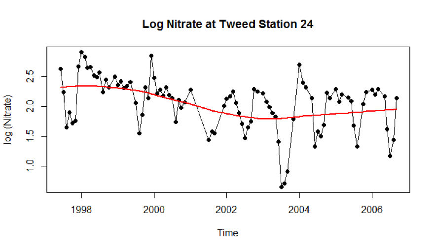{width="400" fig-align="center"}

```{r, eval=FALSE}
m1 <- gam(log_nitrate ~ s(Date))
```

```         
Family: Gaussian
Link function: identity

Parametric coefficients:
             Estimate Std. Error  t value    Pr(>|t|)
(Intercept)   2.04454   0.03965     51.56     <2e-16

Approximate significance of smooth terms:
          edf   Ref.df     F   p-value
s(Date) 6.183   7.336   4.37   0.000272

R-sq.(adj) = 0.242 Deviance explained = 29.3%

GCV = 0.15847 Scale est. = 0.14623 n = 93
```

We are mainly interested in the output related to smooth terms.

```         
Approximate significance of smooth terms:
          edf   Ref.df     F   p-value
s(Date) 6.183   7.336   4.37   0.000272
```

The p-value tells us the significance of the term, i.e., whether the smooth term is significantly different from a flat (horizontal) line. (The p-value **doesn't** tell us whether the smooth term is different from a linear term!) 

The effective degrees of freedom (EDF) tells us how nonlinear the relationship is:

* Higher EDF means a more nonlinear relationship.
* An EDF of 1 indicates a linear relationship.

In our example, the p-value is very small (<<0.05), and therefore we have evidence that this smooth term is necessary in our model.

The EDF for this term is 6.183, suggesting that this is far from linear and that a smooth term may be appropriate.

We can assess the significance of our smooth term using the `anova` function. We fit a simple linear regression and compare it to the additive model we have already fitted:

```{r, eval=FALSE}
m1 <- gam(log_nitrate ~ s(Date))
m2 <- lm(log_nitrate ~ Date)

anova(m2, m1)
```

```         
Analysis of Variance Table
Model 1: log_nitrate ~ Date
Model 2: log_nitrate ~ s(Date)

    Res.Df      RSS    Df    SS      F   Pr(>F)
1     91.000   14.883
2     85.817   12.549 5.183 2.334 3.0794 0.01228
```

The p-value confirms that the smooth term is necessary instead of a linear term. (Note that we don't really need to test for nonlinearity, since the model should penalise excess wiggliness, effectively fitting a linear term where appropriate.)

:::

## Visualising additive models in R

Unlike linear terms, we can't simply report parameter estimates for smooth terms in additive models. We can instead simply use the `plot` function to visualise our smooth functions.

::: {.callout-important icon="false"}
##  Example: River Tweed nitrate level (continued)

Here, we observe that we may have a bimodal shape, with peaks in 1999 and 2005:

```{r, eval=FALSE}
plot(m1)
```

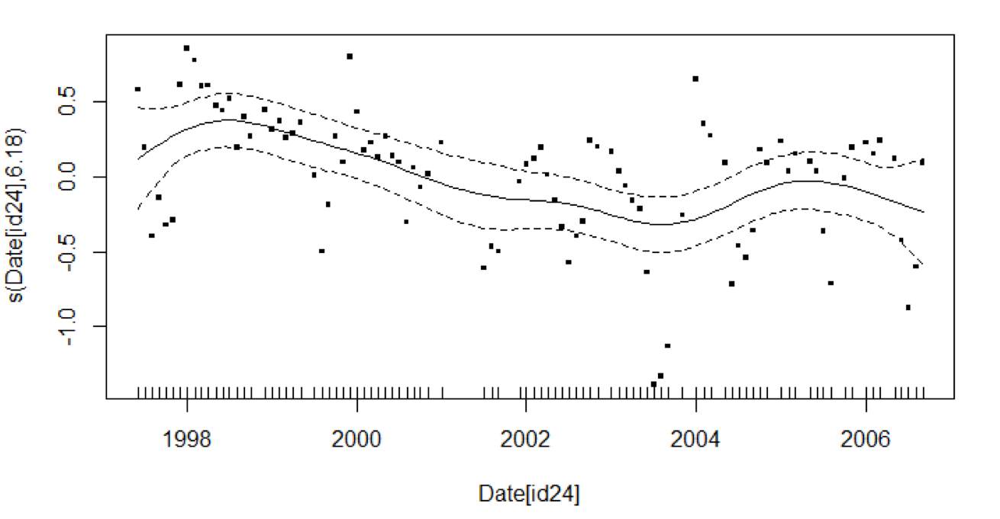{width="400" fig-align="center"}

In reality, we might spot that there is a seasonal pattern evident in the plot, which our smooth does not capture. We could capture this by either:

* fitting a smooth to the months plus a smooth to years (to capture the seasonal pattern plus long term smooth trend), as we saw at the end of last week's notes, or
* increasing the basis dimension for our smooth, using the `k` argument of the `s()` function. (See the help file of the `s` function in R for details, by running `?mgcv::s`.)

:::

# Autocorrelation

We already know that environmental data are often measured over time, and that consecutive measurements are often related. This relationship between adjacent observations is known as **autocorrelation**. The term *autocorrelation* literally means *correlation with oneself*. Here, we can think of it as each point being correlated with "previous" versions of itself.

The strength of autocorrelation tends to be related to how far apart points are in time (known as **lag**). Points closer together have more in common than those further apart.

Many statistical models rely on an assumption that our observations (more specifically our error terms) are independent. If we have correlation then each observation "shares" some information with other observations. This means we have less independent information within our dataset and the *effective sample size* of the dataset will decrease. When we are calculate standard errors, confidence intervals etc., we are using the "wrong" value of $n$. This can lead to us underestimating the variance and being overconfident in our results.

## Autocorrelation function

We can estimate the strength of temporal dependence using a sample **autocorrelation function (ACF)**. This function represents the autocorrelation of the data at a series of different lags in time. Assuming we have a regularly spaced time series, we compute the sample ACF at lag $k$ as:

$$r(k) = \frac{\sum_{t=k+1}^n(x_t - \bar{x})(x_{t-k} - \bar{x})}{\sum_{t=1}^n(x_t - \bar{x})^2}$$

We compute this for values from $k=1,\ldots,K$ where $K$ is some sensible maximum lag.

Our sample ACF is an estimate of the overall ACF, and as such we have to consider uncertainty. Typically we will compute a simple confidence interval around our point estimate at each lag as

$$r(k) \pm 1.96\sqrt{\frac{1}{n}}$$

where $n$ is the number of observations in the time series.

We plot the ACF function with a separate vertical line representing the size correlation at each lag, and dashed lines for the confidence intervals. If the lines lie within the confidence intervals, no autocorrelation is present.

Here, we have several lines outside the confidence intervals, so autocorrelation exists in this dataset.

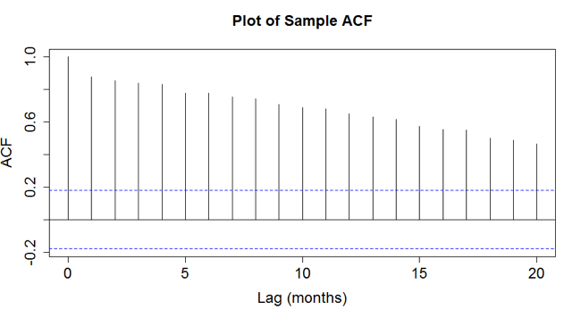{width="300" fig-align="center"}

Each of the three ACFs below are examples of cases where suggest autocorrelation is present.

-   The first has a repeating pattern --- suggests seasonality:

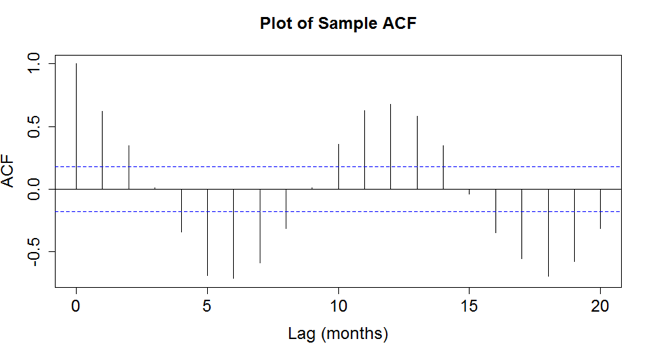{width="300" fig-align="center"}

-   The second has a decreasing pattern --- likely caused by trend:
 
{width="300" fig-align="center"}
 
-   The third has both patterns --- probably seasonality AND trend:

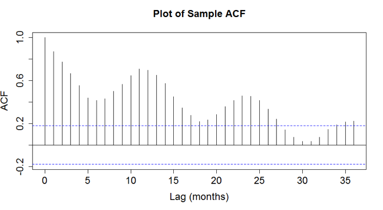{width="300" fig-align="center"}

If we have identified autocorrelation in our data, we have to find a way to account for it in our model. In some cases we may choose to simply treat it as a nuisance, and make adjustments to our standard errors to reflect the reduced effective sample size.

The alternative is to explicitly account for the autocorrelation in our model. For seasonal patterns, we may be able to eliminate it using methods discussed previously, such as harmonics. For other types of autocorrelation, we may use approaches such as autoregressive integrated moving average (ARIMA).

## Autocorrelation models

**Autoregressive integrated moving average** (ARIMA) models are a general class of models which account for autocorrelation. These models combine aspects of two main classes of model: autoregressive (AR) and moving average (MA).

Broadly speaking, AR($p$) models assume that the current value is a function of the previous $p$ observations. In contrast, MA($q$) models assume that the current value can be computed by a linear regression on the $q$ previous random error terms. These models are covered in more detail in the Time Series course, but will be addressed briefly here.

### AR model

An autoregressive (AR) model accounts for correlation by describing each value as a function of the previous values. The AR($p$) process can be written as

$$X_t = \sum_{i=1}^p \phi_i X_{t-i} + \epsilon_t.$$

Here $\phi_i$ is the "autoregressive parameter" which measures the strength of the autocorrelation. $\epsilon_t \sim \mbox{N}(0, \sigma^2)$ is simply random error, often referred to as noise.

### MA model

A moving average (MA) model accounts for correlation by describing each value as a function of the previous set of error terms. The MA($q$) process can be written as

$$X_t = \mu + \sum_{i=1}^q \theta_i \epsilon_{t-i} + \epsilon_t.$$

Here $\mu$ is the mean of the series and $\theta_i$ is the regression parameter associated with the $i$th lag.

### ARIMA

The ARIMA is a combination of AR and MA processes. The I stands for *Integrated*, which relates to "differencing", i.e., replacing a value with the difference between itself and the previous value. We write this model as ARIMA($p,d,q$), where $p$ is the order of the AR process, $d$ is the degree of differencing and $q$ is the order of the MA.

For example, ARIMA(1,0,0) would be equivalent to an AR(1) model and ARIMA(0,0,1) is an MA(1) model.

We can use the sample ACF to suggest the appropriate model to account for our autocorrelation. A smooth decay suggests that we have AR components. A less structured ACF might suggest an MA is more appropriate. In practice, AR processes are less complex than MA and tend to be used more frequently as a result.

::: {.callout-important icon="false"}
##  Examples of ACF plots

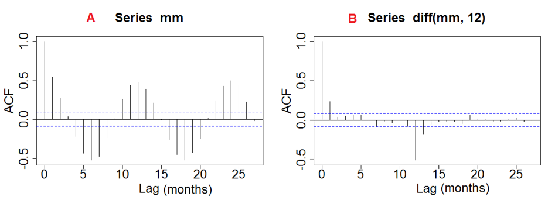{width="500"} 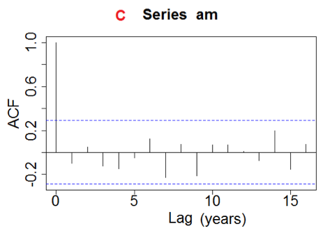{width="250"}

Plot A has a clear seasonal pattern, meaning that harmonics may be more appropriate than an ARIMA.

In Plot B, the value at lag 1 is outside the interval, and thus an AR(1) may be most suitable. (Note that we can likely ignore the spike at lag 12 as just random error).

Plot C does not appear to have any correlations outside of the error bars, and so we can conclude that there is no evidence of autocorrelation. Note that the bars are wider. This is likely because we had less data available.

:::

ARIMA methods are all based on regularly spaced data (measurements equally spaced in time). However, in some cases we may have irregularly spaced data. If the data are roughly regular (just a small deviation here and there), we may be able to treat them as though they are regular. If we have missing data, we may be able to impute or interpolate without too many issues. In cases where we have completely irregular data, we may need to use more complex statistical methods (which will not be covered in this course).

### ARIMA in R

We can use the `arima()` function in R to explore autocorrelation. We must first fit a linear model, and then extract the design matrix to use as an input to this function. For example, to fit an AR(1) model we would use the following code:

```{r, eval=FALSE}
trend.model0 <- lm(response ~ decimal.date)

X <- model.matrix(trend.model0)

trend.model1 <- arima(y, order = c(1, 0, 0), xreg = X, 
                      include.mean = FALSE)
```

## Time Series Model

The seasonal variation can sometimes be so strong that it obscures the overall trend (or any other patterns). In most cases, we are not actually particularly interested in actually knowing about the seasonal trend. In these cases, it is simply a nuisance factor that we need to account for in our model. Our primary interest is usually in understanding the longer term trends in our data.

We often try to remove or separate out this seasonal pattern when analysing time series. We can therefore think of our overall time series model in the following form:

$$X = \text{trend} + \text{seasonal component} + \text{error}$$

In terms of mathematical notation, we can write this as

$$X_t = m_t + s_t + \epsilon_t.$$ Our error, $\epsilon_t$ is assumed to be random, and follows the distribution $\epsilon_t \sim \text{Normal}(0, \sigma^2)$.

## Estimating Trend

We have now identified a method for isolating the trend in our model. However, we still have to work out the best way to explore and understand this trend. We want to know the size of the trend, but also have to assess whether it is linear, and also test for statistical significance.

A variety of models and techniques exist for exploring our trend.

::: {.callout-important icon="false"}
##  Example: Bird populations

We have collected annual data on the population of two birds between 1975 and 2005. What are the trends? Are they significantly different from zero?

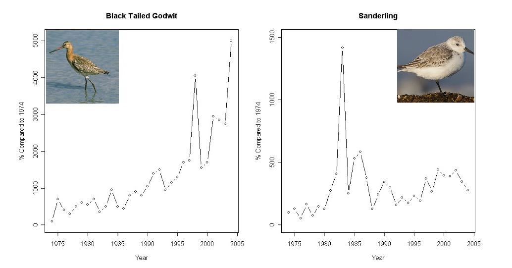{width="500" fig-align="center"}

We have fitted two models to attempt to assess the trends for each bird. The blue line is a linear regression, while the red line is a more flexible additive model.

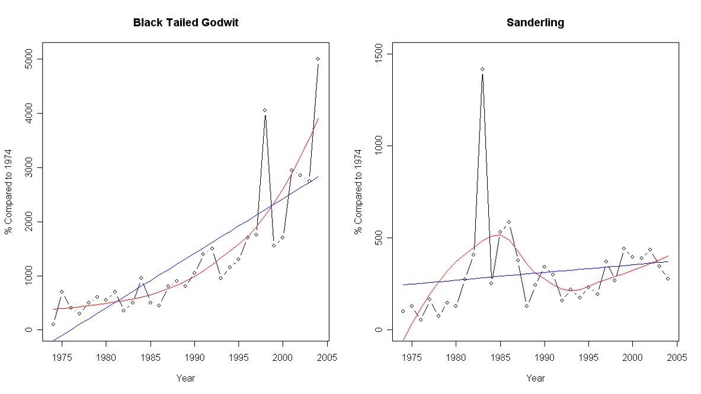{width="500" fig-align="center"}
:::

::: {.callout-tip icon="false"}
##  Exercise 3

Which of the models are more appropriate? Have we adequately captured the patterns in the data?

`r hide("Solution")`

Neither relationship appears to be linear, so that the additive models are more appropriate than the linear regression models here. However, both models fail to capture the peaks in the data well, so that we could consider whether other models are more appropriate. E.g., models for extremes may be more appropriate if we are interested in the peaks.

`r unhide()`
:::

In our bird population example, both models indicate the overall trend, but they do not test for significance. We therefore cannot be sure whether the changes are 'genuine' or are simply down to random variation. We can use non-parametric approaches (e.g., Mann-Kendall test and the Seasonal Kendall) to assess the trend in our data.

### Mann-Kendall test

The **Mann-Kendall test** is commonly used to detect trends in environmental, climate, and hydrological data. It looks for a consistent increase or decrease in a trend over time (not necessarily linear). It is commonly used for short time series, where we may not have sufficient data for more sophisticated approaches.

Assume we have an ordered dataset $z_1, \ldots, z_T$

1.  Compute ALL possible differences $d = z_j - z_k$ where $j>k$.

2.  Create an indicator function $\text{sign}(z_j - z_k)$ such that:

$$
\begin{aligned}
\text{sign}(z_j - z_k) = 
\begin{cases} 
1 & \text{if } z_j - z_k > 0 \\
0 & \text{if } z_j - z_k = 0 \\
-1 & \text{if } z_j - z_k < 0
\end{cases}
\end{aligned}
$$

3.  The Mann-Kendall statistic, $S$, is given by $$S = \sum_{k=1}^{n-1}\sum_{j=k+1}^n \text{sign}(z_j - z_k)$$

Our test statistic measures the size and direction of the trend:

-   A positive value of $S$ suggests the data are increasing over time (an upward trend).
-   A negative value of $S$ suggests a downward trend.
-   $S=0$ implies no trend.

We can carry out a hypothesis test to assess whether $S$ is significantly different from zero:

$$
\begin{aligned}
H_0&: \text{our data are independent random realisations (no trend)} \\
H_1&: \text{there is a significant trend in our data}
\end{aligned}
$$

We compare the test statistic to a standard normal distribution $Z_{(1-\alpha/2)}$.

We can use the `mk.test` function in the `trend` R package, to carry out the Mann-Kendall test.

::: {.callout-tip icon="false"}
##  Exercise

Below, we have plotted the average discharge (m$^3$) from the River Rhine over many years (black line), with the overall trend line added (red line).

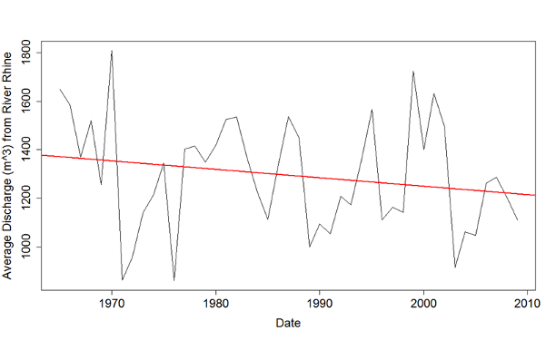{width="400" fig-align="center"}

We carry out the Mann-Kandall test in R as follows, where the vector `Q` contains the average discharge data:

```{r, eval=FALSE}
mk.test(Q)
```

``` r
Mann-Kendall Test two-sided homogeneity test
Statistics for total series

H0: S = 0 (no trend)
HA: S != 0 (monotonic trend)

Statistics for total series
      S  varS    Z    tau  pvalue
 1 -144 10450 -1.4 -0.145 0.16185
```

Given these results, what can we say in terms of the hypotheses of the test?

`r hide("Solution")`

Here we see a p-value of 0.16, which means that there is no evidence to reject $H_0$ and therefore we believe that it is possible that there is no trend present.

`r unhide()`
:::

### Kendall rank correlation coefficient

We can also compute a rank correlation coefficient, $\tau$, which measures the strength of our trend, $$\tau = \frac{S}{D}.$$ Here, $D = \frac{n(n-1)}{2}$, the number of pairwise comparisons used in the calculation of $S$. $\tau$ has a range $(-1, 1)$, similar to the standard correlation used in regression modelling.

::: {.callout-tip icon="false"}
##  Exercise

Chlorophyll levels in a lake have been measured over 36 years, as shown in the plot below.

{width="300" fig-align="center"}

Given that $S=384$, compute $\tau$ to measure the strength of the trend.

*Answer (to 2 decimal places):* `r fitb(answer = "0.61")`

`r hide("Solution")`

$$
\begin{aligned}
D &= \frac{n(n-1)}{2} \\
&= \frac{35 \times 36}{2} \\
&= 680\\
\\
\tau = \frac{S}{D} &= \frac{384}{680} = 0.61
\end{aligned}
$$

`r unhide()`
:::

## Seasonal Kendall test

The *seasonal* Kendall test accounts for seasonality by computing $S$ for each of $M$ seasons separately, then combining the results. For example, if we had monthly data, we might compute $S$ separately for each month. Let $S_j$ be the Kendall statistic for season $j$, then the overall statistic is given by: $$S_k = \sum_{j=1}^M S_j$$

Again, this can be compared to a standard normal distribution $Z_{(1-\alpha/2)}$.

## Smoothing in Time Series

Environmental time series data are often complex and traditional parametric methods are difficult to implement. The relationship between our parameter of interest and time may not follow a linear pattern. We could simply keep adding polynomial functions, but this may become inefficient and lead to a model with too many parameters. It is often more elegant to consider an approach which uses **smoothing**.

We can express the relationship between any response and explanatory variable as $$y = f(x).$$

Here $y$ is the response, $x$ is our explanatory variable and $f()$ is a function which describes their relationship. Smoothing techniques are used to model $f()$ without specifying any specific statistical form of the underlying function.

There is a whole course on smoothing methods (Flexible Regression), and many of you will already have taken this. Therefore we will simply focus briefly on a couple of key methods which are used for environmental data. We will look at one method mainly used for descriptive purposes (LOWESS) and one which is used for estimation (penalised splines).

### LOWESS

LOWESS (LOcally WEighted Scatterplot Smoothing) is an approach which is often used to obtain a graphical illustration of our data. It involves carrying out a series of polynomial regressions on small regions of the data, and then combining them. The more datapoints we have in a region, the smoother our curve will be. This can be somewhat computationally intensive compared to simple moving average methods, but generally produces a smoother function.

LOWESS involves carrying out the following steps:

-   Identify a target point, $x$.
-   Construct a \`window' containing its $k$ nearest neighbours.
-   Fit a weighted polynomial to these $k$ datapoints.
-   We then choose a new target point and repeat until we have covered all timepoints.

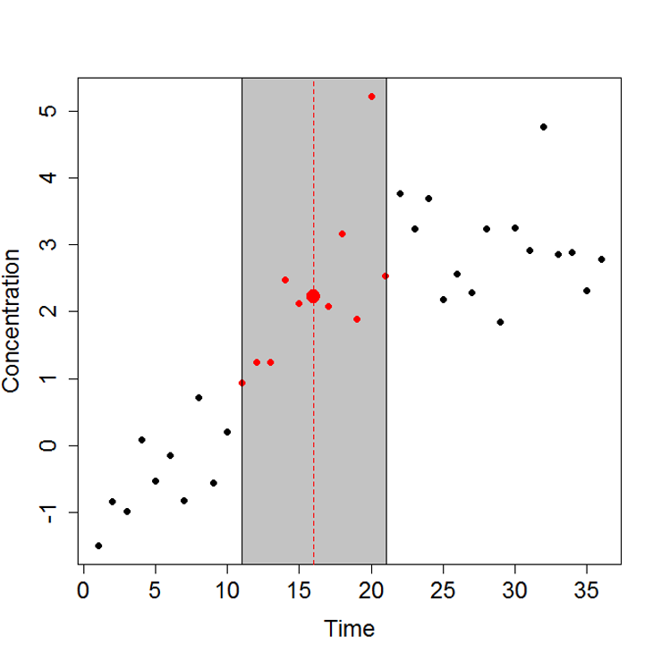{width="300" fig-align="center"}

We have to decide on the size of the window. In R, the default is that each window contains two-thirds of the data. We can fit these models in R using the `scatter.smooth` or `loess` functions. The different colours in the plot below show different sizes of windows. The wider the window, the smoother the function (green narrowest, red widest).

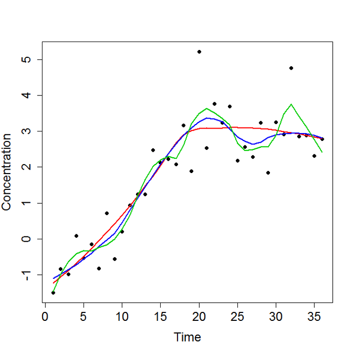{width="300" fig-align="center"}

::: {.callout-important icon="false"}
##  Example: SO$_2$ levels

Air quality $\text{SO}_2$ levels are measured daily over 30 years. The right plot with a wider window (higher bandwidth) is smoother (maybe too smooth?). The narrower bandwidth on the left leads to a gap where there are missing values.

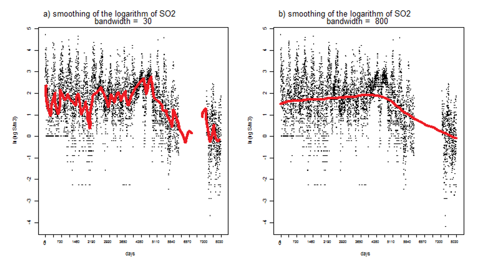{fig-align="center"}
:::

### Splines

**Splines** are an alternative approach to constructing a smooth function. This approach uses piecewise polynomials to estimate the function $f(x)$. Spline functions are polynomial segments which are joined together smoothly at predefined subintervals. The points where the functions join together are known as **knots**.

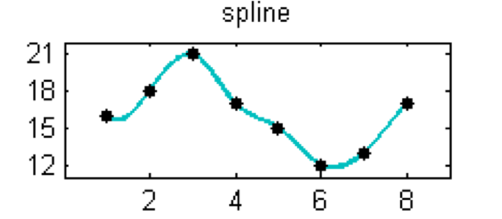{width="300" fig-align="center"}

Our model takes the form: $$Y_i = f(x_i) + \epsilon_i$$

We estimate the function $f()$ as $$\hat{f}(x_i) = \sum_{k=0}^p\beta_k b_k(x_i)$$\
Here, $b_k()$ is a set of polynomial functions known as *basis functions* and $\beta_k$ are their coefficients. We must decide in advance the value of $k$, which defines the number of basis functions used.

Increasing the number of basis functions leads to a more "wiggly" line. Too few basis functions might make the line too smooth, too many might lead to overfitting.

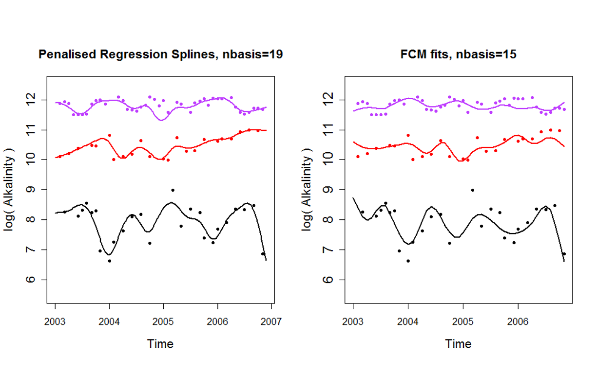{width="500" fig-align="center"}

Choosing the correct number of basis functions can be difficult. Penalised splines (p-splines) avoid this issue. Using penalised splines, we can set a large number of basis functions, but then penalise the coefficients to encourage smoothness. This is a modified form of a standard linear regression, with a parameter $\lambda$ which controls the smoothness of the estimator.

### Additive Models

Developing methods for estimating smooth functions is only one part of the process. We must also work out how to include these in our models. Additive models are a general form of statistical model which allows us to incorporate smooth functions alongside linear terms. $$y_i = \alpha + \sum_{j=1}^k g_j (x_{ij}) + \epsilon_{ij}$$

Here $g_j()$ is a smooth function for the $j$th explanatory variable and $\alpha$ is the overall mean. Note that $g_j()$ could simply be a linear function for one or more variables.

Suppose that we have a variable that exhibits a long-term trend and a seasonal pattern (like we saw in the Mauna Loa example). There are two main ways that we can incorporate this: via a separable structure, or via a non-separable structure.

#### Separable trend and seasonality

We could fit a model with smooth terms for both year (top plot) and month (bottom plot). We assume that the seasonal pattern does not change from year to year (i.e., no interaction). This can be written in the form $$y = f_1(x_1) + f_2(x_2) + \epsilon$$

We can observe a roughly linear increasing trend, but with a seasonal pattern featuring a peak in the winter.

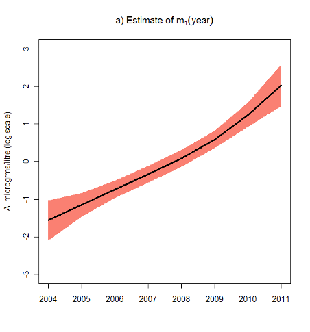{width="250"} 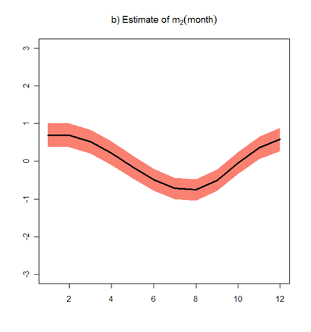{width="250"}

#### Non-separable trend and seasonality

Suppose we decided there was a month by year interaction (i.e., the seasonal pattern may differ by year, or the long-tern trend over the years may differ by month). We would incorporate this via a bivariate term. This can be written in the form $$y = f(x_1, x_2) + \epsilon$$

This can be harder to interpret visually, but we can still see a similar pattern.

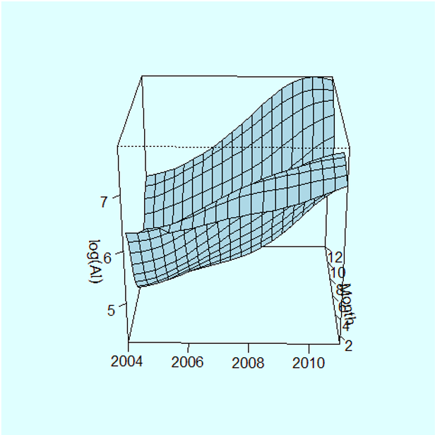{width="300" fig-align="center"}

Note that this non-separable structure also introduces additional computation complexity (i.e., we have lots more parameters to estimate), so that it may be much slower to fit such a model, or it may require additional computational resources, compared to fitting a model with a separable structure.
