```{r}
#| echo: false
#| warning: false
#| message: false

library(webexercises) 
```

## Introduction

A **time series** is a sequence of measurements on the same object made over time. For example, we might measure the level of carbon dioxide ($\text{CO}_2$) in a town every day for a year. The purpose of making such measurements is to understand how our variable of interest has changed over time. For example, a government would be keen to know if air pollution levels are getting better or worse, or a conservationist might want to identify declining trends in wildlife populations to better target their conservation objectives.

We can write our set of time series data as $y_1, \ldots, y_T,$ where $y_i$ is the observation at time point $i$, and $T$ is the total number of observations. Time series data are typically **not independent**, since there will often be correlation between consecutive observations. This dependency structure must be taken into account when modelling.

::: {.callout-tip icon="false"}
##  Question

Can you spot any dependency structure shown in the below plot of log(flow) in the River Dee?

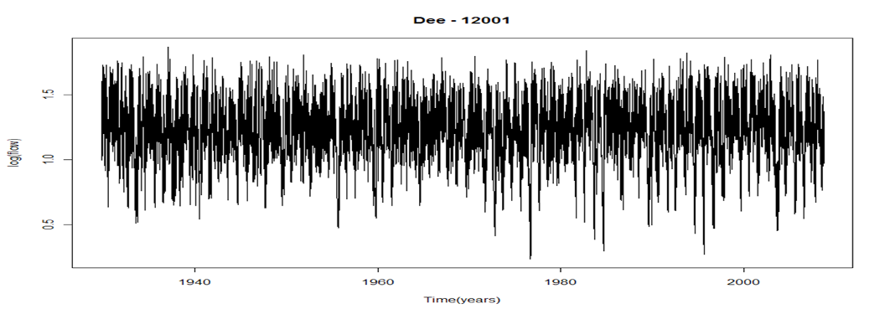{fig-align="center" width="500"}

`r hide("Solution")`

There is a clear structure to the data. It looks like there is a repeated pattern, once per year. (This is a "seasonal pattern" and we'll go into more details about this later in this section of the course.)

`r unhide()`
:::

Lets look at another example. Mauna Loa in Hawaii is one of the biggest and most active volcanoes in the world. $\text{CO}_2$ levels have been monitored since 1958. Mauna Loa is one of the first sites worldwide where increasing $\text{CO}_2$ levels were identified (@fig-Mauna)..

{#fig-Mauna fig-align="center" width="500"}

@fig-Mauna shows a clear trend, and also a seasonal pattern. It may be sensible to standardise the data and represent all observations in terms of '**anomalies**', i.e., their deviation from the starting point (1960 mean level).

::: {.callout-important icon="false"}
##  Example: Global temperature

The plot below shows the global temperature anomaly (the current value compared to the average from 1951--1980).

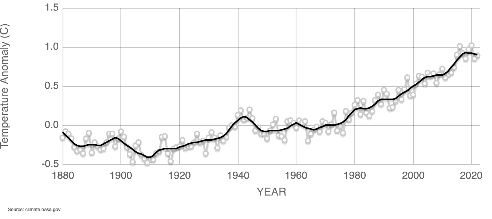{width="500" fig-align="center"}

[Source: https://climate.nasa.gov/vital-signs/global-temperature/](https://climate.nasa.gov/vital-signs/global-temperature/)
:::

::: {.callout-tip icon="false"}
##  Question

How would you describe the change in global temperature shown in the above plot?

We will discuss this in the lecture.
:::

## Ecological Trend

The purpose of time series modelling is to identify any **trends** which exist in the dataset. But what exactly is a trend? It depends who you ask.

The Joint Nature Conservation Council (JNCC) define it as: *a measurement of change derived from a comparison of the results of two or more statistics*. This is often considered to be the *ecological* definition of trend, i.e., a change (in terms of percentage or some index) between two timepoints.

## Statistical Trend

In statistics, the definition of a trend is often more wide-ranging:

-   A long-term change in the mean level (Chatfield, 1996)
-   Long-term movement (Kendall and Ord, 1990)
-   Long-term behaviour of the process (Chandler, 2002)
-   The non-random function $\mu(t) = E(Y(t))$ (Diggle, 1990)

We may be interested in trends in mean, variance or extreme values. Trends are not limited to linear or monotonic patterns.

### Simple Linear Trend

We can represent a simple linear trend using the standard notation: $$Y_t = \beta_0 + \beta_1x_t + \epsilon_t.$$

Here, $\beta_0$ is an intercept and $\beta_1$ represents the slope (trend). This is just a standard linear model, with all the usual assumptions (normality, constant variance, independence). This model therefore does not account for any seasonality or autocorrelation in our data.

::: {.callout-important icon="false"}
##  Example: Chlorophyll levels in a lake

We observe monthly chlorophyll levels in a lake between 2001 and 2006.

We can fit a linear model of the form: $$\text{Log Chlorophyll} = \beta_0 + \beta_1 \text{ Date} + \text{error}$$

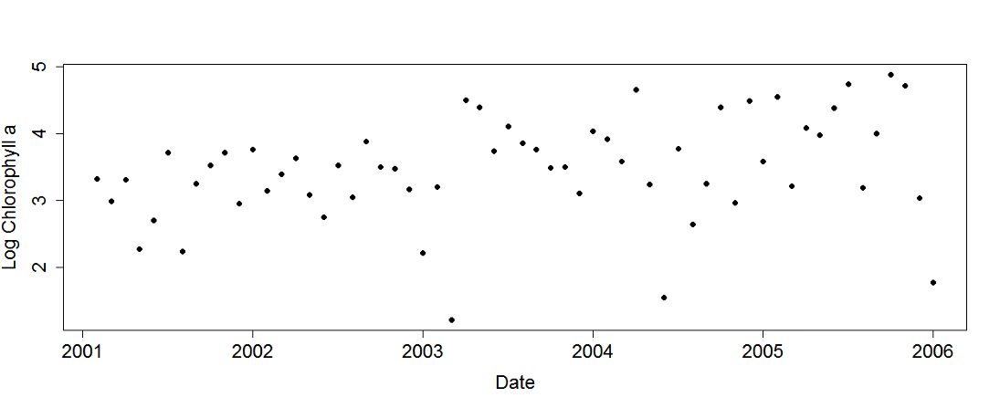{width="500" fig-align="center"}
:::

## Seasonal Patterns

Many environmental time series have some sort of **periodicity** (e.g. a monthly pattern in temperature). We can produce some form of seasonality plot to understand this better. The **period** is the time interval between consecutive peaks or troughs. A **seasonal component** of a dataset is a regular fluctuation with a period of one year or less.

::: {.callout-important icon="false"}
##  Example: Mean surface water temperature in Lake Nam

Lake Nam (Namtso) is a mountain lake in Tibet. The mean surface water temperature was measured monthly between 1996 and 2011.

{width="300" fig-align="center"}

We can plot the data over time, showing clear pattern in the data:

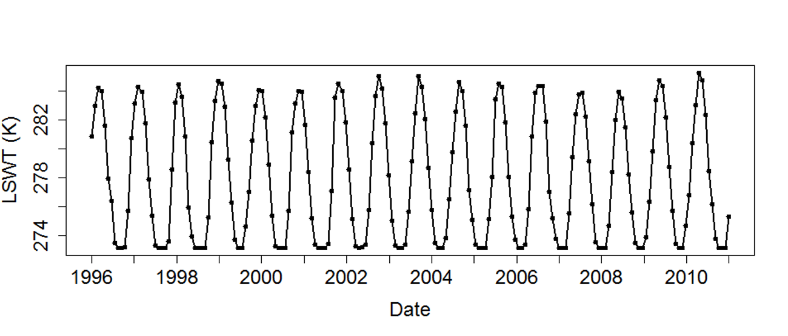{width="500" fig-align="center"}

We should therefore plot the data by month. Doing so indicates a clear seasonal pattern. There is a peak in Month 3 and a trough in Months 9/10:

{width="500" fig-align="center"}
:::

## Harmonic Regression

The monthly pattern is very similar to a sine wave, and we can use this feature in our modelling. This is known as harmonic regression, and is suitable when we have a regular seasonal trend (as we just saw in the Lake Nam example).

{width="400" fig-align="center"}

Harmonic regression is based on an equation of the form

$$Y_t = \beta_0 + \gamma \sin\left(\frac{2\pi [u_t - \theta]}{p}\right) + \epsilon_t$$

Here, $\gamma$ is the amplitude of the wave, $p$ is the period of the wave, and $\theta$ represents the 'position' on the wave (in radians). However, it can often be more convenient to rewrite this in the form of a simple multiple regression model, taking advantage of the double angle formula.

Given that $\sin(a-b) = \sin(a)\cos(b) - \cos(a)\sin(b)$, we can show that:

$$
\begin{aligned}
\gamma \sin\left(\frac{2\pi [u_t - \theta]}{p}\right) &= \gamma \sin\left(\frac{2\pi u_t}{p} - \frac{2\pi\theta}{p}\right)\\
&= \gamma \left[ \sin\left(\frac{2\pi u_t}{p}\right)\cos\left(\frac{2\pi\theta}{p}\right) - \cos\left(\frac{2\pi u_t}{p}\right)\sin\left(\frac{2\pi\theta}{p}\right)\right]
\end{aligned}
$$

Since $\pi$, $\theta$ and $p$ are known, we can create new regression parameters $\gamma_1 = \gamma\cos\left(\frac{2\pi\theta}{p}\right)$ and $\gamma_2 = - \gamma\sin\left(\frac{2\pi\theta}{p}\right)$

The final harmonic regression model can thus be written:

$$Y_t = \beta_0 + \gamma_1 \sin\left(\frac{2\pi u_t}{p}\right) + \gamma_2 \cos\left(\frac{2\pi u_t}{p}\right) + \epsilon_t$$

Our new parameters $\gamma_1$ and $\gamma_2$ control the seasonal trends, with $p$ representing the period. $\beta_0$ is still the intercept term, which can also be interpreted as the overall mean. Note that this is still a linear model, since it is linear in the coefficients.

The standard harmonic regression assumes we have the **same seasonal pattern** each year, but this may not always be appropriate. There are many more sophisticated models available if this assumption does not hold. Some are still based on sine and cosine waves, while others may use autocorrelation functions or a form of semiparametric smoothing.

# Changepoints

One of the main reasons we analyze environmental data is to detect changes. Sometimes these changes occur organically, either as the result of some natural environmental process, or some non-deliberate human action. In some other occasions these changes occur by design, as the result of a deliberate and controlled human action (e.g., policy changes). Regardless of the reason for the change, we want to understand more about when it happened and the extent of the change.

In statistics, a **changepoint** is a point in time after which some or all of the model parameters might change. Most commonly this is a change in mean or variance, but it could also be a change in some other feature of the data. We may not always know exactly when the changepoint occurs or whether we have a changepoint at all. In some cases we may have more than one changepoint.

Reasons for changepoints might include:

-   Environmental events, e.g. flooding, volcanic eruption.
-   Policy, e.g. low emissions zones, water quality regulations.
-   Changes to measuring equipment.

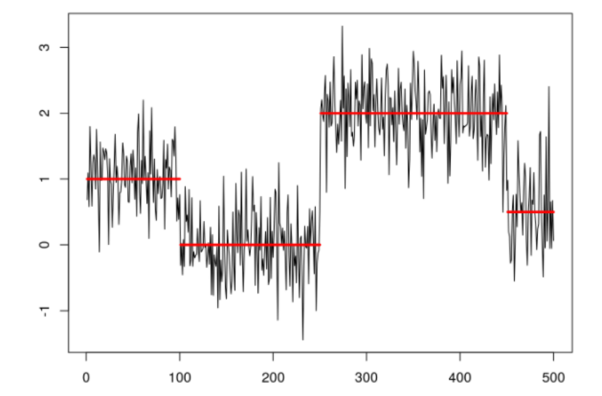{width="400" fig-align="center"}

{width="400" fig-align="center"}

Some simple examples of changepoints include:

-   A shift up (or down) of the mean.
-   A short-term change in the mean.
-   A change in a model parameter, eg slope.

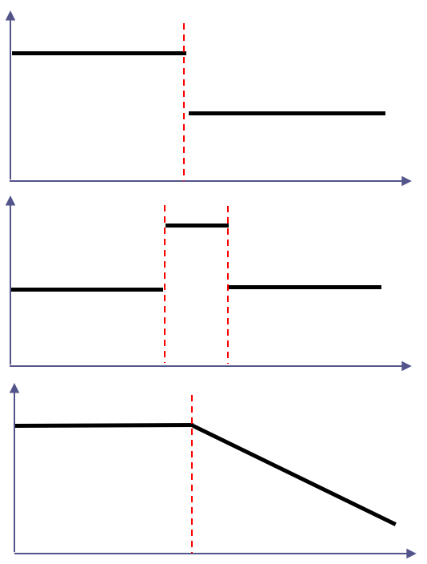{width="300" fig-align="center"}

Consider a series with two different mean levels. The first 20 observations come from $\mbox{N}(10,1)$ and the next 20 observations come from $\mbox{N}(15,1)$. Our ability to detect this change depends on the size of the change and the variability in the data. The plots below illustrate these data and a possible model for these.

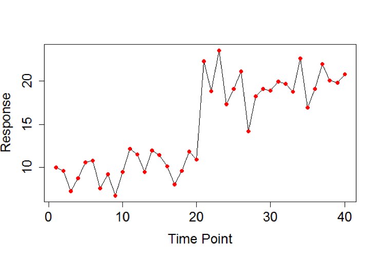{width="300"} 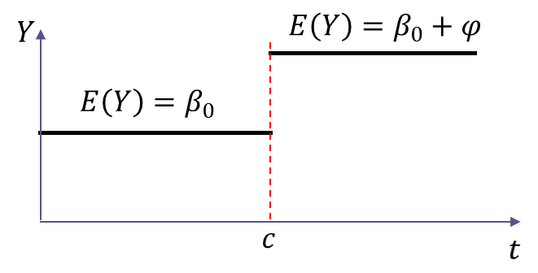{width="300"}

It can be difficult to distinguish changepoints from trend. The plots below illustrate how the magnitude of the shift in mean value can affect our ability to identify the shift in mean. The bottom right plot illustrates the additional effect of a change in variance.

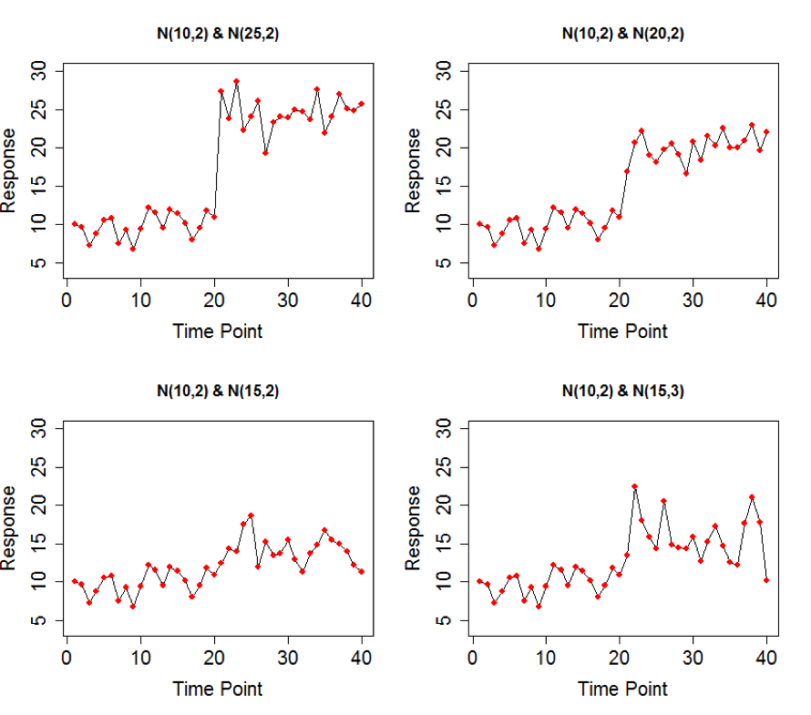{width="500" fig-align="center"}

## Known changepoint

Sometimes it is known that a change occurred at a specific timepoint, but the magnitude or shape of this change are not known.

### Known changepoint --- mean shift

Suppose that we have a series of data $Y_i$ collected at a set of timepoints $t_i$ with $i=1,\ldots, n$. If our known changepoint is at time $c$, then we can construct an indicator function $$\mathcal{I}_{t_i} = 
\begin{cases}
0\hspace{0.5cm} \text{if } \hspace{0.1cm} t_i < c\\
1\hspace{0.5cm} \text{if } \hspace{0.1cm} t_i \geq c
\end{cases}$$ This can then be included as a parameter in our regression model $$Y_i = \beta_0 + \varphi\mathcal{I}_{t_i} + \epsilon_i$$

Here, $\varphi$, the coefficient of the indicator function ,can be described as the **intervention effect**. If this parameter is significant in our model, that implies that we have a significant change in mean at timepoint $c$.

### Known changepoint --- change in slope

We also need to consider examples where we observe a change in slope at a known timepoint.

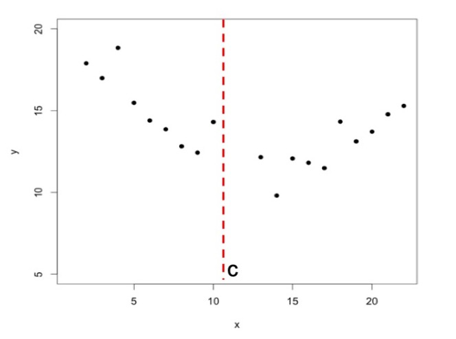{width="300" fig-align="center"}

It would be possible to fit two separate regressions. However, this seems quite simplistic, and it would be better to have a single continuous model.

{width="300" fig-align="center"}

We want our regression to be continuous at $c$ such that we have $$\alpha_1 + \beta_1 c =  \alpha_2 + \beta_2 c$$ This can be rewritten in terms of a single model parameter, as $$\alpha_2 = \alpha_1 + c(\beta_1 - \beta_2)$$ We can thus update our equations to the following, which is known as **piecewise regression** (or segmented regression):

$$
\begin{aligned}
Y_i &= \alpha_1 + \beta_1 x_i + \epsilon_i\hspace{16mm} &\mbox{ for } x<c\\
Y_i &= \alpha_1 +  (\beta_1 - \beta_2)c + \beta_2 x_i + \epsilon_i\hspace{2mm} &\mbox{ for } x\geq c
\end{aligned}
$$


The two linear parts of our model now meet at $c$. Note that our piecewise model is more efficient than two separate regressions, since it uses one fewer parameter.


{width="300" fig-align="center"}

Note that this could be expressed as a single model using an indicator (basis) function  $(x - c)_+ = \begin{cases} 0 & \text{if } \ x < c\\ x- c & \text{if } x \geq c \end{cases}$, yielding to


$$
Y_i = \alpha_1 + \beta_1x_i - (\beta_1-\beta_2)(x_i-c)_+ + \varepsilon_i
$$


This model can be implemented in `R` using the standard `lm()` function by treating `(\beta_1-\beta_2)` as a new coefficient in our linear model (we will cover this on the lecture). However, in many cases we may have more complex changes to our trend. There are a variety of more advanced models for known changepoints, but these are all based on the same underlying principles. For example, the bent cable model allows for an extended "transition phase" between the two slopes, often represented by a smooth curve.

::: {.callout-important icon="false"}
##  Example: Chlorofluorocarbons (CFCs)

Chlorofluorocarbons (CFCs) are pollutants which were often used in aerosols. Their use was phased out in the 1990s as a result of environmental policy. We can see this "phasing out" period represented in the model.

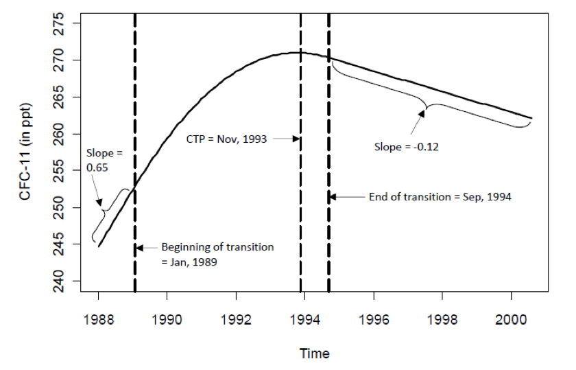{width="500" fig-align="center"}
:::

## Unknown changepoint

It can be more challenging to fit a changepoint model when you don't clearly know exactly when the change occurred. One of the most popular methods is an iterative approach which searches across the entire range of our data for possible changepoints.

::: {.callout-important icon="false"}
##  Example: River Nile flow data

We have historic data on the levels of the River Nile around the city of Aswan, Egypt. Is there any evidence of a change in water volume? If so, when did it occur?

{width="200" fig-align="center"}

{width="350" fig-align="center"}

We can examine the data by fitting a LOWESS curve. There does appear to be a change around 1900. However, we need to explore this further via a model.

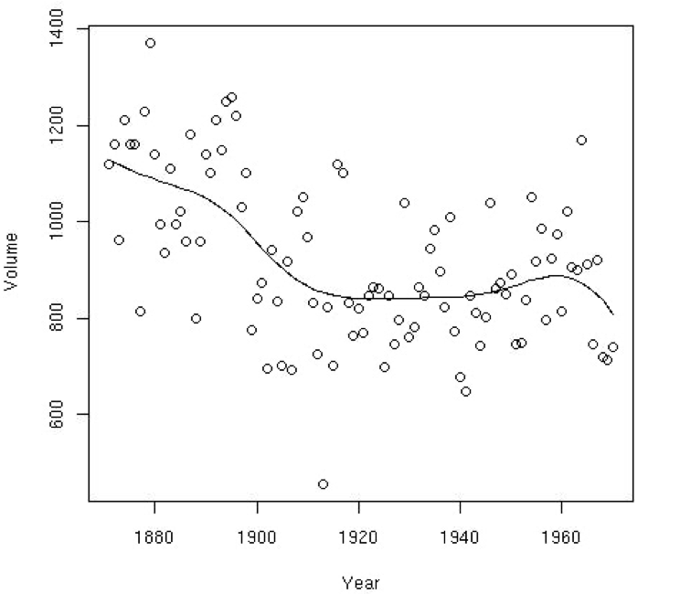{width="350" fig-align="center"}

We use the `segmented()` function in R (in the package also called `segmented`) to fit an unknown changepoint model, using the following steps:

-   First, fit a standard regression using `lm()`.
-   We then pass the linear model into our `segmented()` function along with an initial estimate of the changepoint.
-   This initial estimate (`psi = 1900`) is used as a starting point for our iterative algorithm.

We run this in R:

```{r, eval=FALSE}
out.lm <- lm(Volume ~ Year)
mod <- segmented(out.lm, seg.Z = ~Year, psi = 1900)
```

```         
psi1.x  
  1913  
  
slope(mod)
$x
          Est. St.Err. t value
slope1 -8.1820   1.759  -4.650
slope2  0.7458   1.084   0.688
```

The final model output suggests that the changepoint occurred in 1913. Prior to 1913, the volume was decreasing by 8.18 units per year. Afterwards, it was increasing by 0.75 units per year.

The Aswan Low Dam was constructed between 1899--1902, massively impacting river levels in the area. Therefore it is more sensible to fit a model which introduces a mean shift, rather than a change of slope. Subject matter expertise is key!

{height="180"} {height="180"}

In this case, given there is a clear reason why the time series will change either side of the dam's construction, we need to fit two separate models. The plot below shows two separate penalised spline models for the before and after periods.

{width="350" fig-align="center"}
:::

