## Recap

-   Last week, we discussed some different **sampling methods** and how to determine the **sample size**.

-   We also looked at **monitoring networks** and how they were set up to collect data.

-   Many monitoring networks measure the same variables over a **long time period**.

-   This week we will therefore be looking at **time series** methods and their applications to environmental data.

# Time Series {background-image="river.png"}

<!-- ## What is a Time Series? -->

<!-- {fig-align="center" width="400"} -->

<!-- ## What is a Time Series? {.smaller} -->

<!-- `promtp`: **Can you define a "time series"?** -->

<!-- A **time series** is a sequence of data points or values that are recorded or observed at successive points in time, typically at consistent intervals (e.g., daily, monthly, annually). The primary characteristic of a time series is that the data points are ordered chronologically, allowing for the analysis of how a variable changes over time. -->

<!-- Time series data is used to analyze trends, patterns, and seasonal variations, and it's often used for forecasting future values based on past observations. -->

<!-- For example: -->

<!-- - Stock prices over time (daily or monthly) -->

<!-- - Weather data, like temperature or rainfall recorded at daily intervals -->

<!-- - Sales data for a company, recorded monthly or quarterly -->

<!-- The key idea is that the temporal order of the data matters, and its analysis helps in -->

<!-- understanding trends, cycles, and potential future developments -->

<!-- ## Share your thoughts -->

<!-- {fig-align="center" width="400"} -->

## What is a Time Series?

::: {style="height: 100px;"}
:::

-   A **time series** is a sequence of measurements on the same object made over time.

-   For example, we might measure the level of carbon dioxide (CO$_2$) in a town every day for a year.

-   The purpose of making such measurements is to understand how our variable of interest has **changed over time**.

-   For example, a government would be keen to know if air pollution levels are getting better or worse.

## Time Series Data {auto-animate="TRUE"}

-   We can write our set of time series data as $y_1, \ldots, y_T$, where $y_i$ is the observation at time point $i$, and $T$ is the total number of observations.

-   Time series data are typically **not independent**. There will often be correlation between consecutive observations.

-   This dependency structure must be taken into account when modelling.

{fig-align="center" width="70%"}

## Example: Mauna Loa

:::::: columns
::: {.column width="55%"}
-   Mauna Loa in Hawaii is one of the biggest and most active volcanoes in the world.

-   CO$_2$ levels have been monitored since 1958.

-   One of the first sites worldwide where increasing CO$_2$ levels were identified.
:::

:::: {.column width="45%"}
::: {layout-ncol="1"}
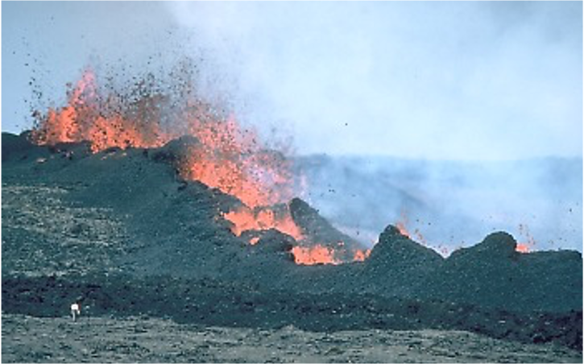{fig-align="center" width="80%"} 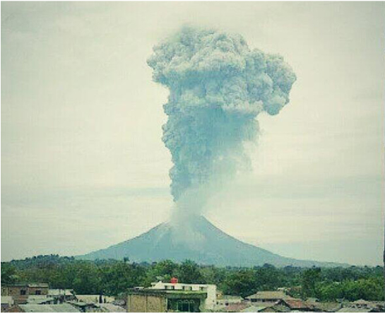{fig-align="center" width="80%"}
:::
::::
::::::

## Example: Mauna Loa {auto-animate="TRUE"}

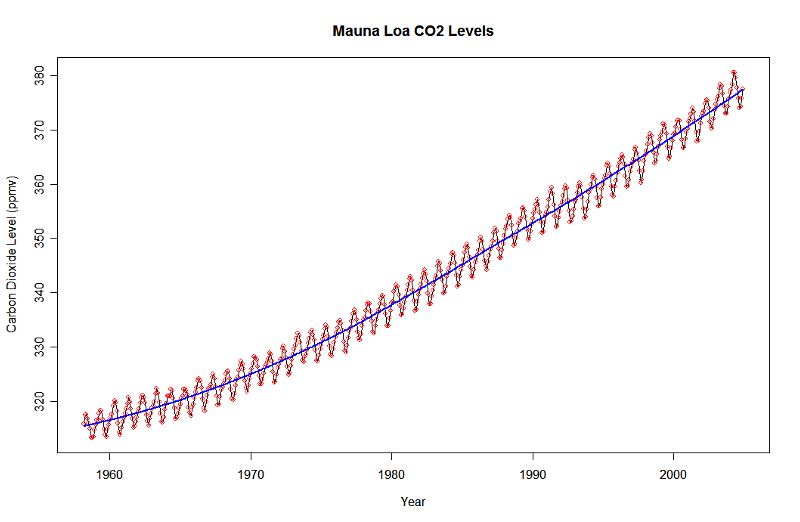{fig-align="center" width="75%"}

## Example: Mauna Loa {auto-animate="TRUE"}

What patterns can you see in the Mauna Loa data?

::: {layout-ncol="2"}
{fig-align="center" width="400"}

{fig-align="center" width="350"}
:::

## Example: Mauna Loa {auto-animate="TRUE"}

{fig-align="center" width="75%"}

-   We can observe a clear **trend**, and also a **seasonal pattern**.

-   It may be sensible to standardise the data and represent all observations as **anomalies**, i.e. their deviation from the starting point (1960 mean level).

## Example: Global Temperature {auto-animate="TRUE"}

-   The plot below shows the global temperature **anomaly** (the current value compared to the 1951–1980 average).

{fig-align="center" width="60%"}

## Example: Global Temperature {auto-animate="TRUE"}

-   The plot below shows the global temperature **anomaly** (the current value compared to the 1951–1980 average).

-   How would you describe the change in temperature?

::: {layout-ncol="2"}
{fig-align="center" width="350"}

{fig-align="center" width="350"}
:::

## Example: Global Temperature {auto-animate="TRUE"}

-   Often this is just simply *"say what you see"*.

. . .

> *"The overall temperature seems fairly stable until around 1980, but then rises substantially, reaching a peak at the present day."*

{fig-align="center" width="55%"}

# Assessing Change Over Time {background-image="river.png"}

## Assessing Change

We still have a number of questions to consider when we think about measuring or understanding changes.

::: incremental
-   Is routine monitoring data **useful / adequate / sufficient** for environmental change detection?

-   How much data do we need? How long should our time series be?

-   Are the commonly used ecological tools for measuring environmental change **statistically rigorous**?

-   How can we use statistical methods in a way that is easily understood by **policy makers**?
:::

## Ecological Trend {auto-animate="TRUE"}

-   The purpose of time series modelling is to identify any **trends** which exist in the dataset.

. . .

-   But what exactly is a trend?

::: fragment
*Share your thoughts*

{fig-align="center" width="350"}
:::

## Ecological Trend {auto-animate="TRUE"}

-   The purpose of time series modelling is to identify any **trends** which exist in the dataset.

-   But what exactly is a trend?

-   It depends who you ask.

. . .

-   lets ask ChaGPT

## Ecological Trend {.smaller auto-animate="TRUE"}

::: {style="height: 100px;"}
:::

**Prompt**: `Can you please define a "trend"?`

::: {.callout-note appearance="minimal" icon="false"}
A "trend" refers to a general direction or pattern of change, development, or movement that becomes noticeable over time. It can apply to many different areas, such as fashion, technology, social behavior, or even ideas. Trends often reflect a shift in public interest, behavior, or the way things are done, and they can evolve slowly or rapidly depending on the context.

For example:

-   In fashion, a trend might be a style of clothing or color that becomes popular for a certain period.
-   In technology, a trend could be the rise of a new innovation, like the growth of AI.
-   In social behavior, a trend could be the increasing use of a specific social media platform.

Trends are typically temporary, though some can become long-lasting or evolve into more permanent changes.
:::

## Ecological Trend {auto-animate="TRUE"}

What do you think about ChatGPT definition?

*Share your thoughts*

{fig-align="center" width="229"}

## Ecological Trend {auto-animate="TRUE"}

What do you think about ChatGPT definition?

-   The Joint Nature Conservation Council (JNCC) define it as *"a measurement of change derived from a comparison of the results of two or more statistics"*.

. . .

-   This is often considered the **ecological** definition of trend: a change (in percentage or some index) between two timepoints.

## Statistical Trend

In statistics, the definition of a trend is often more wide-ranging:

-   A long-term change in the mean level (Chatfield, 1996)
-   Long-term movement (Kendall and Ord, 1990)
-   Long-term behaviour of the process (Chandler, 2002)
-   The non-random function $\mu(t) = \mathbb{E}(Y(t))$ (Diggle, 1990)

. . .

-   We may be interested in trends in **mean, variance or extreme values**.

-   Trends are **not** limited to linear or monotonic patterns.

## Simple Linear Trend

-   We can represent a simple linear trend using the standard notation:

$$
Y_t = \beta_0 + \beta_1 x_t + \epsilon_t .
$$

-   Here, $\beta_0$ is an intercept and $\beta_1$ represents the slope (**trend**).

-   This is just a standard linear model, with all the usual assumptions (normality, constant variance, independence, etc.).

-   This model therefore **doesn't account** for any seasonality or autocorrelation in our data.

## Example: Chlorophyll {auto-animate="TRUE"}

-   We observe monthly chlorophyll levels in a lake between 2001 and 2006.

-   We can fit a linear model of the form:

$$
\text{LogChlorophyll} = \beta_0 + \beta_1\,\text{Date} + \text{error}.
$$

```{r}
#| echo: false
#| warning: false
#| message: false
#| fig-align: center
#| fig-width: 8
#| fig-height: 5


library(ggplot2)
library(lubridate)
library(sjPlot)
library(segmented)
set.seed(42)

# --- Irregular, roughly monthly sampling over 2001-2006 ---
start_date <- as.Date("2001-01-01")
end_date   <- as.Date("2006-01-01")
total_days <- as.numeric(end_date - start_date)

# ~19-20 samples/year * 5 years, with irregular gaps (mean ~19 days apart)
n_approx <- round(total_days / 19)
gaps <- rgamma(n_approx, shape = 3, rate = 3/19)   # mean gap ~19 days, some variability
dates <- start_date + cumsum(gaps)
dates <- dates[dates <= end_date]
n <- length(dates)

t_years  <- as.numeric(dates - start_date) / 365.25
doy      <- yday(dates)

trend    <- 3.1 + 0.25 * t_years
seasonal <- 0.5 * sin(2 * pi * (doy - 60) / 365.25)
noise_sd <- seq(0.35, 0.75, length.out = n)
log_chla <- trend + seasonal + rnorm(n, 0, noise_sd)

df <- data.frame(Date = dates, LogChlorophyll = log_chla)

ggplot(df, aes(x = Date, y = LogChlorophyll)) +
  geom_point(size = 1.8, shape = 16, color = "black") +
  scale_x_date(
    date_breaks = "1 year",
    date_labels = "%Y",
    expand = expansion(mult = 0.02)
  ) +
  scale_y_continuous(breaks = 1:5, limits = c(1, 5.1)) +
  labs(x = "Date", y = "Log Chlorophyll a") +
  theme_bw(base_size = 13) +
  theme(
    panel.grid = element_blank(),
    panel.border = element_rect(color = "black", fill = NA, linewidth = 0.6),
    axis.ticks = element_line(color = "black"),
    axis.text = element_text(color = "black"),
    axis.title.x = element_text(margin = margin(t = 8)),
    axis.title.y = element_text(margin = margin(r = 8))
  )
```

## Example: Chlorophyll {auto-animate="TRUE"}

-   We observe monthly chlorophyll levels in a lake between 2001 and 2006.

-   We can fit a linear model of the form:

$$
\text{LogChlorophyll} = \beta_0 + \beta_1\,\text{Date} + \text{error}.
$$

```{r}
#| echo: false
#| warning: false
#| message: false
#| fig-align: center
#| fig-width: 8
#| fig-height: 5


ggplot(df, aes(x = Date, y = LogChlorophyll)) +
  geom_point(size = 1.8, shape = 16, color = "black") +
  scale_x_date(
    date_breaks = "1 year",
    date_labels = "%Y",
    expand = expansion(mult = 0.02)
  ) +
  geom_smooth(method="lm",col=2,se=F)+
  scale_y_continuous(breaks = 1:5, limits = c(1, 5.1)) +
  labs(x = "Date", y = "Log Chlorophyll a") +
  theme_bw(base_size = 13) +
  theme(
    panel.grid = element_blank(),
    panel.border = element_rect(color = "black", fill = NA, linewidth = 0.6),
    axis.ticks = element_line(color = "black"),
    axis.text = element_text(color = "black"),
    axis.title.x = element_text(margin = margin(t = 8)),
    axis.title.y = element_text(margin = margin(r = 8))
  )
```

## Example: Lake Nam

::::: columns
::: {.column width="50%"}
-   Lake Nam (Namtso) is a mountain lake in Tibet.

-   The mean surface water temperature was measured monthly between 1996 and 2011.
:::

::: {.column width="50%"}
{fig-align="center" width="65%"}
:::
:::::

{fig-align="center" width="90%"}

## Seasonal Patterns

::: {style="height: 100px;"}
:::

-   Many environmental time series have some sort of **periodicity** (e.g. a monthly pattern in temperature).

-   We can produce some form of seasonality plot to understand this better.

-   The **period** is the time interval between consecutive peaks or troughs.

-   A **seasonal component** of a dataset is a regular fluctuation with a period of one year or less.

## Seasonal Patterns

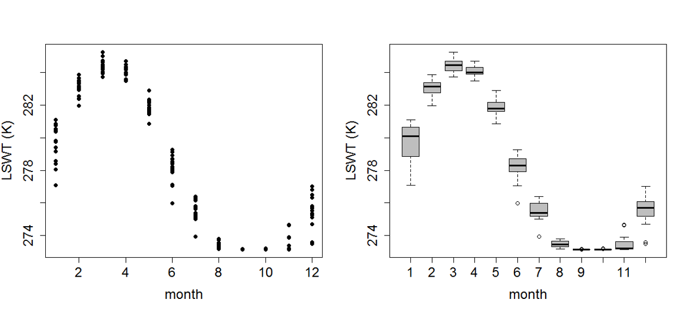{fig-align="center" width="80%"}

-   Plotting the data by month indicates a clear seasonal pattern.

-   There is a peak in Month 3 and a trough in Months 9/10.

## Seasonal Patterns

What is the period in monthly mean surface water temperature time series data of Lake Nam (Namtso)?

:::::: columns
:::: {.column width="60%"}
::: {layout-ncol="1"}
{fig-align="center" width="80%"} {fig-align="center" width="80%"}
:::
::::

::: {.column width="40%"}
*Share your thoughts*

{fig-align="center" width="100%"}
:::
::::::

## Harmonic Regression

-   The monthly pattern is very similar to a **sine wave**, and we can use this feature in our modelling.

-   This is known as **harmonic regression**, and is suitable when we have a regular seasonal component.

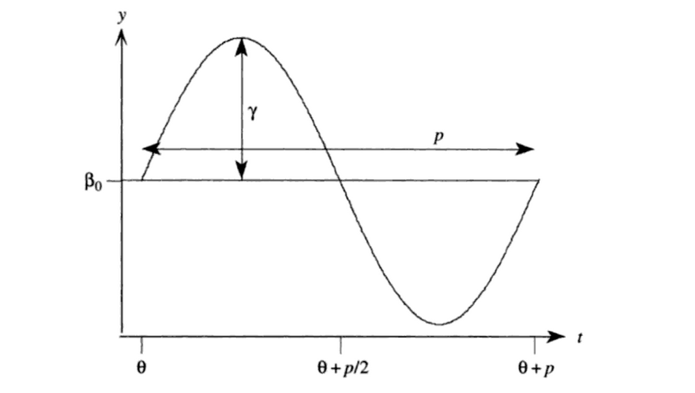{fig-align="center" width="55%"}

## Harmonic Regression

Harmonic regression is based on an equation of the form

$$
Y_t = \beta_0 + \gamma \sin\!\left( \frac{2\pi [x_t - \theta]}{p} \right) + \epsilon_t .
$$

-   Here, $\gamma$ is the **amplitude** of the wave, $p$ is the **period**, and $\theta$ represents the **position** on the wave (in radians).

. . .

-   However, it can often be more convenient to rewrite this in the form of a simple multiple regression model, taking advantage of the **double-angle formula**.

## Harmonic Regression as a linear model

**Exercise**

Show that the Harmonic Regression

$$
Y_t = \beta_0 + \gamma \sin\!\left( \frac{2\pi [x_t - \theta]}{p} \right) + \epsilon_t .
$$

can be written as:

$$
Y_t = \beta_0 + \gamma_1 \sin\!\left( \frac{2\pi x_t}{p} \right)
             + \gamma_2 \cos\!\left( \frac{2\pi x_t}{p} \right) + \epsilon_t .
$$

::: callout-tip
Recall $\sin(a - b) = \sin(a)\cos(b) - \cos(a)\sin(b)$
:::

## Harmonic Regression as a linear model (Proof) {.smaller}

$$
\begin{aligned}
\gamma \sin\!\left( \frac{2\pi[x_t - \theta]}{p} \right) 
&= \gamma \sin\!\left( \frac{2\pi x_t}{p} - \frac{2\pi\theta}{p} \right) \quad \class{fragment}{{}\color{grey}{\text{Recall that }\sin(a - b) = \sin(a)\cos(b) - \cos(a)\sin(b)}}\\
&\class{fragment}{{}= \gamma\left[\sin\!\left(\frac{2\pi x_t}{p}\right)\underbrace{\cos\!\left(\frac{2\pi\theta}{p}\right)}_{\text{Known}}
             - \cos\!\left(\frac{2\pi x_t}{p}\right)\underbrace{\sin\!\left(\frac{2\pi\theta}{p}\right)}_{\text{Known}} \right].}\\
&\class{fragment}{{}= \underbrace{\gamma \cos\!\left(\frac{2\pi\theta}{p}\right)}_{\gamma_1} \sin\!\left(\frac{2\pi x_t}{p}\right)
              \underbrace{-\gamma \sin\!\left(\frac{2\pi\theta}{p}\right)}_{\gamma_2} \cos\!\left(\frac{2\pi x_t}{p}\right)} .\\
&\class{fragment}{{}=\gamma_1 \sin\!\left(\frac{2\pi x_t}{p}\right) + \gamma_2  \cos\!\left(\frac{2\pi x_t}{p}\right)} 
\end{aligned}
$$

## Harmonic Model {auto-animate="TRUE"}

The final harmonic regression model can thus be written:

$$
Y_t = \beta_0 + \gamma_1 \sin\!\left( \frac{2\pi x_t}{p} \right)
             + \gamma_2 \cos\!\left( \frac{2\pi x_t}{p} \right) + \epsilon_t .
$$

-   Our new parameters $\gamma_1$ and $\gamma_2$ control the seasonal trends, with $p$ representing the period.

. . .

::::: columns
::: {.column width="50%"}
**Question** Is this a linear model?
:::

::: {.column width="50%"}
{fig-align="center" width="60%"}
:::
:::::

## Harmonic Model {auto-animate="TRUE"}

The final harmonic regression model can thus be written:

$$
Y_t = \beta_0 + \gamma_1 \sin\!\left( \frac{2\pi x_t}{p} \right)
             + \gamma_2 \cos\!\left( \frac{2\pi x_t}{p} \right) + \epsilon_t .
$$

-   Our new parameters $\gamma_1$ and $\gamma_2$ control the seasonal trends, with $p$ representing the period.

::: incremental
-   $\beta_0$ is still the intercept term, which can also be interpreted as the overall mean.

-   This is still a **linear model**, since it is linear in the coefficients.

-   Standard linear regression assumptions hold (Normality, Homoscedasticity and Independence)
:::

## Fitting an Harmonic Regression in `R`

::: {style="font-size: 0.65em;"}
Suppose we have the following weekly temperature measurements taken in a lake from 2019 to 2023 ($T= 4 \text{ years}$).

-   We want to fit a harmonic regression of the form

$$
\text{Temperature}_t = \beta_0 + \gamma_1 \sin\!\left( \frac{2\pi t}{P} \right)
             + \gamma_2 \cos\!\left( \frac{2\pi t}{P} \right) + \varepsilon_t\quad \\
             \text{such that } \varepsilon_t \overset{iid}{\sim} N(0,\sigma^2) \text{ for } t \in 1,\ldots, (P \times T).
$$
:::

```{r}
#| echo: false
#| message: false
#| warning: false


library(ggplot2)
library(kableExtra)

set.seed(123)

n_years <- 4
start_date <- as.Date("2019-01-01")

# Biweekly sampling dates
dates <- seq(start_date, by = "1 week", length.out = 52 * n_years)
t <- 1:length(dates)

# seasonal signal based on day-of-year (peaks ~ late June)
doy <- yday(dates)
true_mean <- 10 + 8 * cos(2 * pi * (doy - 180) / 365.25)
temp <- true_mean + rnorm(length(t), sd = 1.5)

df <- data.frame(Date = dates, t, temp)

```

::::: columns
::: {.column width="30%"}
```{r}
# Explore the data
head(df) 
```
:::

::: {.column width="70%"}
```{r}
#| echo: false
#| message: false
#| warning: false
#| fig-align: center
#| fig-width: 4.5
#| fig-height: 3.5

ggplot() +
  geom_point(data = df, aes(x = Date, y = temp), color = "black", size = 1.8) +
  scale_x_date(date_breaks = "1 year", date_labels = "%Y") +
  labs(x = "Date", y = "Temperature (°C)") 

```
:::
:::::

## Fitting an Harmonic Regression in `R` {auto-animate="TRUE"}

```{r}
# Period
P <- 52 # 52 weeks per year (365 days /7 days per week)
harmonic_model <- lm(temp ~ sin(2 * pi * t / P) + cos(2 * pi * t / P) ,
                      data = df)


```

::::::: columns
:::: {.column width="50%"}
::: {style="height: 100px;"}
:::

```{r}
#| eval: false
summary(harmonic_model)
```

```{r}
#| echo: false
#| message: false
#| warning: false
library(sjPlot)
tab_model(
  harmonic_model,
  CSS = list(
    css.table = "font-size: 0.65em;",
    css.tdata = "padding: 2px 6px;",   # tighter cell padding, helps fit on slide
    css.thead = "font-size: 0.75em;"   # header row font size
  )
)

beta1 <- coef(harmonic_model)[2]
beta2 <- coef(harmonic_model)[3]
ampl <- sqrt(beta1^2 + beta2^2)
```
::::

:::: {.column width="50%"}
::: {.incremental style="font-size: 0.8em; line-height: 2.2;"}
-   $\hat \beta_0$ Baseline mean temperature level

-   The **amplitude** can be computed $$\sqrt{\hat \gamma_1^2 + \hat \gamma_2^2} = \sqrt{ -0.9^2 +  -7.87^2} \approx 7.92$$

-   This tell us how far temperature fluctuates above and below the mean level.
:::
::::
:::::::

## Fitting an Harmonic Regression in `R` {auto-animate="TRUE"}

```{r}
# Period
P <- 52 # 52 weeks per year (365 days /7 days per week)
harmonic_model <- lm(temp ~ sin(2 * pi * t / P) + cos(2 * pi * t / P) ,
                      data = df)


```

:::::: columns
:::: {.column width="50%"}
::: {style="height: 100px;"}
:::

```{r}
#| eval: false
summary(harmonic_model)
```

```{r}
#| echo: false
#| message: false
#| warning: false
library(sjPlot)
tab_model(
  harmonic_model,
  CSS = list(
    css.table = "font-size: 0.65em;",
    css.tdata = "padding: 2px 6px;",   # tighter cell padding, helps fit on slide
    css.thead = "font-size: 0.75em;"   # header row font size
  )
)

beta1 <- coef(harmonic_model)[2]
beta2 <- coef(harmonic_model)[3]
ampl <- sqrt(beta1^2 + beta2^2)
```
::::

::: {.column width="50%"}
-   We can visualize the fitted model.

```{r}
#| echo: false
#| message: false
#| warning: false

df$preds <- predict(harmonic_model,df)

ggplot() +
  geom_point(data = df, aes(x = Date, y = temp), color = "black", size = 1.8) +
  geom_line(data = df,aes(x=Date,y=preds),col="tomato")+
  scale_x_date(date_breaks = "1 year", date_labels = "%Y") +
  labs(x = "Date", y = "Temperature (°C)") 

```
:::
::::::

## Fitting an Harmonic Regression in `R`

As with any model we fit, we need to check our assumptions:

```{r}
par(mfrow=c(2,2))
plot(harmonic_model)
```

## Limitations of Harmonic Regression

::: {style="height: 100px;"}
:::

-   The standard harmonic regression assumes that we have the **same seasonal pattern each year**, but this may not always be appropriate.

-   There are many more sophisticated models available if this assumption does not hold.

-   Some are still based on sine and cosine waves, while others may use autocorrelation functions or a form of semiparametric smoothing.

## Limitations of Harmonic Regression

::: {style="height: 50px;"}
:::

-   The seasonal variation can sometimes be so strong that it obscures the overall trend (or any other patterns).

-   In most cases, we are not actually particularly interested in the seasonal trend, and we treat it as a **nuisance factor** to account for in our model.

-   Our primary interest is usually in understanding the **longer-term trends**.

-   Therefore, we often try to remove or extract this seasonal pattern when analysing time series.

# Changepoint Detection {background-image="river.png"}

<!-- ## Changepoints {.center} -->

<!-- - So far, we've focused on **recurring** structure in time series: -->

<!--   - Harmonic regression captures cyclical, repeating patterns (e.g. annual seasonality) -->

<!--   - The model assumes the *same* seasonal pattern repeats indefinitely -->

<!-- - But not all structure in a time series is repeating. -->

<!-- - Sometimes a series undergoes a shift in the mean level or the variance that never reverts. -->

<!-- - This raises a different question: -->

<!-- > Instead of *"how does this series cycle?"*, we now ask *"did something change, and if so, when?"* -->

<!-- - This is the idea behind a **changepoint**. -->

## Changepoints

-   One of the main reasons that we analyse environmental data is to detect changes.
-   Sometimes, these changes occur organically, either as the result of some natural environmental process, or some non-deliberate human action.
-   In some other occasions, these changes occur by design, as the result of a deliberate and controlled human action (e.g. policy changes).
-   Regardless of the reason for the change, we want to understand more about when it happened and the extent of the change.

## Changepoints

::: {style="height: 100px;"}
:::

-   In statistics, a **changepoint** is a point in time after which some or all of the model parameters might change.
-   Most commonly, this is a change in mean or variance, but it could also be a change in some other feature of the data.
-   We may not always know exactly when the changepoint occurs, or whether we have a changepoint at all.
-   In some cases, we may have more than one changepoint.

## Examples

::::::: columns
:::: {.column width="55%"}
::: {layout-ncol="1"}
{fig-align="center" width="80%"} 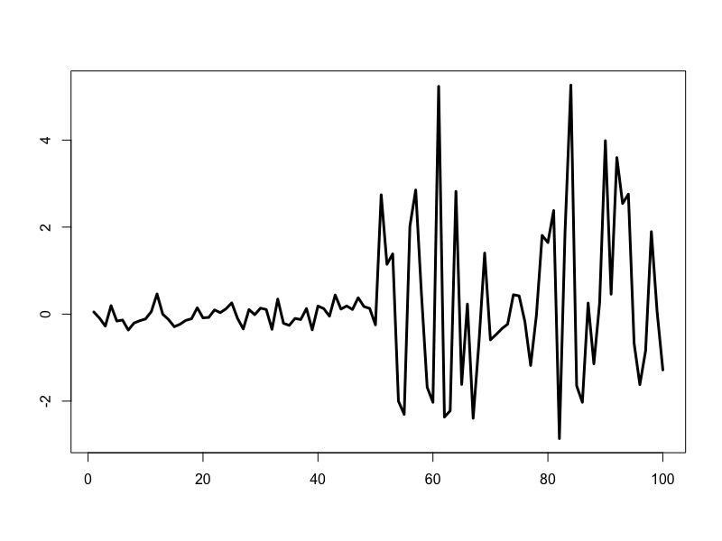{fig-align="center" width="80%"}
:::
::::

:::: {.column width="45%"}
::: {style="height: 50px;"}
:::

-   Reasons for changepoints might include:
    -   Environmental events, e.g. flooding, volcanic eruption.
    -   Policy, e.g. low emissions zones, water quality regulations.
    -   Changes to measuring equipment.
::::
:::::::

## Types of changepoint

Some simple examples of changepoints include:

:::::: columns
:::: {.column width="45%"}
::: {.incremental style="line-height: 2.2;"}
-   A shift up (or down) of the mean.
-   A short-term change in the mean.
-   A change in a model parameter, e.g. slope.
:::
::::

::: {.column width="55%"}
{fig-align="center" width="65%"}
:::
::::::

## Known changepoint --- mean shift {.smaller}

-   Consider a series with two different mean levels.
-   The first 20 observations come from $N(10,1)$.
-   The next 20 observations come from $N(15,1)$.
-   Our ability to detect this change depends on the size of the change and the variability in the data.

:::::: columns
::: {.column width="50%"}

:::

:::: {.column width="50%"}
::: {style="height: 50px;"}
:::


::::
::::::

## Known changepoint --- mean shift

It can be difficult to distinguish changepoints from trend

{fig-align="center" width="80%"}

## Known changepoint --- mean shift

-   We have a series of data $Y_i$ collected at a set of timepoints $t_i$ with $i = 1, \ldots, n$.
-   If our known changepoint is at time $c$, then we can construct an indicator function $$
    \mathcal{I}_{t_i} =
    \begin{cases}
    0 & \text{if } t_i < c\\
    1 & \text{if } t_i \geq c
    \end{cases}
    $$
-   This can then be included as a parameter in our regression model $$
    Y_i = \beta_0 + \varphi \mathcal{I}_{t_i} + \epsilon_i
    $$

## Known changepoint --- mean shift

::: {style="height: 100px;"}
:::

-   Here, $\varphi$, the coefficient of the indicator function, can be described as the **intervention effect**.
-   It controls the size of the mean shift in our model. We have:
    -   $E(Y_i) = \beta_0$ before the changepoint
    -   $E(Y_i) = \beta_0 + \varphi$ after the changepoint
-   If this parameter is significant in our model, that implies that we have a significant change in mean at timepoint $c$.

## Known changepoint --- change in slope

-   We also need to consider examples where we observe a **change in slope** at a known timepoint.

{fig-align="center" width="80%"}

## Known changepoint --- change in slope {.smaller}

-   It would be possible to fit two separate regressions $$
    \begin{aligned}
    Y_i &= \alpha_1 + \beta_1 x_i + \epsilon_i \quad \text{for } x<c\\
    Y_i &= \alpha_2 + \beta_2 x_i + \epsilon_i \quad \text{for } x\geq c
    \end{aligned}
    $$

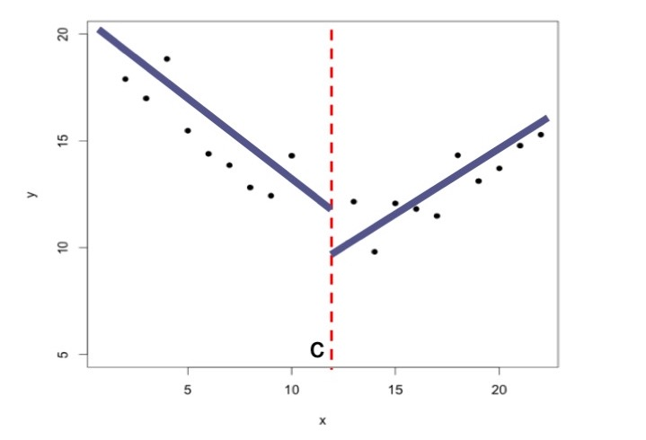{fig-align="center" width="60%"}

::: fragment
However, this seems quite simplistic, and it would be better to have a **single continuous model**.
:::

## Piecewise regression

-   We want our regression to be continuous at $c$, such that we have: $$
    \alpha_1 + \beta_1 c = \alpha_2 + \color{red}{ \beta_2 c}
    $$

::: fragment
-   This can be rewritten in terms of a single model parameter as: $$
    \alpha_2 = \alpha_1 + \beta_1 c - \color{red}{ \beta_2 c} = \alpha_1 + c(\beta_1 - \beta_2)
    $$
:::

::: fragment
-   We can thus update our equations to the following. This is known as **piecewise regression** (or segmented regression): $$
    \begin{aligned}
    Y_i &= \alpha_1 + \beta_1 x_i + \epsilon_i &&\text{for } x<c\\
    Y_i &= \underbrace{\alpha_1 + (\beta_1 - \beta_2)c}_{\alpha_2} + \beta_2 x_i + \epsilon_i &&\text{for } x\geq c
    \end{aligned}
    $$
:::

## Known changepoint --- change in slope {.smaller}

-   The two linear parts of our model now meet at $c$.
-   Note that our piecewise model is more efficient than two separate regressions, since it uses one fewer parameter (no $\alpha_2$).

:::::: columns
::: {.column width="55%"}
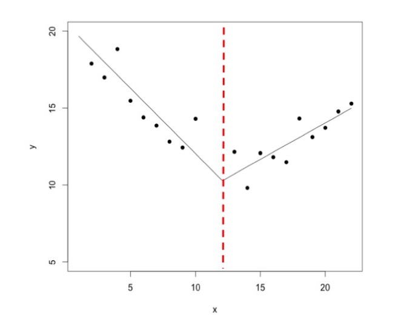{width="90%"}
:::

:::: {.column width="45%"}
Note that the two regression equations can be written as a single equation in terms of the following indicator (basis) function:

$$
(x - c)_+ = \begin{cases}
0 & \text{if } \ x < c\\
x- c & \text{if } x \geq c
\end{cases}
$$

::: {.callout-tip appearance="minimal" icon="false"}
$Y_i = \alpha_1 + \beta_1x_i - (\beta_1-\beta_2)(x_i-c)_+ +\varepsilon_i$
:::
::::
::::::

<!-- ## Known changepoint --- change in slope {.smaller} -->

<!-- -   The two linear parts of our model now meet at $c$. -->

<!-- -   Note that our piecewise model is more efficient than two separate regressions, since it uses one fewer parameter (no $\alpha_2$). -->

<!-- :::::: columns -->

<!-- ::: {.column width="55%"} -->

<!-- {width="90%"} -->

<!-- ::: -->

<!-- :::: {.column width="45%"} -->

<!-- **Exercise** -->

<!-- Note that the two regression equations can be written as a single equation in terms of the following indicator (basis) function: -->

<!-- $$ -->

<!-- (x - c)_+ = \begin{cases} -->

<!-- 0 & \text{if } \ x < c\\ -->

<!-- x- c & \text{if } x \geq c -->

<!-- \end{cases} -->

<!-- $$ -->

<!-- ::: callout-tip -->

<!-- Begin with the case when $x\geq c$ -->

<!-- ::: -->

<!-- :::: -->

<!-- :::::: -->

<!-- ## Piecewise regression as a single equation (proof) {.smaller auto-animate="TRUE"} -->

<!-- From the previous result we know that -->

<!-- $$ -->

<!-- \mathbb{E}(Y_i) = \alpha_1 + (\beta_1 - \beta_2)c + \beta_2 x_i \quad \text{when } x \geq c -->

<!-- $$ -->

<!-- Thus, -->

<!-- $$ -->

<!-- \begin{align} -->

<!-- \mathbb{E}(Y_i) &= \alpha_1 + c \beta_1 - c\beta_2 + \beta_2 x_i \\ -->

<!-- &\class{fragment}{{}=\alpha_1 + \color{red}{\beta_1x_i} -  \color{red}{\beta_1x_i} +  c \beta_1 - c\beta_2 + \beta_2 x_i}\\ -->

<!-- &\class{fragment}{{}=\alpha_1 + \beta_1x_i -  \underbrace{\beta_1x_i +  c \beta_1}_{\beta_1(x_i-c)} + \underbrace{ \beta_2 x_i-c\beta_2 }_{\beta_2(x_i-c)}}\\ -->

<!-- &\class{fragment}{{}=\alpha_1 + \beta_1x_i - (\beta_1-\beta_2)(x_i-c)} -->

<!-- \end{align} -->

<!-- $$ -->

<!-- ## Piecewise regression as a single equation (proof) {.smaller auto-animate="TRUE"} -->

<!-- From the previous result we know that -->

<!-- $$ -->

<!-- \mathbb{E}(Y_i) = \alpha_1 + (\beta_1 - \beta_2)c + \beta_2 x_i \quad \text{when } x \geq c -->

<!-- $$ -->

<!-- $$ -->

<!-- \begin{align} -->

<!-- &\Rightarrow \\ -->

<!-- \mathbb{E}(Y_i) &= \alpha_1 + (\beta_1 - \beta_2)c + \beta_2 x_i \\ -->

<!-- &=\alpha_1 + \beta_1x_i - (\beta_1-\beta_2)(x_i-c) -->

<!-- \end{align} -->

<!-- $$ -->

<!-- :::: fragment -->

<!-- Given the basis function: $(x - c)_+ = \begin{cases}0 & \text{if } \ x < c\\x- c & \text{if } x \geq c\end{cases}$ -->

<!-- :::: -->

<!-- ::::::::: columns -->

<!-- ::::: {.column width="50%"} -->

<!-- :::: fragment -->

<!-- ::: {.callout-warning appearance="minimal" icon="false"} -->

<!-- ## **Case** $x_i < c$: -->

<!-- $$\begin{aligned} -->

<!-- \mathbb{E}(Y_i) &= \alpha_1 + \beta_1x_i - (\beta_1-\beta_2)\overbrace{(x_i-c)_+}^{0}\\ -->

<!-- & = \alpha_1 + \beta_1 x_i\\ -->

<!-- \end{aligned}$$ -->

<!-- ::: -->

<!-- :::: -->

<!-- ::::: -->

<!-- ::::: {.column width="50%"} -->

<!-- :::: fragment -->

<!-- ::: {.callout-warning appearance="minimal" icon="false"} -->

<!-- ## **Case** $x_i \geq c$: -->

<!-- $$ -->

<!-- \begin{aligned} -->

<!-- \mathbb{E}(Y_i) &= \alpha_1 + \beta_1x_i - (\beta_1-\beta_2)(x_i-c)_+\\ -->

<!-- & = \alpha_1 + \beta_1 x_i - (\beta_1-\beta_2)(x_i-c)\\ -->

<!-- &=  \alpha_1 + (\beta_1 - \beta_2)c + \beta_2 x_i -->

<!-- \end{aligned} -->

<!-- $$ -->

<!-- ::: -->

<!-- :::: -->

<!-- ::::: -->

<!-- ::::::::: -->

<!-- ::: fragment -->

<!-- Thus, we recovered -->

<!-- $$ -->

<!-- \begin{aligned} -->

<!-- Y_i &= \alpha_1 + \beta_1 x_i + \epsilon_i &&\text{for } x<c\\ -->

<!-- Y_i &= \alpha_1 + (\beta_1 - \beta_2)c + \beta_2 x_i + \epsilon_i &&\text{for } x\geq c -->

<!-- \end{aligned} -->

<!-- $$ -->

<!-- ::: -->

## Known changepoint in `R` {.smaller}

Lets look at an example on the global surface temperature anomalies from 1850 to 2023, computed as differences of the annual (average) measurement with respect to the 20th century average (1901-2000).

-   The period after 1970 (sometimes called the "Great Acceleration") is associated with post-war industrial expansion and rising greenhouse gas emissions

```{r}
#| echo: false
#| warning: false
#| message: false
#| fig-align: center


library(segmented)
data(globTempAnom)


ggplot(data=globTempAnom,aes(x=Year,y=Anomaly)) + geom_point() + geom_vline(xintercept = 1970,col=2,lty=2) +
    scale_x_continuous(breaks = seq(min(globTempAnom$Year), max(globTempAnom$Year), by = 10))


```

## Known changepoint in `R` {.smaller}

We want to fit our piecewise regression of the form

$$
\text{Temp}_t = \alpha_1 + \beta_1 t_t - (\beta_1-\beta_2)(t-c)_+ +\varepsilon_i \\
\varepsilon_t \sim N(0,\sigma^2)\quad \text{for } t = 1950,\ldots,2020
$$ where $c$ is the *known* changepoint at 1970

```{r}
#| eval: false
fit_slope <- lm(Anomaly ~ Year + I((Year - 1970) * (Year >= 1970)), data = globTempAnom)
summary(fit_slope)
```

:::::: columns
::: {.column width="40%"}
```{r}
#| echo: false
fit_slope <- lm(Anomaly ~ Year + I((Year - 1970) * (Year >= 1970)), data = globTempAnom)
tab_model(fit_slope,  CSS = list(
    css.table = "font-size: 0.65em;",
    css.tdata = "padding: 2px 6px;",   # tighter cell padding, helps fit on slide
    css.thead = "font-size: 0.75em;"   # header row font size
))

alpha1 = coef(fit_slope)[1]
beta1 = coef(fit_slope)[2]
beta2 = coef(fit_slope)[3]

```

$$
\widehat{\text{Temp}}_t = \begin{cases} 
−3.741+0.00189 \ t & t < 1970 \\
−3.741+0.00189 \ t + 0.01703 (t-1970)  \  & t \geq 1970
\end{cases}
$$
:::

:::: {.column width="60%"}
::: incremental
-   **Before 1970**: temperature anomalies rose by about 0.0019$^\circ$C per year ($\approx$ 0.19°C per century) — a fairly mild warming trend.
-   **After 1970**: the rate jumps to about 0.0189$^\circ$C per year ($\approx$ 1.9°C per century) — a 10 times larger than before 1970.
-   both coefficients are highly significant, strongly supporting a change in slope at 1970. <!-- -   $R^2 = 0.890$ indicates that the piecewise model explains about 89% of the variance in temperature anomalies over 1950–2020. -->
:::
::::
::::::

## Known changepoint in `R`

We can visualize the fitted models using the `predict` function:

```{r}
globTempAnom$pred_slope <- predict(fit_slope)
```

```{r}
#| echo: false
#| fig-align: center
globTempAnom$pred_slope <- predict(fit_slope)

ggplot(data=globTempAnom,
       aes(x=Year,y=Anomaly)) +
  geom_point() + 
  geom_vline(xintercept = 1970,
             col=2,lty=2) +
    geom_line(aes(y = pred_slope),
              color = "tomato", 
              linewidth = 0.9) +
      scale_x_continuous(
        breaks = seq(min(globTempAnom$Year), 
                     max(globTempAnom$Year), by = 10))

```

## Known changepoint --- more complex patterns

-   In many cases, we may have more complex changes to our trend.
-   There are a variety of more advanced models for known changepoints, but these are all based on the same underlying principles.
-   For example, the **bent cable** model allows for an extended "transition phase" between the two slopes, often represented by a smooth curve.
-   This can often be more realistic than a sharp change in slope.

## Example: Bent cable for CFC data

-   Chlorofluorocarbons (CFCs) are pollutants which were often used in aerosols.
-   Their use was phased out in the 1990s as a result of environmental policy. We can see this "phasing out" period represented in the model.

{width="70%" fig-align="center"}

## Unknown changepoint

-   It can be more challenging to fit a changepoint model when you don't clearly know exactly when the change occurred.
-   We could try to estimate it visually by looking at a plot, but it may be more appropriate to use statistical modelling.
-   One of the most popular methods is an iterative approach, which searches across the entire range of our data for possible changepoints.
-   This approach compares a series of piecewise models to a standard linear regression, and highlights whether any changepoints exist, and if so, how many.

## Example: River Nile

-   We have historic data on the levels of the River Nile around the city of Aswan, Egypt.
-   Is there any evidence of a change in water volume? If so, when did it occur?

:::::: columns
::: {.column width="50%"}
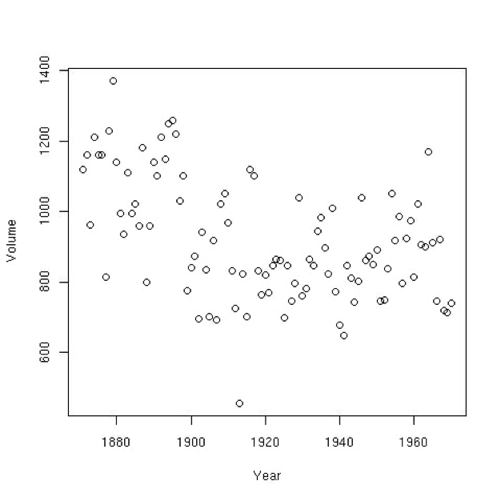{fig-align="center" width="80%"}
:::

:::: {.column width="50%"}
::: {style="height: 50px;"}
:::

{fig-align="center" width="80%"}
::::
::::::

## Example: River Nile

-   We can examine the data by overlaying a LOWESS curve (we will cover this next week).
-   There does appear to be a change around 1900. However, we need to explore this further via a model.

{width="60%" fig-align="center"}

## Fitting in R

-   We use the `segmented()` function in R (in the package also called `segmented`) to fit an unknown changepoint model.

``` r
out.lm <- lm(Volume ~ Year)
mod <- segmented(out.lm, seg.Z = ~Year, psi = 1900)
```

-   First, fit a standard regression using `lm()`.
-   We then pass the linear model into our `segmented()` function along with an initial estimate of the changepoint.
-   This initial estimate (`psi = 1900`) is used as a starting point for our iterative algorithm.

## Example: River Nile

::::: columns
::: {.column width="50%"}
```         
Estimated Break-Point(s):
psi1.x
  1913

slope(mod)
$x
          Est. St.Err. t value
slope1 -8.1820   1.759  -4.650
slope2  0.7458   1.084   0.688
```
:::

::: {.column width="50%"}
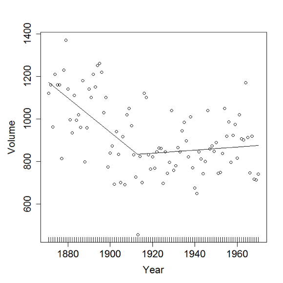{width="70%"}
:::
:::::

-   The final model output suggests that the changepoint occurred in 1913.
-   Prior to 1913, the volume was decreasing by 8.18 units per year. Afterwards, it was increasing by 0.75 units per year.

## Example: River Nile

-   The Aswan Low Dam was constructed between 1899--1902, massively impacting river levels in the area.
-   Therefore, it is more sensible to fit a model that introduces a mean shift, rather than a change of slope.
-   Subject matter expertise is key!

::::: columns
::: {.column width="50%"}
{width="70%"}
:::

::: {.column width="50%"}
{width="60%"}
:::
:::::

## Example: River Nile

-   In this case, given there is a clear reason why the time series will change either side of the dam's construction, we need to fit two separate models.
-   The plot below shows two separate penalised spline models for the "before" and "after" periods.

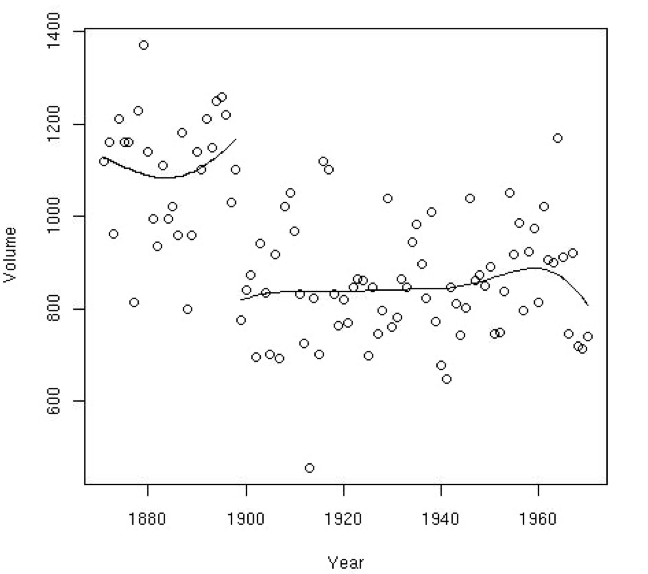{width="50%" fig-align="center"}

# Summary points

## Summary points

-   A **time series** is a sequence of measurements on the same object made overtime.
-   Time series data are typically **not independent**. There will often be correlation between consecutive observations.
-   The purpose of timeseries modelling is to identify any **trends** which exist in the dataset.
-   We can there fore think of our overall time series model in the following form: $$ X = \text{trend} + \text{seasonal component}+ \text{error}$$
-   Our error, $\varepsilon_t$  is assumed to be random,and follows the distribution $\varepsilon_t \sim N(0,\sigma^2)$

## Summary points

-  Many environmental time series have some sort of **periodicity** (e.g. a monthly pattern in temperature) 
-  The **period** is the time interval between consecutive peaks or troughs
-  A seasonal component of a dataset is a regular fluctuation with a period of one year or less.
-  Harmonicregression is suitable when we have a regular trend, and can be written as $$Y_t = \beta_0 + \gamma_1 \sin\!\left( \frac{2\pi x_t}{p} \right)
             + \gamma_2 \cos\!\left( \frac{2\pi x_t}{p} \right) + \epsilon_t  $$


## Summary points

-   A **changepoint** is a point in time after which some or all of the model parameters might change.
-   Some simple examples of changepoints include:
    -   A shift up (or down) of the mean.
    -   A short-term change in the mean.
    -   A change in a model parameter, e.g. slope.
-   We can model such data using **piecewise regression**, **bent cable** model, or using smoothing methods.
